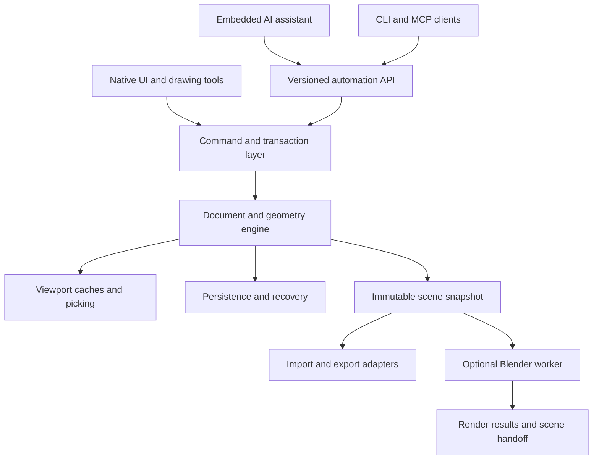

# SketchyUp native Linux build plan

Status: implementation begun; native spikes and remaining gates are recorded in [the roadmap](PR_ROADMAP.md). Updated: 2026-10-03.

This document defines intended behavior and acceptance gates. It does not claim
that the native application, proposed commands, packages, or integrations exist.
Changes to this plan should preserve traceability to the
[scope matrix](SCOPE.md) and [AI modeling contract](AI_MODELING.md).
The [PR roadmap](PR_ROADMAP.md) breaks the gates into reviewable implementation
steps; the [UX design](UX_DESIGN.md) and its mockups provide the interaction
reference. Roadmap clarifications C1–C6 resolve the identified UX edge cases.

## 1. Product objective

Build an independent native Linux modeler with the direct drawing and editing
experience expected from SketchUp, plus AI that can create and modify the same
editable documents as a human. Prioritize architectural design, interiors,
furniture, woodworking, site studies, and general purpose polygonal modeling.

The primary environment is x86-64 Arch Linux running Omarchy. Native means a
compiled desktop application with a native Wayland window, local document
storage, and no browser runtime required for the editor. XWayland/X11 is a
fallback to test, not the primary acceptance environment. Ordinary modeling
must work without an account, internet access, an AI provider, or Blender.

Blender is an optional external renderer and scene handoff destination. The
editor owns the editable model and must remain useful when Blender is absent.

### What feature complete means

There are two separate completion claims:

1. **Core editor completeness (1.0):** every row marked Core in the scope matrix
   passes its acceptance criteria on the declared supported platform. This
   includes native desktop behavior, AI tools and instructions, and the optional
   rendering integration. It is not a claim of complete SketchUp ecosystem parity.
2. **Expanded workflow parity:** the Extended rows add documentation sheets,
   configurable assets, broader exchange, and other advanced workflows. Rows
   marked Investigate require evidence before committing to compatibility.

At M0, record a dated SketchUp desktop reference version and a reproducible
workflow checklist. Keep that baseline fixed for a release; review new upstream
features for a later release instead of continuously moving the finish line.
Document intentional behavioral differences and unresolved gaps publicly.

Matching familiar behavior is the objective. Reusing SketchUp branding,
proprietary assets, or claiming affiliation is not part of the plan. Exact
binary/file/plugin compatibility is a separately tracked engineering problem.

### Current baseline

The committed baseline when this plan was written is a minimal README. A local,
uncommitted Formline prototype contains an Electron/Three.js viewport, boxes and
cylinders, simple transforms, JSON save/load, OBJ export, and snapshot undo.
Its JavaScript checks and three model/history tests have passed locally. That
is not verification of GUI behavior, packaging, or the proposed native engine.

Preserve the prototype for interaction reference and migration fixtures. Treat
its boxes/cylinders as importable source data; do not make its object schema the
new topology model. Audit and commit any reusable prototype assets separately
before relying on them in a native build.

## 2. Architectural decisions

### Proposed baseline and decision gates

| Area | Proposed choice | Required evidence before finalizing |
| --- | --- | --- |
| Application | C++20, Qt 6, CMake, Qt Quick/QML UI | M0 spike: Wayland window, custom geometry, input, high DPI, native dialogs, dependency/license inventory |
| Viewport | Qt Quick 3D custom geometry and overlays; renderer adapter boundary | M0 spike: picking, depth-correct edges, clipping, transparency, instancing and benchmark scenes; evaluate a custom Qt rendering path if these fail |
| Document | Renderer-independent geometry graph, scene hierarchy, stable IDs, transactions | M1/M2 tests for persistence, topology edits, identity mapping and undo |
| Geometry algorithms | Explicit editable surface topology plus replaceable algorithm adapters | M0/M2 comparison of robust predicates, planar arrangements, triangulation, intersections and booleans; choose dependencies on evidence |
| Automation | Versioned typed commands shared by UI, CLI, embedded AI and MCP | M1 contract tests and M5 full modeling demonstration |
| Persistence | Versioned document container with geometry, metadata and embedded assets | M1 crash-safe saves; M4 migration and asset tests |
| Rendering | Separate Blender worker receiving a scene snapshot | M5 preview render; M7 reliable job management and scene handoff |
| Distribution | Arch PKGBUILD, desktop integration, versioned releases | M1 development package; M9 clean install/upgrade/remove validation |

Qt documents native Wayland client support and an API for custom viewport
geometry. These are starting points, not evidence that all editor requirements
are solved. See [Wayland support](https://doc.qt.io/qt-6/wayland-and-qt.html) and
[custom geometry](https://doc.qt.io/qt-6/qquick3dgeometry.html).

C++/Qt is a proposed default, not a rewrite already undertaken. Final dependency
versions and licensing must be recorded in M0 architecture decision records
(ADRs). Evaluate maintained geometry libraries such as CGAL and Open CASCADE for
specific operations; no single library is assumed to supply SketchUp's editing
semantics. A solid-only kernel cannot be the sole document representation,
because users also draw loose edges, open surfaces and non-solid assemblies.

Do not embed Blender as the interactive editor kernel in the initial design.
That would couple document semantics, UI responsiveness and undo to an external
application. Keep the adapter replaceable so future integrations remain possible.

### Module boundaries



Proposed source layout, to be created during implementation:

```text
src/core/          IDs, units, document, scene hierarchy, transactions
src/geometry/      topology, predicates, inference, editing, validation
src/commands/      typed operations and queries
src/io/            native format, recovery, migration, exchange
src/render/        viewport caches, picking, camera, overlays
src/app/           Qt UI, interaction state machines, preferences
src/automation/    CLI, MCP transport, provider adapters, assistant
src/integrations/  Blender worker and scene conversion
resources/         icons, translations, templates, example assets
packaging/arch/    PKGBUILD and desktop integration
schemas/           versioned document and command schemas
examples/ai/       executable modeling recipes and fixtures
tests/             unit, property, integration, GUI and performance suites
```

All entries are proposed repository-root paths. The core must build and run
headlessly without Qt UI, network access, a model provider or Blender.

### Geometry and document invariants

- Model geometry in double precision. Store meters and radians internally with
  explicit conversion at every API/import boundary. Display metric or imperial
  values without changing the underlying model scale.
- Adopt a right-handed, Z-up world for the native format. Local component axes
  can differ. Convert the prototype's Y-up convention explicitly; include
  orientation, winding and rotation fixtures instead of swapping axes ad hoc.
- Represent vertices, edges, oriented face loops (including holes), faces, and
  editing contexts independently of the triangles used for display. Preserve
  curve/arc metadata where available.
- Support loose edges, open surfaces and non-manifold intermediate models.
  A radial-edge or equivalent adjacency representation should be evaluated;
  a manifold-only half-edge assumption must not silently discard user geometry.
- Restrict automatic geometry merging and face formation to the active context.
  Nested groups isolate edits. Components share definitions, with an explicit
  make-unique operation and well-defined instance transforms.
- Specify tolerances for coincidence, coplanarity, short edges and angular
  comparisons. Choose them against small furniture and large site fixtures;
  never use screen-space snapping distance as the geometry merge tolerance.
- Use robust predicates and controlled repair operations for intersections and
  near-degenerate input. Report rejected/ambiguous edits rather than silently
  deleting geometry. Classify open, manifold and solid status separately.
- IDs survive unaffected edits and save/load. Splits and merges return explicit
  old-to-new mappings; an identifier is never secretly reassigned to an
  unrelated face. Requery when a reference becomes ambiguous.
- UI and automation mutate only through commands. A validated transaction either
  commits completely or leaves the document unchanged. Preview geometry is
  temporary and cannot be mistaken for saved model content.
- Derive render meshes, spatial indexes and selection buffers incrementally.
  Heavy algorithms operate on snapshots off the UI thread and commit only
  against the revision they inspected.

The intended line/face/inference behavior is grounded in
[SketchUp's drawing concepts](https://help.sketchup.com/en/sketchup/introducing-drawing-basics-and-concepts).
The detailed rules and tests in this plan are our proposed implementation contract.

### Persistence, history and recovery

Use a documented versioned container with a manifest, authoritative document
records, material/texture assets and optional thumbnails. Decide JSON versus
binary geometry chunks from benchmarks in M1; do not serialize renderer objects.

Save through a sibling temporary file and atomic replacement, with explicit
error handling for full disks, interrupted writes and unavailable destinations.
Maintain a last known good copy and a checksummed recovery journal. Autosave is
recovery data and must not overwrite the user's last explicit save. Recovery
must distinguish unsaved documents from named files and report missing assets.

Undo/redo covers geometry, hierarchy, metadata and AI edits. Bound history by
memory, support checkpoints, and invalidate a redo branch on a new edit. Use
change sets rather than full-scene copies for routine edits. Save/load round
trips preserve identity, units, materials, components and annotations. Refuse
unsupported future versions with a useful message. Apply migrations to a copy.

Imported archives/assets need resource limits and path validation. Opening a
model must not execute embedded scripts. Parameter formulas use a constrained
expression language if implemented, not arbitrary host-language evaluation.

## 3. AI integration

The complete proposed tool contract, agent procedure and examples are in
[AI_MODELING.md](AI_MODELING.md). AI is a client of the editor's capabilities;
manual and AI edits have identical geometry validation and undo semantics.

Ship an embedded conversational panel and an external MCP interface backed by
the same command registry. Also provide a headless CLI for reproducible recipes
and evaluations. Provider adapters support a selected remote tool-capable model
and a tested local model endpoint; publish a capability matrix instead of
assuming every provider implements the same features.

AI needs queries, measurements, selection context, topology and hierarchy
summaries, previews, and structured errors. Screenshots supplement these inputs.
Do not make screenshot interpretation or mouse clicking the primary edit API.
Support named assemblies and optional semantic attributes so an assistant can
identify a wall or a window without claiming that every arbitrary mesh has a
known architectural meaning.

Expose preview/apply and direct-edit modes as user preferences. In direct mode,
routine requested edits can commit without a confirmation on every operation;
keep one-step undo and the operation summary. Confirm ambiguous destructive
scope, paid rendering beyond configured limits, or external publication. These
product behaviors are requirements for the future app, not extra approval
requirements on development of this repository.

Store credentials through an OS credential facility. Default local automation
to stdio or a user-private socket; remote transport requires explicit setup and
authentication. Only send the requested document context to a remote provider,
show which provider is active, and redact secrets from diagnostics. Imported
object names, comments and textures are data, never agent instructions.

## 4. Blender rendering and handoff

Blender supports background execution and Python scripts through its
[command-line interface](https://docs.blender.org/manual/en/5.0/advanced/command_line/arguments.html).
Use a versioned adapter with a controlled script and structured arguments, rather
than AI-generated shell or Python code.

### Initial pipeline

1. Snapshot a specific document revision, camera, visible content and materials.
2. Export GLB plus a sidecar manifest for stable IDs, unit/axis metadata, render
   settings and editor concepts not represented by GLB.
3. Run a discovered compatible Blender executable in a temporary job directory.
4. Import the snapshot, map materials and camera settings, configure lighting,
   and render with Cycles; add a tested Eevee preview preset at M7.
5. Return an image, logs and a reproducibility manifest. The editor shows the
   source revision and whether the current model has since changed.

Blender's documented glTF support includes meshes, cameras and PBR materials;
that makes it a useful initial interchange path. It is not a lossless native
model format. See [Blender's glTF support](https://developer.blender.org/docs/release_notes/2.80/import_export/).
Validate material, camera and hierarchy behavior against the actual supported
Blender versions, including transparency, normals and mirrored transforms.

### Production requirements

- Optional dependency discovery, compatibility checks, a clear install/configure
  path and no requirement to run Blender to open/edit/save a document.
- Nonblocking jobs with progress, cancellation, timeouts, bounded concurrency,
  cleanup and useful failures. A killed worker cannot corrupt the live document.
- CPU fallback when supported GPU rendering is unavailable; choose GPU devices
  explicitly and record their configuration. Never promise every driver works.
- Camera framing, orthographic/perspective settings, world orientation, color
  management, textures, instancing, backfaces, shadows and clipping policies
  covered by reference scenes. State any section/export limitations.
- Local HDRI/light presets and deterministic seeds where applicable. Record
  Blender version, adapter version, source revision, render settings and assets.
- Save a `.blend` scene or open it in Blender for advanced lighting and materials.
  Initial handoff is one way. Bringing Blender edits back is a separate import
  with a loss report, not a promise to preserve editable topology or history.
- Allow-listed worker operations and non-executable interchange data. No arbitrary
  AI-supplied script execution. Keep scripts and temporary files under app control.

## 5. Milestones and dependencies

Milestones are gates, not dates. All are planned; none is completed by this PR.
Every gate needs named acceptance fixtures, implementation PRs, test results,
known gaps and a reproducible demo. Scope IDs below refer to [SCOPE.md](SCOPE.md).

| Gate | Work and dependencies | Exit criteria |
| --- | --- | --- |
| M0 — feasibility and decisions | Baseline workflow audit; C++/Qt/viewport spike; topology and algorithm trials; dependency/license decision; Arch hardware inventory | ADRs committed; native Wayland spike works on primary machine; edge/face/hole and near-coplanar experiments expose no unresolved architectural blocker; scope inventory and reference version recorded |
| M1 — native foundation | After M0: build, CI, window, camera, picking, document IDs, units, transactions, persistence skeleton, automation registry, development PKGBUILD | Clean build/install; create/save/reopen a document; atomic-save failure tests; undo/redo and headless command smoke tests; 100%/150%/200% scale input alignment |
| M2 — editable topology | After M1: planar loops, holes, loose geometry, splitting/merging, triangulation, tolerances, ID mapping, real face push/pull | Draw/split/extrude/cut fixtures produce expected topology; degeneracy tests fail safely; undo restores the prior document; split-face IDs are traceable |
| M3 — drawing and inference | After M2: lines, rectangles, circles, polygons, arcs, guides, inference, numeric entry, selection and navigation | Build a measured room manually on arbitrary planes; inference fixtures pass at different zooms; drag cancellation and numeric entry are consistent; no camera/tool input conflict |
| M4 — editing and organization | After M3: transforms, arrays, nested groups, component definitions/instances, tags, outliner, materials, history/recovery, prototype importer | Reusable window edits propagate correctly; make-unique isolates changes; nested-context edits stay isolated; room model survives save/reopen and simulated crash recovery |
| M5 — end-to-end AI and render alpha | After M4: embedded assistant, CLI/MCP, first remote/local provider tests, transactional recipes, basic GLB-to-Blender render | Complete the demonstration below manually and through AI; stale edits rejected; AI change is one undo step; Blender is optional and render cancellation leaves the model intact |
| M6 — advanced modeling | After M5: offset, follow-me, intersections, booleans, flip/soften/smooth, repair diagnostics and richer semantic recipes | Roof, staircase, joinery and furniture fixtures pass; booleans report solid prerequisites; chained edits preserve materials and entity mappings |
| M7 — presentation and rendering | After M6: UV tools, styles, scenes, sections, dimensions/text, shadows, camera animation, full Blender job management | A documented building study exports consistent views and dimensions; section behavior and material fixtures pass; render manifests and scene handoff reproduce tested results |
| M8 — exchange and extensibility | After M7: core import/export fidelity, documented command API, extension packaging, migration tools and user docs | Exchange round trips meet published per-format guarantees; a sample extension uses only public commands; shipped agent recipes run against the released schemas |
| M9 — release hardening / 1.0 | After M8 and all Core rows: performance, hardware matrix, accessibility, clean packaging, upgrade tests, bug triage | All Core acceptance rows pass; no known data-loss/recovery or critical security defect; performance budgets pass; support matrix and release evidence published |
| M10 — expanded parity | After 1.0; feasibility studies may start in M0 | Extended workflows delivered in separately gated releases; Investigate rows either acquire tested support or retain an explicit, visible limitation |

Work can overlap once interfaces are stable: Blender adapter development can use
scene fixtures before M5; provider adapters can use a mock command registry;
file compatibility feasibility should start early. Overlap cannot bypass a gate
that an end-to-end result depends on.

### M5 demonstration: the first useful complete workflow

Starting from an empty document:

1. Draw a 6 m by 4 m room footprint with 0.2 m thick walls, 2.7 m high.
2. Cut a 1.2 m by 1.0 m window opening with its sill 0.9 m above the floor.
3. Create a reusable window assembly and a second instance; label the assemblies.
4. Ask AI to widen only the selected instance by 0.2 m while maintaining its center,
   sill height, wall opening and the other instance. Make it unique as needed.
5. Inspect the measured result and connected geometry; undo and redo as one edit.
6. Save/reopen with units, identities, materials and component structure intact.
7. Render the current camera in Blender, then keep editing while the job runs.
8. Repeat with Blender absent, provider disconnected, stale AI revision, canceled
   preview, invalid geometry and an interrupted save. Preserve valid user work.

Define whether dimensions refer to clear opening or frame outer dimensions in
the fixture. The agent must resolve this explicitly rather than silently choosing.

### Planning, staffing and sequencing

Treat full parity as a multi-year program, not a short prototype enhancement.
A solo implementation should advance one gate at a time and publish useful alpha
releases. A small team needs ownership for geometry, desktop/viewport, automation,
interchange/rendering, and testing; those are responsibilities, not required headcount.

Do not derive delivery dates by counting toolbar buttons. At M0, estimate M1–M5
from measured spikes and split work into reviewable issues with dependencies.
Re-estimate after M2 (topology) and M5 (complete workflow), then forecast M6–M9.
Calendar dates and staffing remain uncommitted until those estimates exist.

Use the stable Rxxx IDs in [PR_ROADMAP.md](PR_ROADMAP.md) when opening work;
these are planning IDs, not GitHub PR numbers. The roadmap maps every scope row
to proposed PRs and defines their dependencies and acceptance evidence.

Each implementation issue should include scope IDs, user-visible behavior,
preconditions, a fixture or example model, test expectations, file/API impacts,
performance implications and its milestone. A milestone is incomplete while a
required acceptance row is failing, even if its UI is present.

## 6. Validation and quality gates

### Test strategy

| Layer | Required evidence |
| --- | --- |
| Geometry | Unit and property tests for topology invariants; randomized edit sequences; regression corpus for holes, tiny edges, overlapping/coplanar faces, reversed normals, self-intersections and non-manifold input |
| Transactions | Atomic failure, cancellation, rollback, undo/redo, ID remapping, repeated request deduplication and concurrent-revision rejection |
| Persistence | Golden fixtures for every supported format version, prototype migration, missing textures, truncated/corrupt files, disk-full simulation and crash recovery |
| Interaction | Tool state tests plus native GUI runs for mouse/keyboard, focus, drag capture, screen scaling, dialogs and context editing |
| AI | Deterministic tool/recipe contract tests separately from probabilistic provider evaluations; semantic result assertions and refusal/recovery cases |
| Rendering/exchange | Geometry, units, camera and material assertions plus tolerant image comparisons; no exact cross-GPU pixel equality requirement |
| Packaging | Clean Arch builds, install/upgrade/uninstall, desktop/MIME integration and launch from both a terminal and application launcher |

CI should run headless core/schema tests per PR and native compile/package checks
on a controlled Arch build environment. Run sanitizers and geometry fuzzing in
scheduled jobs. GPU/Wayland/Omarchy acceptance needs actual desktop evidence;
a headless test passing does not prove native interaction works.

### Initial performance budgets

These are proposed release targets to calibrate at M0, not measured capabilities.
Record CPU, GPU, driver, RAM, compositor, display resolution and scaling for every
benchmark. Maintain separate integrated-GPU and discrete-GPU reports.

| Scenario | Initial target on declared reference hardware |
| --- | --- |
| 100k visible triangles, 1k instances, ordinary shaded/edge view | p95 frame time at most 16.7 ms at 1920x1080 after warmup |
| 1M visible triangles, 10k instances | p95 frame time at most 33.3 ms with documented viewport settings |
| Selection/inference in standard scene | p95 response below 50 ms; avoid full-scene rebuilds |
| Routine primitive edit | p95 feedback below 100 ms; longer operations expose progress/cancel |
| 100 MB native fixture with local assets | Open and save each within 5 s on reference SSD, without blocking event processing |
| 100 ordinary edits followed by undo/redo | No unbounded memory growth; report peak RSS and history/cache allocation |

Set an explicit numeric peak-memory budget from M0 measurements and freeze it
before M9. Benchmark cold/warm cases, repeated component instances, unique
geometry, large textures, deep nesting, and far-from-origin coordinates. Changes
to budgets require documented rationale; never silently shrink fixtures to pass.

### Platform acceptance matrix

- Primary: current supported Arch x86-64 snapshot, Omarchy/Hyprland, native Wayland.
- Intel and AMD Mesa rendering, plus an NVIDIA configuration where hardware is
  available; state untested configurations rather than declaring universal support.
- Fractional scale, multiple displays, mixed DPI, resize/fullscreen, suspend/resume,
  keyboard layouts, clipboard, file dialogs, pointer capture and input methods.
- Qt X11 fallback tested separately. ARM, other distributions and other operating
  systems are future support decisions, not implied by Qt portability.
- Accessibility: keyboard reachability, labeled controls, readable contrast,
  configurable shortcuts, visible focus and scalable text. Record screen-reader
  limitations of the viewport and provide a navigable entity/measurement view.

## 7. Packaging and release process

Build through CMake presets and package with a maintained PKGBUILD. AUR publication
is a later distribution task after a reproducible package exists; it does not
replace testing. Avoid modifying a user's Omarchy or compositor configuration.
Use standard application data/config/cache locations and provide a desktop entry,
icon, MIME registration and explicit default-app behavior.

Pin build inputs or record an exact Arch package snapshot and toolchain manifest.
Test against current Arch as well as the release baseline to detect rolling
updates that break the app. Define supported Qt/Blender version ranges in release
notes and test minimum/latest supported versions where practical. Do not claim
bit-for-bit reproducible packages until that has actually been checked.

Release artifacts need checksums, dependency/license notices, a changelog, format
migration notes, tested hardware/platform information and known limitations.
Optional AI and Blender features must fail independently of core editing. Verify
upgrade from the previous release using real documents and preservation of user
preferences. Older binaries must reject unsupported newer documents safely.

Application code uses MIT (owner decision, ADR 0001). M0 must check the exact
Qt modules, geometry dependencies, importer libraries and distributed assets
against it before implementation depends on them. Track third-party notices and
source obligations as release artifacts. This plan does not make a legal claim
about compatibility with any proprietary format or service.

## 8. Risks and decisions to record

| Risk / open decision | Approach and gate |
| --- | --- |
| Geometry robustness dominates development | Prove face splitting, holes, merges and push/pull at M2; preserve a failing-case corpus; do not mask failures with triangle-only edits |
| Qt viewport cannot meet CAD-like overlays/picking | M0 rendering spike; keep viewport behind an adapter and decide before building all tools |
| Stable references break after topology changes | Explicit ID mappings, revision checks and semantic requery; no best-guess mutation of a stale face |
| AI output is plausible but geometrically wrong | Validate measurements/topology and task postconditions; maintain executable recipes and adversarial evaluations |
| Local models have weaker tool support | Capability discovery and provider-specific evaluation; unsupported combinations reported clearly |
| `.skp`, DWG, existing extensions or hosted assets need unavailable dependencies | Early feasibility research; no compatibility promises until a Linux distribution path and fidelity corpus exist |
| glTF loses editor semantics or renderer appearance | Keep the native document authoritative, use a sidecar, publish transfer limits and test conversion fixtures |
| Native rewrite abandons useful prototype data | Versioned `.formline` importer and preserved sample fixtures; explicit axis/material conversion |
| Scope grows beyond a finishable release | Freeze the dated 1.0 scope matrix; add extended requirements to later gates with explicit status |
| Arch rolling updates or GPU variation regress the app | Record versions, test reference/current environments, retain prior packages and publish tested configurations |

Before M1, ADRs must resolve: application license, UI/rendering path, geometry
representation and algorithm dependencies, coordinate conventions, reference
hardware and persistence container. Before M5, decide supported provider adapters,
automation transports and Blender version range. Before M9, freeze support policy,
performance budgets, public API versions and the compatibility feature report.

## 9. Definition of done

A feature is done when its scope row passes, manual and automation paths agree
where applicable, undo and persistence are covered, errors are actionable, docs
and schemas match implementation, and platform/performance evidence is attached.

For 1.0, all Core rows are required. Extended or Investigate work must remain
clearly labeled and cannot be counted as completed through screenshots, stubs,
mock providers or unverified packaging. Publish the remaining gap list alongside
the release rather than calling a partial implementation feature complete.
