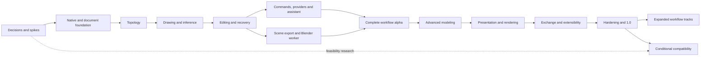

# Pull request roadmap

Status: M0–M6 gates passed; M7 presentation and rendering is in progress. Updated: 2026-10-06.

This is the execution breakdown of the [build plan](BUILD_PLAN.md),
[scope matrix](SCOPE.md), [UX design and mockups](UX_DESIGN.md), and
[AI contract](AI_MODELING.md). The docs planning PR is
[GitHub PR #1](https://github.com/zygote55/sketchyup/pull/1).
**R001 and subsequent IDs are roadmap identifiers, not existing GitHub PR numbers.**
Implementation evidence is linked below. Roadmap identifiers are never GitHub PR numbers; no milestone or released capability is implied by starting a row.

## How to execute this roadmap

1. Merge the planning documentation, then start R001. Carry the designer's source
   and mockups as the visual reference; implement the native application through
   the selected M0 architecture, not by promoting mockup HTML into the runtime.
2. Each entry is an intended review unit with scope, dependencies, work and
   acceptance evidence. Start its code branch from current `main`, or from an
   explicitly declared dependency branch while that prerequisite is under review.
   Never merge a dependent PR before its prerequisite.
3. In addition to listed dependencies, every M1–M9 entry requires the previous
   milestone gate to pass before it is accepted as delivered. Spikes and fixture
   work may overlap earlier. M10 entries require M9, then follow their individual
   dependencies; the optional tracks do not block unrelated ones.
4. Listed dependencies are the most relevant implementation inputs, not a demand
   to serialize unrelated work inside a milestone. Track names identify areas of
   ownership; actual people are assigned when opening a PR. These roles do not
   prescribe team size or create a staffing commitment.
5. Split an entry into `Rxxx.a`, `Rxxx.b`, etc. if it crosses an independently
   testable boundary or becomes too large to review. Record child dependencies,
   update scope coverage and keep the parent open until every required child
   passes. Investigation plus conditional implementation often needs this split.
6. Every runtime feature includes its command/query path, validation, applicable
   undo and persistence, and user-facing errors. A toolbar button, mock response,
   successful render or compiling stub does not close the underlying feature.
7. Use targeted checks for each change and attach native interaction evidence
   when needed. Do not defer basic usability, failure handling or geometry tests
   until M9; M9 broadens and revalidates evidence against the release candidate.
8. Track real PR URL, status, owner and fixture/evidence links as entries start.
   An unsupported compatibility investigation closes its research outcome only;
   its capability stays unsupported. Calendar estimates follow M0/M2/M5 evidence.

This roadmap contains 108 entries: 89 through the 1.0 gate and
19 for expanded workflows/conditional compatibility. All 73 scope rows
are covered in the [traceability table](#scope-to-pr-coverage).

## Active implementation slices

Planning and M0 implementation PRs [#1](https://github.com/zygote55/sketchyup/pull/1),
[#2](https://github.com/zygote55/sketchyup/pull/2), [#3](https://github.com/zygote55/sketchyup/pull/3),
[#4](https://github.com/zygote55/sketchyup/pull/4), [#5](https://github.com/zygote55/sketchyup/pull/5),
[#6](https://github.com/zygote55/sketchyup/pull/6), [#7](https://github.com/zygote55/sketchyup/pull/7),
and [#8](https://github.com/zygote55/sketchyup/pull/8) are merged in dependency order.
The [M0 gate record](verification/M0.md) identifies accepted evidence and the
implementation/platform boundaries carried into later milestones.

R007/R008 foundation work is merged in [PR #9](https://github.com/zygote55/sketchyup/pull/9): pinned Arch builds, scene transforms,
properties, revision persistence and original-schema migration. See
[foundation evidence](verification/R007-R008-foundation.md).
R009/R010/R013 are in merged [PR #10](https://github.com/zygote55/sketchyup/pull/10).
R011 incremental viewport work is merged in [PR #11](https://github.com/zygote55/sketchyup/pull/11).
R012 durable container work is merged in [PR #12](https://github.com/zygote55/sketchyup/pull/12).
R014 is merged in [PR #13](https://github.com/zygote55/sketchyup/pull/13).
The [M1 gate record](verification/M1.md) passes. R015 persistent topology is
merged in [PR #14](https://github.com/zygote55/sketchyup/pull/14); R016 is merged in
[PR #15](https://github.com/zygote55/sketchyup/pull/15). R017 tessellation/picking
associations are merged in [PR #16](https://github.com/zygote55/sketchyup/pull/16).
R018 erase/healing and scoped cleanup are merged in [PR #17](https://github.com/zygote55/sketchyup/pull/17).
R019 face push/pull and through openings are merged in [PR #18](https://github.com/zygote55/sketchyup/pull/18).
R020 is merged in [PR #19](https://github.com/zygote55/sketchyup/pull/19), and the [M2 gate](verification/M2.md) passes.
R021 tool lifecycle and camera interleaving are merged in [PR #20](https://github.com/zygote55/sketchyup/pull/20).
R022 numeric input and guarded operation revision are merged in [PR #21](https://github.com/zygote55/sketchyup/pull/21).
R023 plane-aware drawing tools merged in [PR #22](https://github.com/zygote55/sketchyup/pull/22).
R024 curve records and native tools merged in PRs #23–24.
R025 indexed inference and R026 direction constraints are merged in PRs #25–26.
R027 guide records and persistence merged in [PR #27](https://github.com/zygote55/sketchyup/pull/27); native tools merged in [PR #28](https://github.com/zygote55/sketchyup/pull/28). R028 selection merged in PRs #29–30. R029 navigation merged in [PR #31](https://github.com/zygote55/sketchyup/pull/31); the [M3 checkpoint](verification/M3.md) passes.

M4 transforms, copy arrays, groups, shared components, tags/Outliner, entity Info
and materials (R030–R036) are merged in PRs #32–48. Formline and complete M4
persistence are merged in [PR #49](https://github.com/zygote55/sketchyup/pull/49).
Recovery storage is merged in [PR #50](https://github.com/zygote55/sketchyup/pull/50);
native scheduling/selection is merged in [PR #51](https://github.com/zygote55/sketchyup/pull/51).
The labeled history API merged in [PR #52](https://github.com/zygote55/sketchyup/pull/52);
native History controls merged in [PR #53](https://github.com/zygote55/sketchyup/pull/53).
Document unit data/API/persistence merged in [PR #54](https://github.com/zygote55/sketchyup/pull/54); native preferences merged in [PR #55](https://github.com/zygote55/sketchyup/pull/55).
The integrated [M4 workflow](verification/M4.md) passed local and CI verification and merged in [PR #56](https://github.com/zygote55/sketchyup/pull/56). M4 and M5 are complete; the [M5 gate](verification/M5.md) records provider, assistant, MCP and room/window acceptance. The [M6 gate](verification/M6.md) is complete; M7 presentation and rendering is in progress.

Build/CLI/package scaffolding in these spikes is reusable by R007–R014, but does
not mark all M1 requirements delivered.

## Implementation clarifications for the supplied UX

The original mockup assets are reference illustrations. These clarifications are
requirements for the corresponding implementation PRs, including where a static
screen currently uses simplified wording.

| ID | Clarification | Required behavior |
| --- | --- | --- |
| C1 | Recovery claims | A full disk may also prevent journaling. Show the last verified recovery revision/time; say edits remain in memory when durability is unknown. Claim recovery protection only for verified durable data. |
| C2 | Lost commit response | Reconcile request/transaction ID against engine outcome before saying “Nothing was applied.” Distinguish pending, committed, aborted and unknown; retry with the same idempotency identity. |
| C3 | Explicit instance scope | “Only this instance” authorizes make-unique; report it and preserve siblings. Ask about definition scope only if the request is ambiguous or would affect additional instances. |
| C4 | Numeric re-entry | Replace the last eligible user operation as one undo item only while its amend token still matches the current content revision/context. Every successful revision increments content revision and invalidates staged AI previews; never undo an intervening edit to apply it. |
| C5 | Responsive layouts | Use logical pixels with unambiguous boundaries: width <800, 800≤width<1100, 1100≤width<1500, width≥1500. Verify at 640, 900, 1200 and 1600; hide/collapse job detail before Measurements. |
| C6 | Human-facing commands | Model operations share command handlers across UI/AI, but internal transaction/query plumbing need not appear as raw menu items. Expose public actions with labels, context, forms and shortcuts. |

Scope is still the full proposed inventory. These clarifications refine behavior;
they do not silently remove Core requirements. Original mockup screenshots are
not native runtime verification, and their sample entity counts are illustrative.

## Delivery gates and release checkpoints

Each gate includes every planned entry listed in its phase plus the exit criteria
in BUILD_PLAN.md. Keep an evidence record in `docs/verification/Mx.md` when the
phase actually completes: revision, PRs, fixtures, commands, platform versions,
manual outcomes, measured budgets and remaining issues. The M0 record exists; later gate records are added only after completion. A gate cannot pass with unresolved required acceptance failures.

| Gate | Planned PRs | Review focus | Release/checkpoint |
| --- | --- | --- | --- |
| M0 | [R001](#r001)–[R006](#r006) | Architecture, dependency/license decisions, native/geometry feasibility and UX contracts | Decision baseline; no product release |
| M1 | [R007](#r007)–[R014](#r014) | Native shell, command/document foundation, atomic save and installable development package | Internal native skeleton |
| M2 | [R015](#r015)–[R020](#r020) | Editable topology, face formation, holes, push/pull and invariant tests | Geometry checkpoint |
| M3 | [R021](#r021)–[R029](#r029) | Precise manual drawing, inference, selection and navigation | Manual drawing preview |
| M4 | [R030](#r030)–[R039](#r039) | Components, hierarchy, materials, persistence and recovery | Manual modeling preview |
| M5 | [R040](#r040)–[R051](#r051) | Real providers, staged AI, headless automation and optional Blender rendering | End-to-end room/window alpha |
| M6 | [R052](#r052)–[R060](#r060) | Advanced geometry, solids, repairs, hosted components and recipes | Advanced modeling alpha |
| M7 | [R061](#r061)–[R072](#r072) | Presentation, annotations, sections, rendering and scene handoff | Presentation alpha |
| M8 | [R073](#r073)–[R081](#r081) | Document/exchange formats, extensions, libraries and shipped AI instructions | Feature-complete Core beta candidate |
| M9 | [R082](#r082)–[R089](#r089) | All Core rows, platform/performance/provider/package evidence and no release-blocking defects | Native editor 1.0; ecosystem gaps disclosed |
| M10 | [R090](#r090)–[R108](#r108) | Separate Extended releases and conditional compatibility decisions | Expanded parity; no unsupported compatibility claims |

M5 deliberately uses inner/outer wall loops rather than requiring the M6 Offset
tool, and a supported recipe rather than the later generic hosted-component
system. The designer's mockup history is illustrative, not a dependency override.

## Dependency overview



Within a gate, use the explicit Requires links below. Geometry and desktop work
meet at typed commands; AI and Blender work meet at immutable snapshots. Passing
one path is not evidence that the other path works.

## Proposed PRs

The suggested PR title is the heading after each stable roadmap ID. Every entry
starts **Planned** and is updated as work begins. “Verify” is its minimum acceptance evidence; shared invariants
and the linked scope requirements apply even when not repeated in the entry.

### M0 — Decisions and feasibility

<a id="r001"></a>

#### R001 — Freeze the reference workflows and decision register

**Status:** Verified (M0 scope; see gate record). **Evidence:** [R001](verification/R001.md). **Track:** Planning. **Scope:** N01, D01, A01. **UX:** —.

**Requires:** Planning documentation; milestone gate rule above.

**Build:** Record the dated SketchUp reference version, native-only definition, scope baseline, fixture naming scheme, hardware inventory and ADR template. Select the application license and review proposed dependency licenses. Inventory prototype assets without importing the uncommitted application wholesale.

**Verify:** Each decision has an owner role and evidence requirement; reference workflows map to scope IDs; prototype fixture provenance and licensing are recorded. This is a planning gate, not a claim of compatibility.

<a id="r002"></a>

#### R002 — Prove the native viewport and desktop integration

**Status:** Verified (M0 scope; see gate record). **Evidence:** [native spike](verification/native-spike.md), [viewport follow-up](verification/R002-viewport.md). **Track:** Desktop. **Scope:** N01, N03, N04. **UX:** §2, §3, §7.

**Requires:** [R001](#r001); milestone gate rule above.

**Build:** Build an isolated C++/Qt Wayland spike with custom geometry, depth-correct edges, clipping, instancing, picking, dialogs and theme tokens. Exercise pointer capture and mixed display scale. Decide the viewport adapter implementation from measurements.

**Verify:** Attach a reproducible Arch/Omarchy run and timing report for 100k/1M triangle fixtures; picking remains aligned at 100%, 150% and 200%. Unmet requirements have a chosen alternative before M1.

<a id="r003"></a>

#### R003 — Choose topology representation and geometry algorithms

**Status:** Verified (M0 scope; see gate record). **Evidence:** [native spike](verification/native-spike.md). **Track:** Geometry. **Scope:** G01, G02, E01, E07, E09. **UX:** —.

**Requires:** [R001](#r001); milestone gate rule above.

**Build:** Compare surface adjacency representations and algorithm libraries on loose edges, non-manifold junctions, planar arrangements, holes, near-coplanar intersections and extrusion. Decide precision, tolerance, curve metadata and dependency boundaries.

**Verify:** Commit fixture inputs and measured outcomes, including rejected cases. The selected approach supports open surface editing and traceable face splits, rather than requiring every document to be a solid.

<a id="r004"></a>

#### R004 — Specify the document, persistence and command contracts

**Status:** Verified (M0 scope; see gate record). **Evidence:** [native spike](verification/native-spike.md). **Track:** Core. **Scope:** D01, D02, D03, D04, A01, X06. **UX:** —.

**Requires:** [R003](#r003); milestone gate rule above.

**Build:** Specify IDs, Z-up coordinates, local transforms, revisions, transaction outcomes, history, format manifest and recovery journal. Compare container/chunk encodings on representative files and select one with migration/version rules.

**Verify:** ADRs include worked split/merge ID maps, save interruption behavior, commit reconciliation and serialization examples. Define the initial memory budget and benchmark procedure; later changes require recorded rationale.

<a id="r005"></a>

#### R005 — Investigate Linux SKP and DWG feasibility early

**Status:** Verified (M0 scope; see gate record). **Evidence:** [native spike](verification/native-spike.md). **Track:** Interchange. **Scope:** C01, C05. **UX:** —.

**Requires:** [R001](#r001); milestone gate rule above.

**Build:** Inventory available APIs/libraries, version/platform support, distribution requirements and sample files for SKP and DWG. Produce a support-or-gap decision, with possible supported conversion paths clearly separated from native support.

**Verify:** Evidence identifies a viable Linux delivery path or an explicit unresolved blocker for each format. A negative result does not block the Core editor; it blocks the corresponding compatibility delivery PR.

<a id="r006"></a>

#### R006 — Reconcile interaction contracts and responsive designs

**Status:** Verified (M0 scope; see gate record). **Evidence:** [interaction contracts](decisions/0006-interaction-contracts.md). **Track:** Desktop. **Scope:** N03, N04, N05, D03, D04, A03, A04. **UX:** §3–§4, §6, §8, §10.

**Requires:** [R002](#r002), [R004](#r004); milestone gate rule above.

**Build:** Adopt the supplied design and resolve C1–C6 below: truthful recovery/commit states, instance scope, replace-last-operation semantics, logical-pixel breakpoints, and user-facing command metadata. Specify 640/900/1200/1600 layouts and keyboard/trackpad behavior.

**Verify:** State diagrams and acceptance scenarios cover save failure, post-commit timeout, intervening edits and direct-mode instance changes. Review a 640 px tile and a wide split Tray/Assistant mockup; preserved original screenshots remain labeled references.

### M1 — Native foundation

<a id="r007"></a>

#### R007 — Establish the native build and headless CI

**Status:** Verified (foundation scope). **Evidence:** [foundation](verification/R007-R008-foundation.md). **Track:** Core. **Scope:** N01, N02. **UX:** —.

**Requires:** [R002](#r002), [R003](#r003), [R004](#r004); milestone gate rule above.

**Build:** Create the CMake/C++ layout, core library and Qt application targets, formatting policy, dependency manifest and CI compile/test jobs. Keep the core executable without the Qt UI or optional integrations.

**Verify:** A clean checkout builds on the pinned Arch environment; a headless core smoke test runs without a display, network provider or Blender. Publish exact toolchain/package versions.

<a id="r008"></a>

#### R008 — Implement document identity, units and scene records

**Status:** Verified (foundation scope). **Evidence:** [foundation](verification/R007-R008-foundation.md). **Track:** Core. **Scope:** D01, D02, O06. **UX:** —.

**Requires:** [R007](#r007); milestone gate rule above.

**Build:** Add document/entity IDs, revision counters, local/world transforms, double-precision canonical units and extensible property records. Provide an empty-document and primitive fixture for subsequent services.

**Verify:** IDs and values round trip through in-memory records; mirrored/nested transform and meter/radian conversion fixtures pass; IDs cannot be reused for unrelated entities.

<a id="r009"></a>

#### R009 — Implement typed commands and atomic history

**Status:** Verified (foundation scope). **Evidence:** [command and shell foundation](verification/R009-R013-actions.md). **Track:** Core. **Scope:** D03, A01. **UX:** —.

**Requires:** [R008](#r008); milestone gate rule above.

**Build:** Add command/query registration, schemas, preconditions, staged change sets, atomic commit/abort and bounded undo/redo. Separate content revision from view/selection state. Reserve idempotency and public-action metadata.

**Verify:** Failed commands leave the authoritative document unchanged; undo/redo and redo-branch invalidation pass; history respects its allocation budget and commands cannot bypass validation.

<a id="r010"></a>

#### R010 — Build the responsive native window and theme system

**Status:** Verified (foundation scope). **Evidence:** [command and shell foundation](verification/R009-R013-actions.md). **Track:** Desktop. **Scope:** N01, N03, N04, N05. **UX:** §2–§3, §7, §10.

**Requires:** [R007](#r007), [R006](#r006); milestone gate rule above.

**Build:** Implement the in-window top bar, tool rail, viewport slot, Tray/Assistant containers and status/Measurements regions. Add light/dark/system tokens, logical-pixel sizing and region focus navigation; hide unimplemented controls.

**Verify:** 640/900/1200/1600 width checks preserve Measurements and useful viewport space; 150% scaling and F6 focus order work; no compositor configuration is changed.

<a id="r011"></a>

#### R011 — Connect the document to viewport caches and navigation

**Status:** In progress. **Evidence:** [incremental viewport](verification/R011-incremental-viewport.md). **Track:** Desktop. **Scope:** N01, G09. **UX:** §3.1, §4.1.

**Requires:** [R010](#r010), [R008](#r008); milestone gate rule above.

**Build:** Implement render cache invalidation, camera orbit/pan/zoom/fit, world axes, grid, scene bounds and entity picking IDs. Use snapshot updates and correct resource ownership.

**Verify:** Synthetic document changes update only affected caches; picking matches visible IDs and mirrored transforms; resize/suspend recovery does not leak graphics resources.

<a id="r012"></a>

#### R012 — Implement native save/load and truthful save state

**Status:** Verified (foundation scope). **Evidence:** [durable container and save](verification/R012-durable-save.md). **Track:** Core. **Scope:** D02, D04. **UX:** §6.1–§6.2.

**Requires:** [R009](#r009), [R010](#r010); milestone gate rule above.

**Build:** Serialize the initial native format with atomic replacement, validation, resource limits and explicit save snapshots. Add native Open/Save/Save as, dirty state and Save/Discard/Cancel on close.

**Verify:** Interrupted writes preserve the prior file; disk-full failures remain visible; edits after a save snapshot leave the document Edited. Recovery is never claimed before journal durability exists.

<a id="r013"></a>

#### R013 — Connect menus, shortcuts and palette to public actions

**Status:** Verified (foundation scope). **Evidence:** [command and shell foundation](verification/R009-R013-actions.md). **Track:** Desktop. **Scope:** N03, N05, A01. **UX:** §3.2, §4.2.

**Requires:** [R009](#r009), [R010](#r010), [R011](#r011); milestone gate rule above.

**Build:** Add user-facing labels, shortcuts, context/enablement and parameter forms to command metadata. Build menus and Ctrl+K search from those actions, plus scene/entity/recent-document search interfaces.

**Verify:** Every available modeling action has a discoverable route; low-level transaction plumbing is not dumped into the palette. Focused text inputs retain normal typing and conflicting shortcuts are detected.

<a id="r014"></a>

#### R014 — Package the native development application for Arch

**Status:** Verified (development package scope). **Evidence:** [Arch package acceptance](verification/R014-package.md). **Track:** Release. **Scope:** N02. **UX:** —.

**Requires:** [R007](#r007), [R010](#r010), [R012](#r012); milestone gate rule above.

**Build:** Add PKGBUILD, desktop entry, icon, MIME integration and standard data/config/cache paths. Document a clean build and local install workflow using the supported dependency set.

**Verify:** Build/install/launch/remove in a disposable Arch environment; opening a document from the launcher works. No user desktop files or preferences are deleted on uninstall.

### M2 — Editable topology

<a id="r015"></a>

#### R015 — Implement editable surface topology and entity mappings

**Status:** Verified (topology records and propagated edge splits). **Evidence:** [persistent topology](verification/R015-topology.md). **Track:** Geometry. **Scope:** G01, D02, D03. **UX:** —.

**Requires:** [R008](#r008), [R009](#r009); milestone gate rule above.

**Build:** Add vertex, edge, oriented loop and face records with adjacency and editing contexts. Support wire/open/non-manifold structures; expose created/deleted/modified IDs and split/merge mappings.

**Verify:** Adjacency invariants and randomized record edits pass; persistence/undo preserve connectivity; a split cannot silently reuse the old ID for an unrelated face.

<a id="r016"></a>

#### R016 — Form and split planar faces from intersecting edges

**Status:** Verified (bounded planar insertion). **Evidence:** [finite arrangements](verification/R016-planar-faces.md). **Track:** Geometry. **Scope:** G01, G02. **UX:** —.

**Requires:** [R015](#r015); milestone gate rule above.

**Build:** Implement coplanar edge insertion, intersection splitting, loop extraction, automatic face formation and holes inside the active context. Define overlap/coincidence behavior using the chosen tolerance policy.

**Verify:** Closed, nested, crossing, coincident and nearly planar fixtures give expected loops/faces; invalid outlines yield structured diagnostics with no partial commit.

<a id="r017"></a>

#### R017 — Tessellate faces with holes into viewport caches

**Status:** Verified (derived caches and picking API). **Evidence:** [topology viewport](verification/R017-topology-viewport.md). **Track:** Geometry. **Scope:** G01, P02. **UX:** —.

**Requires:** [R016](#r016), [R011](#r011); milestone gate rule above.

**Build:** Derive triangles, normals, face/edge picking associations and bounds from authoritative face loops. Preserve face identities independently of triangle order.

**Verify:** Concave and multi-hole fixtures show no filled holes or picking mismatch; cache rebuilds and orientation changes preserve original face records.

<a id="r018"></a>

#### R018 — Implement erase, face healing and local cleanup

**Status:** Verified (core and command APIs). **Evidence:** [erase/heal and cleanup](verification/R018-erase-heal.md). **Track:** Geometry. **Scope:** G02, D03. **UX:** —.

**Requires:** [R016](#r016), [R017](#r017); milestone gate rule above.

**Build:** Define face versus edge erase, healing by redrawing valid boundaries and controlled coincident-edge cleanup. Keep cleanup scoped and reversible.

**Verify:** Deletion/healing fixtures verify affected adjacency and untouched neighbors; noncoplanar redraw never fabricates a face; undo restores the exact prior topology.

<a id="r019"></a>

#### R019 — Implement face push/pull and through openings

**Status:** Verified (bounded sweeps, command preview and desktop numeric input). **Evidence:** [push/pull](verification/R019-push-pull.md). **Track:** Geometry. **Scope:** E01, G01. **UX:** —.

**Requires:** [R018](#r018); milestone gate rule above.

**Build:** Extrude selected planar faces with inner loops, create connecting side faces, and handle push-to-opposite-face openings. Return topology mappings and preview results through the command layer.

**Verify:** Boxes, concave profiles, holed faces and wall openings pass dimension/volume/boundary checks; invalid self-intersection rejects safely; undo and redo restore expected IDs.

<a id="r020"></a>

#### R020 — Establish the geometry regression and fuzzing gate

**Status:** Verified. **Evidence:** [geometry regression gate](verification/R020-geometry-gate.md). **Track:** Quality. **Scope:** D06, G01, G02, E01, E09. **UX:** —.

**Requires:** [R019](#r019); milestone gate rule above.

**Build:** Collect small/large-scale, degenerate, reversed and non-manifold fixtures; add invariant/property tests and edit-sequence fuzzing. Set a reproducible tolerance report and minimized-failure process.

**Verify:** Seeded runs reproduce failures; invalid input produces bounded diagnostics; M2 evidence demonstrates split/extrude/cut/save/reopen/undo without topology corruption.

### M3 — Drawing and inference

<a id="r021"></a>

#### R021 — Implement tool lifecycle and camera interleaving

**Status:** Verified. **Evidence:** [tool lifecycle](verification/R021-tool-lifecycle.md). **Track:** Desktop. **Scope:** N03, G03, E01. **UX:** §4.1–§4.2.

**Requires:** [R013](#r013), [R011](#r011), [R019](#r019); milestone gate rule above.

**Build:** Create Ready/Anchored/Preview/Committed interaction states, click and drag input, pointer capture, cancellation and temporary camera gestures. Connect initial line/push-pull tools to engine commands.

**Verify:** Escape never dirties a canceled operation; camera movement preserves an anchored tool; focus loss, pointer cancellation and rejection leave a usable state.

<a id="r022"></a>

#### R022 — Implement numeric entry and guarded operation revision

**Status:** Verified. **Evidence:** [numeric entry and amendment](verification/R022-numeric-amend.md). **Track:** Desktop. **Scope:** D01, D03, G10. **UX:** §4.2–§4.3.

**Requires:** [R021](#r021); milestone gate rule above.

**Build:** Parse explicit/implicit units, fractions, locale-aware separators, coordinates, angles and tool-specific syntax. Revise the most recent eligible operation atomically without crossing an intervening content edit.

**Verify:** Keyboard-only coordinates and 12'6", 3/4", comma-decimal and invalid inputs pass. Re-entry replaces one undo item but increments the content revision; manual/AI intervening edits invalidate the amend token.

<a id="r023"></a>

#### R023 — Ship line, freehand, rectangle and polygon tools

**Status:** Merged in [PR #22](https://github.com/zygote55/sketchyup/pull/22). **Evidence:** [drawing tools](verification/R023-drawing-tools.md). **Track:** Desktop. **Scope:** G03, G04. **UX:** §4.1–§4.4.

**Requires:** [R022](#r022), [R016](#r016); milestone gate rule above.

**Build:** Add chained and disconnected lines, sampled freehand, regular polygons, axis-aligned and rotated rectangles on explicit/hovered planes. Keep tool-specific parameters in shared commands.

**Verify:** Typed and pointer construction produce equivalent geometry; rotated-plane and cancel fixtures pass; closed outlines form the same engine faces as automation.

<a id="r024"></a>

#### R024 — Ship circles, arc variants and pie tools

**Status:** Merged in [PR #23](https://github.com/zygote55/sketchyup/pull/23) and [PR #24](https://github.com/zygote55/sketchyup/pull/24); both child slices passed CI. **Track:** Geometry. **Scope:** G05. **UX:** §4.2–§4.4.

**Requires:** [R023](#r023); milestone gate rule above.

**Build:** Add circle and center/two-point/three-point arc records, pie sectors and configurable segmentation. Preserve radius/angle metadata while deriving editable edges.

**Verify:** Radius, angle, tangent and segment-count fixtures pass across arbitrary planes; invalid constraints explain failure without changing committed geometry.

- **R024.a — Curve records, commands and persistence:** [PR #23](https://github.com/zygote55/sketchyup/pull/23), merged; [evidence](verification/R024a-curve-records.md). Analytic circle/arc/pie parameters, derived edge associations, undo, inspection and version-4 migration.
- **R024.b — Native circle, arc and pie interaction:** [PR #24](https://github.com/zygote55/sketchyup/pull/24), merged; [evidence](verification/R024b-native-curves.md). Pointer phases, configurable segmentation, typed radius/angle/bulge, amendment, cancellation and native fixtures. Requires R024.a.

<a id="r025"></a>

#### R025 — Implement point and surface inference

**Status:** Complete. PR #25 merged after both CI jobs passed. **Evidence:** [indexed inference](verification/R025-inference.md). **Track:** Geometry. **Scope:** G06. **UX:** §4.4.

**Requires:** [R024](#r024), [R011](#r011); milestone gate rule above.

**Build:** Add spatially indexed endpoint, midpoint, center, intersection, on-edge and on-face candidates. Rank nearby candidates and expose selectable alternatives with marker shape/text.

**Verify:** Fixed logical-pixel acquisition works across zoom and DPI; screen snapping never changes geometry tolerances; dense-scene inference stays within the benchmark budget.

<a id="r026"></a>

#### R026 — Implement directional inference and locks

**Status:** Merged in [PR #26](https://github.com/zygote55/sketchyup/pull/26); both CI jobs passed. **Evidence:** [direction constraints and locks](verification/R026-directional-inference.md). **Track:** Geometry. **Scope:** G06, G07. **UX:** §4.2, §4.4.

**Requires:** [R025](#r025); milestone gate rule above.

**Build:** Add axis, parallel, perpendicular and tangent constraints, reference-point arming, plane/direction locks and candidate cycling. Model lock state independently of camera movement.

**Verify:** Recorded input paths select expected constraints at multiple zooms; Shift/arrows release predictably and ambiguous candidates remain inspectable.

<a id="r027"></a>

#### R027 — Implement tape, protractor and guide geometry

**Status:** Merged in PRs #27–28; both CI jobs passed for each slice. **Evidence:** [native guides](verification/R027b-native-guides.md). **Track:** Desktop. **Scope:** G07, D01. **UX:** §4.3–§4.4.

**Requires:** [R026](#r026), [R022](#r022); milestone gate rule above.

**Build:** Add guide points/lines, distance/angle tools, offset guide creation and explicit guide cleanup. Keep guides distinct from model edges and save them with the document.

**Verify:** The 0.9 m sill guide can be constructed and reused without accidental face formation; unit conversion, lock and undo cases pass.

- **R027.a — Guide records, commands and persistence:** Merged in [PR #27](https://github.com/zygote55/sketchyup/pull/27); both CI jobs passed. Separate guide points/lines, offsets, angles, measurement queries, cleanup, undo and version-5 migration. [Evidence](verification/R027a-guide-records.md).
- **R027.b — Native tape, protractor and guide inference:** Merged in [PR #28](https://github.com/zygote55/sketchyup/pull/28); both CI jobs passed. Pointer/numeric construction, guide display and acquisition, measurement-only mode, cleanup UI and the measured sill fixture. [Evidence](verification/R027b-native-guides.md). Requires R027.a.

<a id="r028"></a>

#### R028 — Implement full geometry selection behavior

**Status:** Verified; shared selection and native interaction are merged. **Track:** Desktop. **Scope:** G08, N05. **UX:** §4.5–§4.6.

**Requires:** [R025](#r025), [R013](#r013); milestone gate rule above.

**Build:** Add hover feedback, additive/toggle selection, left/right window selection, connected geometry, hidden-geometry mode and accessible selection summaries. Disambiguate face/group double-click behavior by entity type.

**Verify:** Selection IDs match visual feedback under occlusion and mixed geometry; keyboard traversal works; selections never bypass locked or inactive contexts.

- **R028.a — Typed selection state and deletion:** Merged in [PR #29](https://github.com/zygote55/sketchyup/pull/29); both CI jobs passed. Shared eligibility, boundary/connected expansion, keyboard order, session isolation and atomic typed deletion. [Evidence](verification/R028a-selection-model.md).
- **R028.b — Native selection interaction:** Merged in [PR #30](https://github.com/zygote55/sketchyup/pull/30); both CI jobs passed. Hover, modifiers, window/crossing selection, click expansion, keyboard traversal, hidden geometry, feedback and Outliner integration. [Evidence](verification/R028b-native-selection.md). Requires R028.a.

<a id="r029"></a>

#### R029 — Complete drawing navigation and push/pull UX

**Status:** Verified. **Evidence:** [navigation and push/pull](verification/R029-navigation-push-pull.md), [M3 checkpoint](verification/M3.md). **Track:** Desktop. **Scope:** G09, E01, N03. **UX:** §3.1, §4.1–§4.4.

**Requires:** [R028](#r028), [R027](#r027), [R021](#r021); milestone gate rule above.

**Build:** Add perspective/orthographic presets, FOV control, trackpad navigation, explicit orbit/pan tools and push/pull typed/repeat-distance/new-face behavior. Finalize context-sensitive modifier hints.

**Verify:** Build a measured room on arbitrary planes without tool/camera conflicts; middle-button-free input is usable; repeated push/pull and standard-view picking remain correct.

### M4 — Editing and organization

<a id="r030"></a>

#### R030 — Implement precise move, rotate, scale and flip

**Status:** Complete. Core/X11 and the M4 Wayland retest pass. **Track:** Geometry. **Scope:** E02, D03. **UX:** §4.2–§4.3.

**Requires:** [R028](#r028), [R022](#r022), [R015](#r015); milestone gate rule above.

**Build:** Transform vertices/edges/faces with defined connected-geometry behavior, pivots and local/world frames. Add copy mode and negative-scale/flip handling with identity mapping.

**Verify:** Rotated/mirrored and connected-face fixtures pass; transformed topology validates; numerical and interactive paths agree and one gesture is one undo step.

- **R030.a — Scoped transform/copy core:** Merged in [PR #32](https://github.com/zygote55/sketchyup/pull/32); both CI jobs passed. [Evidence](verification/R030a-scoped-transforms.md). Shared vertices, pivots, local/world frames, reflection, typed copy mappings and atomic validation.
- **R030.b — Native move/rotate/scale/flip:** Merged in [PR #33](https://github.com/zygote55/sketchyup/pull/33); both CI jobs passed. The carried Wayland retest passed in the M4 gate. [Evidence](verification/R030b-native-transforms.md). Pointer/numeric tools, copy mode, selection feedback and one-gesture undo. Requires R030.a.

<a id="r031"></a>

#### R031 — Implement linear and radial copy arrays

**Status:** Merged in [PR #34](https://github.com/zygote55/sketchyup/pull/34); both CI jobs passed. **Evidence:** [copy arrays](verification/R031-copy-arrays.md). **Track:** Geometry. **Scope:** E03. **UX:** §4.3.

**Requires:** [R030](#r030); milestone gate rule above.

**Build:** Add count/spacing/equal-division arrays, rotation copies and repeat entry using xN and /N syntax. Explicitly define copy count versus total instance count.

**Verify:** Counts, transforms and spacing are exact; invalid/huge counts fail before allocation; repeating numeric entry obeys the guarded amend contract.

<a id="r032"></a>

#### R032 — Implement groups and nested editing contexts

**Status:** Complete; all three implementation layers merged with passing CI. **Track:** Core. **Scope:** O01, G08. **UX:** §4.6, §5.

**Requires:** [R030](#r030), [R012](#r012); milestone gate rule above.

**Build:** Add create/open/close/explode groups, locking/hiding and context-local geometry merging. Connect dimming and clickable breadcrumbs; validate reparented transforms.

**Verify:** Edits cannot merge into inactive groups; nested escape navigation and save/undo work; locked descendants cannot be mutated indirectly.

Implementation split:

- **R032.a — Group records and hierarchy operations:** Merged in [PR #35](https://github.com/zygote55/sketchyup/pull/35); both CI jobs passed. Persistent typed groups,
  sibling grouping, world-preserving reparent/explode, authoritative locks and
  v1–v5 migration. [Evidence](verification/R032a-group-records.md).
- **R032.b — Native grouped editing:** Merged in [PR #36](https://github.com/zygote55/sketchyup/pull/36); both CI jobs passed. Raw selection grouping, protected picking,
  scoped drawing/inference, dimming, open/close/escape and breadcrumbs. Requires R032.a. [Evidence](verification/R032b-native-groups.md).
- **R032.c — Context geometry consolidation:** Merged in [PR #37](https://github.com/zygote55/sketchyup/pull/37); both CI jobs passed. Merge separate raw records in one active context
  and combine promoted geometry on explode while preserving appearance and identities.
  Requires R032.b; completes the R032 gate. [Evidence](verification/R032c-context-consolidation.md).

<a id="r033"></a>

#### R033 — Implement component definitions and instances

**Status:** Records and shared operations merged in [PR #38](https://github.com/zygote55/sketchyup/pull/38) and [PR #39](https://github.com/zygote55/sketchyup/pull/39), both CI jobs passed for each. Native scope workflow merged in [PR #40](https://github.com/zygote55/sketchyup/pull/40), with both CI jobs and local core, sanitizer and native X11/Wayland checks passing. R033 is complete. **Track:** Core. **Scope:** O02, E03. **UX:** §4.6, §5.

**Requires:** [R032](#r032), [R031](#r031); milestone gate rule above.

**Build:** Add shared definitions, instance transforms, insertion/local axes, replacement and make-unique. Show shared-definition scope in the viewport banner and mutation preconditions.

**Verify:** Definition edits propagate to all instances; make-unique isolates exactly one; mirror/scale/nesting and cyclic-definition rejection pass with undo/persistence.

Implementation split: R033.a records, transactions and persistence; R033.b shared mutation, instance operations and public commands; R033.c native context workflow and scope feedback. Each child requires its predecessor; R033 remains open until all pass. [Record decision](decisions/0007-component-records.md). [Foundation evidence](verification/R033a-component-records.md). [Operation evidence](verification/R033b-component-operations.md). [Native evidence](verification/R033c-native-components.md).

<a id="r034"></a>

#### R034 — Implement Outliner, tags and hierarchy operations

**Status:** Completed. Tag records and persistence merged in [PR #41](https://github.com/zygote55/sketchyup/pull/41); native Outliner/tag controls merged in [PR #42](https://github.com/zygote55/sketchyup/pull/42). Both CI jobs passed for each PR. **Track:** Desktop. **Scope:** O04, N05. **UX:** §5, §10.

**Requires:** [R033](#r033), [R010](#r010); milestone gate rule above.

**Build:** Add searchable hierarchy, bidirectional selection, rename/hide/lock, tag folders and drag/keyboard reparenting. Keep tagging separate from geometry ownership.

**Verify:** Keyboard operations match pointer actions; world transforms survive reparenting; visibility changes preserve topology and scene ownership.

Implementation split: R034.a tag records, visibility, public commands and persistence; R034.b searchable Outliner, tag controls and pointer/keyboard hierarchy operations. Both child PRs passed. [Record decision](decisions/0008-tag-records.md). [Foundation evidence](verification/R034a-tag-records.md). [Native evidence](verification/R034b-native-organization.md).

<a id="r035"></a>

#### R035 — Implement Entity info and measured properties

**Status:** Completed. Core measurements and conservative solid validation merged in [PR #43](https://github.com/zygote55/sketchyup/pull/43); native Info and unit-aware editing merged in [PR #44](https://github.com/zygote55/sketchyup/pull/44). Both CI jobs passed for each PR. **Track:** Core. **Scope:** O06, D01. **UX:** §5.

**Requires:** [R034](#r034), [R015](#r015); milestone gate rule above.

**Build:** Expose names, bounds, position, dimensions, length and area with explicit frames; support validated editable fields. Classify solids before showing volume and prepare semantic attributes for recipes.

**Verify:** Unit-aware edits update geometry rather than display-only numbers; bounds and areas match rotated/mirrored fixtures; invalid solids do not show a fabricated volume.

Implementation split: R035.a core measurements, solid classification and public commands; R035.b native fields and unit-aware editing. [Frame/volume decision](decisions/0009-entity-measurements.md). [Foundation evidence](verification/R035a-entity-measurements.md). [Native evidence](verification/R035b-native-entity-info.md).

<a id="r036"></a>

#### R036 — Implement materials and managed asset storage

**Status:** Complete. Material records, independent front/back assignments, lineage and schema-10 persistence pass 33 development and 27 sanitizer suites. Managed assets and packaged manifests pass 35 development and 28 sanitizer suites. Front/back opacity rendering, swatches, local presets, paint/sample and resource controls pass native checks on X11/Weston at scales 1 and 2. All four layers are merged in PRs #45–48. **Track:** Core. **Scope:** P01, D02. **UX:** §5, §6.4.

**Requires:** [R033](#r033), [R012](#r012); milestone gate rule above.

**Build:** Add color/opacity and front/back assignments, an asset manifest, missing-asset records and local swatches. Wire paint/sample actions and preserve material ownership through component edits.

**Verify:** Assignments survive split/transform/undo/save; copied documents resolve packaged assets; missing assets are explicit and imported paths cannot escape the container.

Implementation split: R036.a material records, assignments, public commands and persistence; R036.b managed assets and container manifests; R036.c front/back opacity rendering and picking; R036.d native swatches, resources and paint/sample. [Material decision](decisions/0010-material-records.md). [Foundation evidence](verification/R036a-material-records.md). [Asset decision](decisions/0011-managed-assets.md). [Asset evidence](verification/R036b-managed-assets.md). [Rendering evidence](verification/R036c-material-rendering.md). [Native controls evidence](verification/R036d-native-materials.md).

<a id="r037"></a>

#### R037 — Persist complete hierarchy and prototype geometry

**Status:** Complete. PR #49 passed both Native build runs and merged. Formline conversion and the complete M4 golden fixture pass 37 development suites; cylinder solid regressions pass 28 sanitizer suites. Import/report/save checks pass X11 and Weston at scales 1 and 2. [Format decision](decisions/0014-formline-import.md). [Evidence](verification/R037-formline-persistence.md). **Track:** Interchange. **Scope:** D02, X01. **UX:** §6.4.

**Requires:** [R036](#r036), [R035](#r035); milestone gate rule above.

**Build:** Extend native save/load to all M4 records and import Formline v1 boxes/cylinders as editable native geometry. Preserve colors, names and visibility with an explicit right-handed Y-up to Z-up transform.

**Verify:** Golden fixtures verify position, winding, rotations, units and component identity after relocation/save/reopen; corrupt legacy data rejects without altering the source file.

<a id="r038"></a>

#### R038 — Implement durable recovery and recovery UI

**Status:** Merged in PRs #50–51. R038.a adds checksummed checkpoint/journal storage, immutable capture, verified-prefix recovery, process locks and fault injection; 38 development and 28 sanitizer suites pass. [Storage evidence](verification/R038a-recovery-storage.md). R038.b adds background scheduling, configurable intervals, native recovery selection and headless access; 40 development suites and native X11/Weston at scales 1 and 2 pass. [Native evidence](verification/R038b-native-recovery.md). [Storage decision](decisions/0015-recovery-storage.md). **Track:** Core. **Scope:** D04, D02. **UX:** §6.1–§6.3.

**Requires:** [R037](#r037); milestone gate rule above.

**Build:** Add checksummed journaling/checkpoints, retained explicit-save copies, configurable recovery intervals and recovery selection UI. Track the last durable revision separately from in-memory changes.

**Verify:** Forced termination, disk-full and interrupted journal fixtures preserve the last good data; the UI only claims recovery for verified revisions and handles unsaved documents correctly.

<a id="r039"></a>

#### R039 — Expose history and integrated M4 editing workflows

**Status:** Complete. PRs #52–56 passed CI and merged; the M4 gate passes. R039.a implements bounded labels/task metadata and guarded history navigation; 42 development and 29 sanitizer suites plus native regressions pass; R039.b adds native History navigation, labeled menus and focus handling. R039.c adds per-document units with schema 12, atomic edits and save/recovery preservation; R039.d adds first-run/default units and native input/readout integration. R039.e verifies the integrated room, shared/unique windows and killed-writer recovery on X11/Weston and actual Hyprland. Local and CI validation pass; all dependencies are merged. [M4 evidence](verification/M4.md). [Units decision](decisions/0018-document-units.md). [Units evidence](verification/R039c-document-units.md). [Native units evidence](verification/R039d-native-units.md). [History decision](decisions/0017-labeled-history.md). [API evidence](verification/R039a-labeled-history.md). [Native evidence](verification/R039b-native-history.md). **Track:** Desktop. **Scope:** D03, N03, O01, O02. **UX:** §4.2, §5–§6.

**Requires:** [R038](#r038), [R034](#r034); milestone gate rule above.

**Build:** Add labeled history navigation and task metadata, model-first keyboard focus, new-document units and close/recovery flows. Record an M4 room with two reusable window assemblies.

**Verify:** Undo/redo via menus, shortcuts and History agree; close/save cancellation preserves edits; the room and component fixtures survive recovery without losing identity.

### M5 — AI and rendering alpha

<a id="r040"></a>

#### R040 — Publish bounded document inspection and measurement tools

**Status:** Complete. Bounded inspection, retained snapshots and native view capture merged in PRs [#57](https://github.com/zygote55/sketchyup/pull/57), [#58](https://github.com/zygote55/sketchyup/pull/58) and [#59](https://github.com/zygote55/sketchyup/pull/59) after local and CI verification. [Bounded-query evidence](verification/R040a-bounded-inspection.md), [snapshot evidence](verification/R040b-inspection-snapshots.md), [desktop evidence](verification/R040c-desktop-inspection.md). **Track:** Automation. **Scope:** A01, A02. **UX:** —.

**Requires:** [R035](#r035), [R037](#r037); milestone gate rule above.

**Build:** Expose capability discovery, context-aware IDs, hierarchy/topology queries, pagination, semantic attributes, measurements, snapshots and view capture. Generate versioned schemas from the registry.

**Verify:** A headless client identifies and measures the selected window without full-model dumps; local/world frames and visibility are explicit; limits and unknown capabilities fail predictably.

<a id="r041"></a>

#### R041 — Implement staged previews and commit reconciliation

**Status:** Complete. Private staging, durable co-recorded outcomes, publication/reconciliation and incremental transaction dispatch merged in PRs [#60](https://github.com/zygote55/sketchyup/pull/60)–[#63](https://github.com/zygote55/sketchyup/pull/63) after local, sanitizer and CI checks passed. [Dispatch evidence](verification/R041d-transaction-dispatch.md), [coordinator evidence](verification/R041c-transaction-coordinator.md), [outcome evidence](verification/R041b-durable-outcomes.md), [private proposal evidence](verification/R041a-private-staging.md). **Track:** Automation. **Scope:** A03, D03. **UX:** §8.2–§8.3.

**Requires:** [R040](#r040), [R009](#r009), [R039](#r039); milestone gate rule above.

**Build:** Add private transactions, staged queries/diffs, previews, revision compare-and-swap, durable outcome lookup, idempotent retries and bounded staging lifetime. Support committed/aborted/pending/unknown outcomes.

**Verify:** Intervening edits reject stale commits; retry never duplicates a committed task; lost responses after commit reconcile to the original undo entry. Cancellation before/after commit has distinct truthful outcomes.

<a id="r042"></a>

#### R042 — Add the headless automation CLI and recipe runner

**Status:** Complete. Persistent headless sessions and versioned recipes merged in PRs [#64](https://github.com/zygote55/sketchyup/pull/64) and [#65](https://github.com/zygote55/sketchyup/pull/65) after all local, targeted sanitizer and both CI runs passed. Explicit model/save scope, bounded I/O and shared transaction/inspection dispatch are exercised by the installed recipe, which creates, saves, reopens and measures its model without a display or provider. [Recipe evidence](verification/R042b-transaction-recipes.md), [session evidence](verification/R042a-headless-session.md). **Track:** Automation. **Scope:** A06, A07. **UX:** —.

**Requires:** [R041](#r041); milestone gate rule above.

**Build:** Provide explicit document targeting, schema discovery, bounded structured input/output and transaction execution without UI. Use the same core library and errors as the desktop.

**Verify:** A deterministic recipe creates, saves, reopens and measures a model with no display/provider; invalid input and stale document state return nonzero structured failures.

<a id="r043"></a>

#### R043 — Expose the shared tools through local MCP

**Status:** Complete. Headless MCP [PR #66](https://github.com/zygote55/sketchyup/pull/66) and native inspection [PR #67](https://github.com/zygote55/sketchyup/pull/67) merged after local regression, sanitizer, installed executable and both CI runs passed. Native selection/camera inspection uses a private socket and stdio bridge; staged transactions are available in the headless binding. [Native evidence](verification/R043b-native-mcp.md), [protocol evidence](verification/R043a-local-mcp.md), [native contract](decisions/0029-native-mcp.md). **Track:** Automation. **Scope:** A06, A01. **UX:** —.

**Requires:** [R042](#r042); milestone gate rule above.

**Build:** Add stdio transport, explicit session/document selection and bounded event subscriptions. Expose only registered capabilities; keep file destinations and model access scoped.

**Verify:** A test client discovers tools, inspects selection and completes one transaction; disconnect cleans up uncommitted staging; no arbitrary filesystem or shell access is exposed.

<a id="r044"></a>

#### R044 — Implement assistant orchestration and a remote provider

**Status:** In progress. R044.a provider-neutral task orchestration is implemented over the real transaction/inspection engine, with scoped command authorization, preview-first Apply, bounded provider retries, cancellation and durable-outcome reconciliation. All 56 development suites and three targeted sanitizer suites pass. The engine merged in PR [#68](https://github.com/zygote55/sketchyup/pull/68) after both CI runs passed. The user explicitly selected **OpenAI** as the first remote provider. R044.b implements its bounded asynchronous Responses adapter and Linux Secret Service credential helper; protocol/credential fixtures pass against the real staging engine. Both CI runs passed and PR [#72](https://github.com/zygote55/sketchyup/pull/72) merged as `15ad1d6`. Native setup UI is implemented in R046.d; the user-connected ChatGPT-plan gpt-6-astra configuration now passes live measurement, room creation and resize workflows. Final subscription/acceptance CI and merges remain pending. [M5 evidence](verification/M5.md). [Adapter evidence](verification/R044b-openai-provider.md). [Engine evidence](verification/R044a-assistant-orchestration.md), [contract](decisions/0030-assistant-orchestration.md). **Track:** Automation. **Scope:** A04, A05, A08. **UX:** §8.2, §8.5.

**Requires:** [R041](#r041); milestone gate rule above.

**Build:** Build a provider-neutral tool loop with context selection, budgets, cancellation, retries and credential storage. Implement one explicitly chosen remote adapter and remote-context disclosure.

**Verify:** Provider fixtures cover tool/error translation, rate limits and timeouts; credentials are absent from documents/logs. A live recorded trial distinguishes tool execution from unsupported model claims.

<a id="r045"></a>

#### R045 — Implement and measure a local model configuration

**Status:** In progress. A bounded loopback Ollama adapter now shares the asynchronous lifecycle with OpenAI. Runtime/model capability checks, no-truncation controls and native-schema compatibility hints are implemented. All 61 development suites and both provider sanitizer suites pass. The corrected CPU corpus is recorded: all four live tasks hit the five-minute limit, with no measurement/modeling quality pass. The stopped-endpoint case and manual edit/save/reopen pass. This remains an experimental profile. Both CI runs passed and PR [#74](https://github.com/zygote55/sketchyup/pull/74) merged as `f7bb874`; the local quality failures remain disclosed. The implementation/measurement requirement is satisfied; the selected remote workflow supplies the live M5 modeling demonstration. [Evidence](verification/R045-local-provider.md), [contract](decisions/0036-local-provider.md). **Track:** Automation. **Scope:** A05. **UX:** §8.5.

**Requires:** [R044](#r044); milestone gate rule above.

**Build:** Add a local endpoint adapter and capability/hardware configuration. Reuse the same schemas and orchestration; record limits for images, context size and tool reliability.

**Verify:** Run the same initial task corpus locally; report model/version/hardware and failures. Manual modeling and saved documents remain available if the endpoint is stopped.

<a id="r046"></a>

#### R046 — Build the assistant panel and change preview UX

**Status:** In progress. R046.a binds the existing native document and selection to the durable assistant transaction engine, preserving prior history, one-entry Apply, stale-preview rejection, temporary locks and uncertain-outcome reconciliation. All 62 enabled development suites and four focused sanitizer suites pass. R046.b adds opt-in structured clarification with bounded host answers and matching provider replay; full development and focused sanitizer checks pass. R046.c adds the immutable hatched geometry overlay and measured bounds labels; X11/Wayland DPR 1/2, native Intel, viewport regression and sanitizer checks pass. R046.d adds native setup/consent, per-request permissions, task activity, clarification, preview/direct controls, responsive layouts and uncertain-outcome fencing. Local native and sanitizer acceptance passes; panel CI and the live M5 gate remain pending. Clarification and the overlay merged in PRs [#76](https://github.com/zygote55/sketchyup/pull/76) and [#77](https://github.com/zygote55/sketchyup/pull/77), respectively, after both CI runs passed. The panel is in PR [#78](https://github.com/zygote55/sketchyup/pull/78). R046.e adds the user-requested ChatGPT subscription connection: browser PKCE sign-in, verified identity, per-account OS session storage, rotation, model entitlement checks and completed-only streaming. Live ChatGPT sign-in and gpt-6-astra tool inference now pass; recorded authored-window preview/direct workflows pass. The manually authored component now passes through instance-only ordinary geometry edits; final CI/merges remain pending. [M5 evidence](verification/M5.md). [Live evidence](verification/R051b-live-acceptance.md). [Subscription evidence](verification/R046e-chatgpt-plan.md), [contract](decisions/0041-chatgpt-plan.md). The bridge merged in PR [#75](https://github.com/zygote55/sketchyup/pull/75) as `9be2d34` after both CI runs passed. [Panel evidence](verification/R046d-native-assistant-panel.md). [Preview evidence](verification/R046c-assistant-preview.md). [Clarification evidence](verification/R046b-assistant-clarification.md), [bridge evidence](verification/R046a-native-assistant-transactions.md), [contract](decisions/0037-native-assistant-transactions.md). **Track:** Desktop. **Scope:** A03, A04, N05. **UX:** §3.3, §8.

**Requires:** [R044](#r044), [R045](#r045), [R041](#r041), [R010](#r010); milestone gate rule above.

**Build:** Add provider/context chips, composer, plain-language activity, clarification cards, hatched diffs, Apply/Discard/Refine and direct-edit mode. Keep stable request/transaction identity through reconnects.

**Verify:** Preview and direct modes produce one undo entry; stale/unknown/failed/committed states display correctly. Keyboard operation and narrow/wide layouts pass with the native model still editable.

<a id="r047"></a>

#### R047 — Implement exact room and instance-only window recipes

**Status:** Complete. Exact room and instance-only window commands, bounded ordinary-command expansion and executable transaction recipes are implemented. All 57 development suites, both targeted sanitizer suites, installed recipes and an actual native Wayland open/render check pass. Both CI runs passed and PR [#69](https://github.com/zygote55/sketchyup/pull/69) merged as `ac57cdd`. [Evidence](verification/R047-room-window-recipes.md), [contract](decisions/0031-room-window-recipes.md). **Track:** Automation. **Scope:** A07, A08, O02. **UX:** §8.1–§8.4.

**Requires:** [R042](#r042), [R040](#r040), [R033](#r033), [R030](#r030); milestone gate rule above.

**Build:** Create executable recipes using existing face/transform operations and explicit opening/frame metadata. Build wall thickness with inner/outer loops so M5 does not depend on M6 Offset. Update a selected window and its opening without scaling frame thickness.

**Verify:** The M5 6×4 m room and 1.2→1.4 m window checks pass; center/sill/member thickness and sibling fingerprints remain unchanged. Make-unique follows explicit requested scope without redundant confirmation.

<a id="r048"></a>

#### R048 — Export immutable GLB snapshots for rendering

**Status:** Complete. Immutable GLB/manifest export, explicit camera/settings, hierarchy/shared meshes, managed asset embedding and bounded CLI publication are implemented. All 58 development suites, the exporter sanitizer suite, installed export checks, official Khronos validation and real Blender 5.2.1 imports pass. Both CI runs passed and the implementation merged. [Evidence](verification/R048-glb-snapshots.md), [subset contract](decisions/0032-glb-snapshots.md). **Track:** Interchange. **Scope:** X02, P08. **UX:** —.

**Requires:** [R036](#r036), [R040](#r040); milestone gate rule above.

**Build:** Export visible snapshot geometry, hierarchy, instances, simple materials and camera with unit/axis conversion and an ID/settings sidecar. Document the initial subset and unsupported features.

**Verify:** Known-size and mirrored-instance scenes import with matching dimensions/orientation; snapshot revision is stable while editing continues; packaged assets resolve without external source paths.

<a id="r049"></a>

#### R049 — Render a snapshot in an optional Blender worker

**Status:** Complete. The optional Blender 5.2 LTS worker, isolated job directories, explicit device selection, bounded cancellation/timeouts, one CPU retry and verified PNG publication are implemented. Lifecycle fixtures, targeted sanitizers and real CPU render/fallback/cancellation checks pass. The full development run also passes (59 passed, real-Blender opt-in skipped and tested separately). Both CI runs passed and the implementation merged. [Evidence](verification/R049-blender-worker.md), [contract](decisions/0033-blender-worker.md). **Track:** Rendering. **Scope:** P08. **UX:** —.

**Requires:** [R048](#r048); milestone gate rule above.

**Build:** Discover supported Blender versions and launch a controlled script/job directory to render a fixed Cycles preset. Add cancellation, timeouts, CPU fallback and a structured result manifest.

**Verify:** Absent Blender leaves editing usable; successful images report source revision/settings; failures and cancellation return actual outcomes and cannot mutate the document.

<a id="r050"></a>

#### R050 — Add Render setup, job progress and result tabs

**Status:** Complete. Native setup/device checks, current-camera capture, asynchronous preparation, job status/cancellation, result tabs, PNG saving and revision/session provenance are implemented. Actual Wayland rendering, X11/Wayland at DPR 1/2, native sanitizers, all 60 development suites, existing shell/inspection regressions and source-package/install checks pass. Both CI runs passed and PR [#73](https://github.com/zygote55/sketchyup/pull/73) merged as `c10a692`. [Evidence](verification/R050-native-render-ui.md), [contract](decisions/0035-native-render-ui.md). **Track:** Desktop. **Scope:** P08, N03. **UX:** §9.

**Requires:** [R049](#r049), [R010](#r010); milestone gate rule above.

**Build:** Add camera/resolution/device controls, optional setup, status chips, Stop/Cancel and an in-window result view with Save image and revision provenance. Basic progress is valid even before full M7 job management.

**Verify:** Modeling continues during rendering; absent executable, unsupported device, stale result and failed output have usable states. Success requires worker success and a verified output image.

<a id="r051"></a>

#### R051 — Validate and document the complete M5 alpha

**Status:** Complete. R051.a adds retained before/after room fixtures, an opt-in OpenAI/local corpus runner, a reproducible offline acceptance command, isolated native recordings and installed workflow instructions. R051.b verifies live ChatGPT-plan gpt-6-astra measurement, room creation and authored-window preview/direct→undo/redo→save/reopen→render. Initial resize corpus results are mixed; the manually authored component target is safely rejected because the recipe requires metadata. R051.c adds ordinary unique-instance edits and aligns draft lifetime with the remaining task budget. The manually authored target, native room creation and final repeated resize corpus now pass. M5 local live acceptance and both final CI runs pass; the stack is merged through [PR #82](https://github.com/zygote55/sketchyup/pull/82). [Gate record](verification/M5.md), [instance-edit evidence](verification/R051c-instance-edit.md). [Live evidence](verification/R051b-live-acceptance.md). [Procedure](M5_ACCEPTANCE.md), [preparation evidence](verification/R051a-alpha-acceptance.md). **Track:** Quality. **Scope:** A07, A08, P08, D04. **UX:** —.

**Requires:** [R046](#r046), [R047](#r047), [R043](#r043), [R050](#r050), [R038](#r038); milestone gate rule above.

**Build:** Turn the room/window demo into a reproducible manual, CLI and live-assistant acceptance suite. Include persisted fixtures, screen recordings, provider configuration and native package instructions.

**Verify:** Demonstrate draw/edit/AI/undo/save/reopen/render and all eight failure variants from the build plan, including post-commit response loss. Mock providers alone cannot close this gate.

### M6 — Advanced modeling

<a id="r052"></a>

#### R052 — Implement robust planar offset

**Status:** Verified; all three layers merged with passing CI. R052.a ([PR #83](https://github.com/zygote55/sketchyup/pull/83)) defines signed region offset, holes, splitting/collapse, bounded joins and precision using the existing Clipper2 dependency. [Contract](decisions/0043-planar-offset.md), [fixtures](verification/R052a-planar-offset.md). R052.b ([PR #84](https://github.com/zygote55/sketchyup/pull/84)) adds the shared boundary-insertion command, world/local distance, context/lineage preservation and preview/Undo/persistence tests ([evidence](verification/R052b-offset-command.md)); it depends on R052.a. R052.c ([PR #85](https://github.com/zygote55/sketchyup/pull/85)) adds native F/Offset controls, visible preview, numeric amendment and X11/Wayland interaction evidence ([native acceptance](verification/R052c-native-offset.md)); it depends on R052.b. R052.a, R052.b and native R052.c are merged. The M5 gate is accepted. **Track:** Geometry. **Scope:** E04. **UX:** §4, §11.

**Requires:** [R020](#r020), [R022](#r022); milestone gate rule above.

**Build:** Offset selected planar loops with holes and concavities; expose the same command to tool and AI clients. Define island removal and collapse behavior explicitly.

**Verify:** Convex/concave/holed and disappearing-region fixtures produce expected topology or actionable rejection; exact distance, previews and undo pass.

<a id="r053"></a>

#### R053 — Implement profile follow-me and sweep

**Status:** Verified. R053.a ([PR #86](https://github.com/zygote55/sketchyup/pull/86)) adds the immutable sweep kernel with defined frame transport, miter joins, cap/side/segment mappings and classified twist/intersection rejection. [Contract](decisions/0044-profile-sweep.md), [fixtures](verification/R053a-sweep-kernel.md). It depends on R052.c. R053.b ([PR #87](https://github.com/zygote55/sketchyup/pull/87)) adds the shared local/world command, preserved source selection, generated mappings, scoped instance edits and preview/Undo/persistence ([evidence](verification/R053b-sweep-command.md)); it depends on R053.a. R053.c ([PR #88](https://github.com/zygote55/sketchyup/pull/88)) adds native Follow Me (Shift+F), selected-path preview/Apply/cancel, retained profile/path selection and shared-component interaction ([native evidence](verification/R053c-native-sweep.md)); it depends on R053.b. All three layers are merged with passing exact-head CI and local acceptance. Closed holed profiles are explicitly unsupported pending multiple-shell validation. **Track:** Geometry. **Scope:** E05. **UX:** —.

**Requires:** [R052](#r052), [R024](#r024); milestone gate rule above.

**Build:** Sweep profiles along open/closed paths with defined frames and corner joins. Preserve source/profile selection and return generated face mappings.

**Verify:** Straight, curved and closed paths meet expected cross sections; twists/self-intersections are classified; cancel/undo restore the source geometry.

<a id="r054"></a>

#### R054 — Implement context-scoped geometry intersections

**Status:** Verified. R054.a ([PR #89](https://github.com/zygote55/sketchyup/pull/89)) adds immutable crossing/coplanar face intersection geometry, holes, contact edges, bounded normalization and precision rejection ([contract](decisions/0045-face-intersections.md), [fixtures](verification/R054a-face-intersections.md)). The branch follows R053.c in the review stack. R054.b ([PR #90](https://github.com/zygote55/sketchyup/pull/90)) adds selected/context/model reference modes, transformed target insertion, lineage and preview/Undo/persistence ([command evidence](verification/R054b-intersection-command.md)); it depends on R054.a. R054.c ([PR #91](https://github.com/zygote55/sketchyup/pull/91)) adds native Intersect (I), reference-scope controls, preview/Apply/cancel, descendant selection and component interaction ([native evidence](verification/R054c-native-intersections.md)); it depends on R054.b. All three layers are merged with passing exact-head CI and local display acceptance. **Track:** Geometry. **Scope:** E06. **UX:** —.

**Requires:** [R020](#r020), [R033](#r033); milestone gate rule above.

**Build:** Add selected/context/model intersection modes with broad-phase filtering and robust intersection insertion. Account for local transforms and group boundaries.

**Verify:** Coplanar and crossing fixtures create expected edges without merging unrelated contexts; mirrored/nested transforms and ID maps survive undo/save.

<a id="r055"></a>

#### R055 — Implement solid union, subtraction and intersection

**Status:** Verified. R055.a ([PR #92](https://github.com/zygote55/sketchyup/pull/92)) adds the immutable Manifold-backed adapter with native solid preconditions, polygon reconstruction, source-face provenance, bounded precision and disconnected outputs ([contract](decisions/0046-solid-booleans.md), [fixtures](verification/R055a-solid-booleans.md)); it depends on R054.c. R055.b ([PR #93](https://github.com/zygote55/sketchyup/pull/93)) adds the shared command with explicit operand retention, transformed placement, source material sides, generated provenance and scoped instance edits ([command evidence](verification/R055b-boolean-command.md)). R055.c ([PR #94](https://github.com/zygote55/sketchyup/pull/94)) adds native Solid Boolean (Shift+B), operation/retention controls, target/tool swap, visible preview, generated selection and X11/Wayland acceptance ([native evidence](verification/R055c-native-booleans.md)). All three layers and the following cavity/reflection fix in R056.b are merged with passing exact-head CI and local display acceptance. **Track:** Geometry. **Scope:** E07. **UX:** —.

**Requires:** [R054](#r054); milestone gate rule above.

**Build:** Classify solid prerequisites and route validated operands through the chosen boolean adapter. Preserve materials/provenance and defined operand consumption rules.

**Verify:** Disjoint, touching, overlapping and near-coplanar fixtures verify volumes and topology; invalid solids identify boundary defects before mutation.

<a id="r056"></a>

#### R056 — Complete trim, split and outer-shell tools

**Status:** Verified. R056.a ([PR #95](https://github.com/zygote55/sketchyup/pull/95)) adds bounded native shell containment, signed material-volume analysis and classified winding/contact rejection ([contract](decisions/0047-shell-containment.md), [evidence](verification/R056a-shell-containment.md)). It follows R055.c in the review stack. R056.b ([PR #96](https://github.com/zygote55/sketchyup/pull/96)) attaches cavity boundaries to material outputs, preserves provenance/materials, supports reused hollow operands and reports material volume ([cavity evidence](verification/R056b-cavity-booleans.md)). R056.c ([PR #97](https://github.com/zygote55/sketchyup/pull/97)) adds immutable Split regions and filled Outer Shell geometry with provenance and bounded containment ([contract](decisions/0048-split-outer-shell.md), [kernel evidence](verification/R056c-solid-operations.md)). R056.d ([PR #98](https://github.com/zygote55/sketchyup/pull/98)) adds shared Trim, Split and Outer Shell commands with explicit retention, region ownership, physical material sides and component-scoped receipts ([command evidence](verification/R056d-solid-commands.md)). R056.e ([PR #99](https://github.com/zygote55/sketchyup/pull/99)) adds native Solid tools (Shift+B), all six operation choices, clear Trim retention, selected result regions and shared-component workflows. Local X11/Wayland and sanitizer acceptance passes ([native evidence](verification/R056e-native-solid-tools.md)); All five R056 layers are merged with passing exact-head CI. **Track:** Geometry. **Scope:** E07. **UX:** —.

**Requires:** [R055](#r055); milestone gate rule above.

**Build:** Add remaining solid operations and UI/automation parameters, including explicit keep/delete-operand behavior and handling of multiple output solids.

**Verify:** Joinery and nested-shell fixtures distinguish trim/subtract/outer-shell semantics; resulting groups, materials and entity maps persist and undo correctly.

<a id="r057"></a>

#### R057 — Implement face orientation and edge display semantics

**Status:** Verified. R057.a ([PR #100](https://github.com/zygote55/sketchyup/pull/100)) adds bounded immutable face reversal and seed-based orientation, preserving native identities and rejecting non-manifold/conflicting connectivity ([contract](decisions/0049-face-orientation.md), [kernel evidence](verification/R057a-face-orientation.md)). R057.b ([PR #101](https://github.com/zygote55/sketchyup/pull/101)) adds shared Reverse/Orient commands with physical material-side preservation, component scope and preview/Undo/persistence ([command evidence](verification/R057b-orientation-commands.md)). R057.c ([PR #102](https://github.com/zygote55/sketchyup/pull/102)) adds native Face orientation (Shift+O), direction arrows, reference selection and physical-side framebuffer verification. Local X11/Wayland and sanitizer acceptance passes ([native evidence](verification/R057c-native-orientation.md)); R057.d ([PR #103](https://github.com/zygote55/sketchyup/pull/103)) adds paired GLB sides and a verified Cycles front/back shader transfer ([contract](decisions/0050-two-sided-export.md), [export evidence](verification/R057d-two-sided-export.md)). R057.e ([PR #104](https://github.com/zygote55/sketchyup/pull/104)) adds persistent edge flags, identity/lineage transfer, schema 13 and atomic conflict checks ([contract](decisions/0051-edge-appearance.md), [data evidence](verification/R057e-edge-appearance.md)). R057.f ([PR #105](https://github.com/zygote55/sketchyup/pull/105)) adds shared edge commands, component scope and inspection flags ([command evidence](verification/R057f-edge-commands.md)). R057.g ([PR #106](https://github.com/zygote55/sketchyup/pull/106)) adds shared smooth corner normals, viewport lighting and GLB/Cycles transfer ([contract](decisions/0052-smooth-shading.md), [shading evidence](verification/R057g-smooth-shading.md)). R057.h ([PR #107](https://github.com/zygote55/sketchyup/pull/107)) adds native edge actions, dashed hidden-geometry display and shared picking/inference policy ([native edge evidence](verification/R057h-native-edges.md)). All eight R057 layers are merged with passing exact-head CI. **Track:** Geometry. **Scope:** E08, P01. **UX:** —.

**Requires:** [R054](#r054), [R036](#r036); milestone gate rule above.

**Build:** Add reverse/orient faces, soften/smooth/hide/reveal edges and front/back material preservation. Keep topology separate from visual smoothing and tessellation.

**Verify:** Normals and material assignments agree in viewport/export after mirrored and connected edits; hidden geometry remains selectable through explicit modes.

<a id="r058"></a>

#### R058 — Build geometry diagnostics and explicit repair UI

**Status:** Verified. R058.a ([PR #108](https://github.com/zygote55/sketchyup/pull/108)) adds bounded read-only geometry findings, exact versus lower-bound counts, typed references and safe whole-shell reversal eligibility ([contract](decisions/0053-geometry-diagnostics.md), [kernel evidence](verification/R058a-geometry-diagnostics.md)). R058.b ([PR #109](https://github.com/zygote55/sketchyup/pull/109)) adds the guarded `geometry.diagnose` query to CLI, snapshots, MCP and assistant inspection, with a separate byte bound for deep reference paths ([inspection evidence](verification/R058b-diagnostic-inspection.md)). R058.c ([PR #110](https://github.com/zygote55/sketchyup/pull/110)) adds the shared native report sheet, selectable/framed references and guarded orientation previews with Undo ([native evidence](verification/R058c-native-diagnostics.md)). All three layers are merged with passing exact-head CI and local native acceptance. **Track:** Desktop. **Scope:** E09, D06. **UX:** §5, §6.4.

**Requires:** [R056](#r056), [R057](#r057); milestone gate rule above.

**Build:** Expose open/non-manifold/inverted/degenerate findings with bounded entity lists; add selectable/framed results and staged repair commands. Reuse report-sheet presentation.

**Verify:** Each finding identifies a fixture defect; repair is previewable/undoable and does not silently delete unrelated faces; enormous diagnostic output stays bounded.

<a id="r059"></a>

#### R059 — Implement face-aligned and opening-cutting components

**Status:** Verified. R059.a ([PR #111](https://github.com/zygote55/sketchyup/pull/111)) adds immutable face-aligned component placement with explicit glue frames, anchor containment and independent signed component scale on mirrored/sheared hosts ([contract](decisions/0054-hosted-components.md), [placement evidence](verification/R059a-component-placement.md)). R059.b ([PR #112](https://github.com/zygote55/sketchyup/pull/112)) adds bounded native through-wall cuts, first-exit selection, preserved host identities and explicit obstruction rejection ([opening evidence](verification/R059b-hosted-openings.md)). R059.c ([PR #113](https://github.com/zygote55/sketchyup/pull/113)) adds explicit canonical glue-face references, shared-edit/unique/axes behavior and schema 14 persistence; all 88 development suites, targeted sanitizers and native component regressions pass ([glue evidence](verification/R059c-component-glue.md)). R059.d ([PR #114](https://github.com/zygote55/sketchyup/pull/114)) adds immutable regeneration from one uncut surface, stable opening identities and preserved current appearance ([regeneration evidence](verification/R059d-host-regeneration.md)). R059.e ([PR #115](https://github.com/zygote55/sketchyup/pull/115)) adds persistent attachments, automatic move/resize/rehost/delete updates, bounded schema 15 records and durable Undo recovery; all 91 development suites, targeted sanitizers, installed CLI and native component regressions pass ([attachment evidence](verification/R059e-host-attachments.md)). R059.f ([PR #116](https://github.com/zygote55/sketchyup/pull/116)) adds five shared hosted-component commands, bounded discovery, metadata-aware previews and native assistant permissions/locks ([command evidence](verification/R059f-hosted-commands.md)). R059.g ([PR #117](https://github.com/zygote55/sketchyup/pull/117)) adds native glue authoring, face-placement previews, exact numeric amendment, signed transforms and bind/detach/bake controls ([native evidence](verification/R059g-native-hosted-placement.md)). R059.h ([PR #118](https://github.com/zygote55/sketchyup/pull/118)) implements attached copy/array relationships, complete assembly remapping and guarded numeric amendments ([copy evidence](verification/R059h-hosted-copy-arrays.md)); all 93 development suites, targeted sanitizers and the four native display variants pass. R059.i ([PR #119](https://github.com/zygote55/sketchyup/pull/119)) adds explicit validated room adoption through the shared command and native Edit action, preserving authored IDs/paint and enabling ordinary hosted movement, deletion and instance-only resize ([adoption evidence](verification/R059i-recipe-host-adoption.md)). All nine layers are merged with passing exact-head CI and the recorded local acceptance. **Track:** Geometry. **Scope:** O03, O02. **UX:** —.

**Requires:** [R056](#r056), [R033](#r033), [R047](#r047); milestone gate rule above.

**Build:** Promote explicit recipe host relationships into general placement behavior, gluing/alignment and opening updates on move/delete/definition changes. Support local/mirrored transforms.

**Verify:** Moving/replacing/deleting a hosted window updates the correct opening and restores its previous host; shared-definition changes preserve instance-specific placement.

<a id="r060"></a>

#### R060 — Complete solid metrics and advanced assembly recipes

**Status:** Verified; all seven layers merged with passing exact-head CI. R060.a ([PR #120](https://github.com/zygote55/sketchyup/pull/120)) implements bounded final-state `assert.measurement` postconditions using validated volume and existing frame-aware measurements ([contract](decisions/0055-geometric-assertions.md), [evidence](verification/R060a-geometric-assertions.md)); all 95 development suites, targeted sanitizers, native assistant and installed CLI checks pass. R060.b ([PR #121](https://github.com/zygote55/sketchyup/pull/121)) adds the editable gable roof with explicit pitch, overhang and vertical thickness, analytic completion assertions, native before/after fixtures and preserved adopted-room content ([contract](decisions/0056-gable-roof-recipe.md), [evidence](verification/R060b-roof-recipe.md)); all 96 development suites, targeted sanitizers, four native display variants and installed examples pass. R060.c ([PR #122](https://github.com/zygote55/sketchyup/pull/122)) adds a filled straight stair flight with explicit rise/run/count relationships, verified tread geometry, preserved scene records and editable native fixtures ([contract](decisions/0057-straight-stair-recipe.md), [evidence](verification/R060c-stair-recipe.md)); all 97 development suites, targeted sanitizers, four native display variants and installed recipes pass. R060.d ([PR #123](https://github.com/zygote55/sketchyup/pull/123)) adds tables with shared component legs and open cabinets with shared side/horizontal panels, measured member geometry, explicit clearances, ordinary instance-only edits and retained native fixtures ([contract](decisions/0058-furniture-recipes.md), [evidence](verification/R060d-furniture-recipes.md)); all 98 development suites, targeted sanitizers, four native display variants and installed examples pass. R060.e ([PR #124](https://github.com/zygote55/sketchyup/pull/124)) adds explicit unit/frame/yaw placement with preserved geometry, hosted assemblies and distant-coordinate model precision ([contract](decisions/0059-site-placement-recipe.md), [evidence](verification/R060e-site-placement.md)). R060.f ([PR #125](https://github.com/zygote55/sketchyup/pull/125)) fixes the viewport float-projection defect exposed by the near/far site comparison, with camera-relative GPU positions and consistent picking, clipping, inference and assistant previews ([contract](decisions/0060-camera-relative-rendering.md), [evidence](verification/R060f-viewport-precision.md)); all 99 development suites, native display variants and targeted sanitizers pass. R060.g ([PR #126](https://github.com/zygote55/sketchyup/pull/126)) adds the integrated half-lap joinery/study fixture, retained material/face mappings, native editing and live assembly/site trials ([procedure](M6_ACCEPTANCE.md), [gate evidence](verification/M6.md)). Integrated local acceptance passes, including 100 regression suites, native/sanitizer workflows, installed fixtures, real Blender and live ChatGPT-plan trials. The M6 gate is accepted after both exact-head CI runs passed and PR #126 merged in dependency order. **Track:** Automation. **Scope:** O06, A07, A08. **UX:** —.

**Requires:** [R058](#r058), [R059](#r059), [R053](#r053); milestone gate rule above.

**Build:** Expose validated solid volume and geometric assertions; add roof, stairs, table/cabinet and site-placement recipes using the now-available commands.

**Verify:** Expected rise/run/pitch/member dimensions and closed-volume assertions pass; unsupported geometry is reported; recipes preserve unrelated scene content and undo as one task.

### M7 — Presentation and rendering

<a id="r061"></a>

#### R061 — Implement texture mapping and material editing

**Status:** Verified; all seven layers merged with passing exact-head CI. R061.a ([PR #127](https://github.com/zygote55/sketchyup/pull/127)) prepares the affine UV kernel with explicit repeat size/rotation, three-pin projection and inverse-transpose preservation through reflected/sheared coordinate changes ([contract](decisions/0061-affine-texture-mapping.md), [evidence](verification/R061a-texture-mapping.md)). R061.b ([PR #128](https://github.com/zygote55/sketchyup/pull/128)) adds independent front/back face projections, geometry-lineage and affine-frame preservation, schema 16 persistence and managed-image relocation ([contract](decisions/0062-face-texture-records.md), [evidence](verification/R061b-face-textures.md)); all 102 development suites, 16 targeted sanitizer suites, 16 native checks and installed compatibility checks pass. R061.c ([PR #129](https://github.com/zygote55/sketchyup/pull/129)) prepares bounded static PNG/JPEG decoding, normalized image export bytes and linear repeat sampling ([contract](decisions/0063-texture-image-decoding.md), [evidence](verification/R061c-texture-images.md)). R061.d ([PR #130](https://github.com/zygote55/sketchyup/pull/130)) integrates embedded images, independent side UVs, opacity and bounded texture transfer into GLB and Blender ([contract](decisions/0064-textured-glb-export.md), [evidence](verification/R061d-textured-export.md)). R061.e ([PR #131](https://github.com/zygote55/sketchyup/pull/131)) adds textured native drawing, independent physical sides, alpha-aware CPU/GPU selection, bounded background decoding and context-owned OpenGL dispatch ([contract](decisions/0065-viewport-textures.md), [evidence](verification/R061e-viewport-textures.md)); all 105 regression suites, 32 native checks and targeted sanitizer/installed checks pass. R061.f ([PR #132](https://github.com/zygote55/sketchyup/pull/132)) adds explicit scoped planar, three-pin and affine authoring commands, reset, stored/effective face inspection and a packaged embedded-image example ([contract](decisions/0066-texture-authoring-commands.md), [evidence](verification/R061f-texture-commands.md)). R061.g ([PR #133](https://github.com/zygote55/sketchyup/pull/133)) adds native projection editing, explicit source/target sides and world/local coordinates, shear-preserving repeat size/rotation, unit-aware origins and atomic reset ([contract](decisions/0067-native-texture-editor.md)). All 106 regression suites, 16 native display checks and targeted sanitizer/installed checks pass ([evidence](verification/R061g-texture-editor.md)); R061 delivery and the M6 gate are accepted. **Track:** Desktop. **Scope:** P01. **UX:** §5, §7.

**Requires:** [R057](#r057), [R036](#r036); milestone gate rule above.

**Build:** Add image textures, UV position/scale/rotation and projected mapping, with undoable front/back assignments and missing-asset resolution. Extend import/export material data.

**Verify:** Textured and mirrored-face fixtures retain mapping after edits/save/relocation; source textures are packaged and transparency is represented consistently.

<a id="r062"></a>

#### R062 — Implement viewport styles and display controls

**Status:** In progress. R062.a ([PR #134](https://github.com/zygote55/sketchyup/pull/134), merged with passing exact-head CI) provides document-owned model styles, atomic history/snapshot semantics, schema 17 persistence and strict migration from historical textured files ([contract](decisions/0068-model-styles.md)). All 108 regression suites, 11 sanitizer suites, four native checks and 15 installed migration/export cases pass ([evidence](verification/R062a-model-styles.md)). R062.b ([PR #135](https://github.com/zygote55/sketchyup/pull/135)) adds all five native display modes, profiles, background/ground/grid/axes controls, shared style commands and inspection, and an undoable Styles panel ([contract](decisions/0069-native-model-styles.md)). All 109 regression suites, 44 native checks, targeted sanitizer suites and installed/schema checks pass ([evidence](verification/R062b-native-styles.md)). R062 delivery awaits dependency checks; the M6 gate is accepted. **Track:** Desktop. **Scope:** P02. **UX:** §5, §7.

**Requires:** [R057](#r057), [R011](#r011); milestone gate rule above.

**Build:** Add shaded/textured/monochrome/wireframe/X-ray display, profiles, background/ground controls and model-style persistence. Keep application theme distinct from document style.

**Verify:** Style switching preserves geometry and picking; dark/light UI and high-contrast selection remain legible; benchmark display settings are recorded.

<a id="r063"></a>

#### R063 — Implement named scenes and saved view state

**Status:** In progress. R063.a ([PR #136](https://github.com/zygote55/sketchyup/pull/136)) prepares immutable selective scene records, stable ordering, atomic Undo/Redo, missing-reference diagnostics and schema-18 persistence ([contract](decisions/0070-saved-scene-records.md)). All 111 regression suites and seven sanitizer suites pass; installed migration checks cover all 15 property combinations, retained missing references and exact uint64 IDs ([evidence](verification/R063a-saved-scenes.md)). R063.b ([PR #137](https://github.com/zygote55/sketchyup/pull/137)) adds six shared commands, three bounded queries, scene tabs and the Scenes panel, selective recall, native camera transitions and reduced motion ([contract](decisions/0071-scene-workflows.md)). All 112 regression suites, targeted sanitizers and installed/schema checks pass ([evidence](verification/R063b-scene-workflows.md)); delivery awaits dependency checks; the M6 gate is accepted. **Track:** Core. **Scope:** P03. **UX:** §3.1, §5.

**Requires:** [R062](#r062), [R034](#r034); milestone gate rule above.

**Build:** Persist selective camera, visibility, style and section-state snapshots with scene tabs, ordering and update semantics. Define which properties a scene controls.

**Verify:** Scene changes recall only opted-in state; deleted references are reported; keyboard selection, save/undo and component/tag changes do not corrupt scenes.

<a id="r064"></a>

#### R064 — Implement section planes and section visualization

**Status:** In progress. R064.a ([PR #138](https://github.com/zygote55/sketchyup/pull/138)) adds oriented half-space clipping, closed-contour fill with holes/islands, cut edges, exact multi-plane seams and source-triangle provenance ([contract](decisions/0072-section-geometry.md)). All 113 regression suites and the geometry sanitizer suite pass ([evidence](verification/R064a-section-geometry.md)). R064.b ([PR #139](https://github.com/zygote55/sketchyup/pull/139)) adds immutable context-scoped plane records, active-context state, atomic history, strict schema-19 persistence and retained missing contexts ([contract](decisions/0073-section-records.md)). All 115 regression suites, nine sanitizer suites, four native checks and five installed migration cases pass ([evidence](verification/R064b-section-records.md)). R064.c ([PR #140](https://github.com/zygote55/sketchyup/pull/140)) adds four shared section commands, three bounded inspection queries, strict local/world authoring and a packaged example ([contract](decisions/0074-section-commands.md)). All 116 regression suites, focused sanitizers, four native checks and installed/schema checks pass ([evidence](verification/R064c-section-workflows.md)). R064.d ([PR #141](https://github.com/zygote55/sketchyup/pull/141)) adds saved named-section activation, one-step undoable recall, missing/relocated section diagnostics and strict schema-20 persistence ([contract](decisions/0075-section-scenes.md)). All 116 regression suites, five sanitizer suites, four native sanitizer display variants and installed/schema checks pass ([evidence](verification/R064d-section-scenes.md)). R064.e ([PR #142](https://github.com/zygote55/sketchyup/pull/142)) adds native authoring, derived section drawing, cap-aware picking/inference and retained-geometry selection ([contract](decisions/0076-native-sections.md)). All 116 suites, 36 native display checks including eight sanitizer variants, and installed/package checks pass ([evidence](verification/R064e-native-sections.md)). R064.f ([PR #143](https://github.com/zygote55/sketchyup/pull/143)) adds scoped GLB/Blender surfaces and caps with separate provenance, retained side UVs/normals and explicit line-transfer losses ([contract](decisions/0077-section-export.md)). All 117 suites, focused sanitizers, eight native variants, actual Cycles/glTF and installed/package checks pass ([evidence](verification/R064f-section-export.md)). Implementation and local acceptance are complete; delivery awaits remote CI and dependency merges; the M6 gate is accepted. **Track:** Geometry. **Scope:** P04. **UX:** §5, §11.

**Requires:** [R063](#r063), [R054](#r054); milestone gate rule above.

**Build:** Add oriented/context-scoped planes, clipping, fill/edge generation and active plane state. Define picking and export behavior for clipped geometry.

**Verify:** Nested/mirrored and multi-plane fixtures yield correct clipped views and section edges; native geometry remains intact and section state persists.

<a id="r065"></a>

#### R065 — Implement associative dimensions and labels

**Status:** In progress. R065.a ([PR #144](https://github.com/zygote55/sketchyup/pull/144)) adds stable geometric anchors, topology-lineage remapping and explicit missing/ambiguous states ([contract](decisions/0078-annotation-anchors.md)). All 118 suites, the anchor sanitizer suite and installed/package checks pass ([evidence](verification/R065a-annotation-anchors.md)). R065.b ([PR #145](https://github.com/zygote55/sketchyup/pull/145)) adds immutable annotation records, atomic topology remapping, recovery and schema-21 persistence ([contract](decisions/0079-annotation-records.md)). All 120 suites, five sanitizer suites and native/installed/package checks pass ([evidence](verification/R065b-annotation-records.md)). R065.c ([PR #146](https://github.com/zygote55/sketchyup/pull/146)) adds shared annotation commands, explicit rebinding, bounded inspection, seven regenerated catalogs and a split-reference example ([contract](decisions/0080-annotation-workflows.md)). The 121-suite regression coverage, five sanitizer suites and native/installed/schema/package checks pass ([evidence](verification/R065c-annotation-workflows.md)). R065.d ([PR #147](https://github.com/zygote55/sketchyup/pull/147)) adds the native editor, live dimensions, leaders, labels and visible broken-reference markers ([contract](decisions/0081-native-annotations.md)). All 121 suites, 16 native normal/sanitized cases and installed/package checks pass ([evidence](verification/R065d-native-annotations.md)). Implementation and local acceptance are complete; delivery awaits remote CI and ordered dependency merges. **Track:** Geometry. **Scope:** P05. **UX:** —.

**Requires:** [R064](#r064), [R035](#r035); milestone gate rule above.

**Build:** Store geometric references for dimensions, leaders and labels; update measurements through topology maps and mark broken/ambiguous references visibly.

**Verify:** Moving/splitting/deleting referenced geometry updates or invalidates annotations correctly; units, scale and save/undo are covered by fixtures.

<a id="r066"></a>

#### R066 — Implement editable 3D text and font handling

**Status:** In progress. R066.a ([PR #148](https://github.com/zygote55/sketchyup/pull/148)) adds bounded local-font shaping, native planar/extruded glyph geometry and explicit font provenance ([contract](decisions/0082-shaped-text-geometry.md)). All 122 suites, the font geometry sanitizer suite and installed/package checks pass ([evidence](verification/R066a-shaped-text-geometry.md)). R066.b ([PR #149](https://github.com/zygote55/sketchyup/pull/149)) adds the bounded offscreen helper ([contract](decisions/0083-headless-text-worker.md)). All 123 suites, worker sanitizer coverage and installed/relocation/package checks pass ([evidence](verification/R066b-headless-text-worker.md)). R066.c ([PR #150](https://github.com/zygote55/sketchyup/pull/150)) adds schema-22 typed editable sources with cached geometry, history and recovery ([contract](decisions/0084-editable-text-persistence.md)). All 124 suites, nine sanitizer suites and native/installed/package checks pass ([evidence](verification/R066c-editable-text-persistence.md)). R066.d ([PR #151](https://github.com/zygote55/sketchyup/pull/151)) adds shared create/update/bake commands, bounded inspection and a native text-sign example ([contract](decisions/0085-editable-text-workflows.md)). All 125 suites, five sanitizer suites and schema/native/installed/package/Blender checks pass ([evidence](verification/R066d-editable-text-workflows.md)). R066.e ([PR #152](https://github.com/zygote55/sketchyup/pull/152)) adds the native editor, responsive private generation, cancellation and explicit font portability controls ([contract](decisions/0086-native-editable-text.md)). All 125 suites, eight native normal/sanitized cases and installed/package checks pass ([evidence](verification/R066e-native-editable-text.md)). Implementation and local acceptance are complete; delivery awaits remote CI and ordered dependency merges. **Track:** Geometry. **Scope:** P05. **UX:** —.

**Requires:** [R065](#r065), [R016](#r016); milestone gate rule above.

**Build:** Create text geometry from local fonts with editable source strings/settings and extrusion. Define missing-font substitution and portability reporting.

**Verify:** Glyphs with holes, Unicode and multiline fixtures form valid geometry; editing/reopening preserves source text or reports a missing font explicitly.

<a id="r067"></a>

#### R067 — Implement explicit location, sun and shadow controls

**Status:** Implementation and local acceptance complete; remote CI and ordered dependency merges pending. R067.a ([PR #153](https://github.com/zygote55/sketchyup/pull/153)) provides the deterministic offline solar algorithm and 239 NOAA reference fixtures. R067.b ([PR #154](https://github.com/zygote55/sketchyup/pull/154)) persists studies in schema 23, scenes, history/recovery and render snapshots. R067.c ([PR #155](https://github.com/zygote55/sketchyup/pull/155)) adds shared authoring, bounded inspection and the installed example. R067.d ([PR #156](https://github.com/zygote55/sketchyup/pull/156)) adds native sun controls, scene capture and camera-focused viewport shadows ([contract](decisions/0090-native-sun-and-shadows.md), [acceptance evidence](verification/R067d-native-sun-and-shadows.md)): all 128 suites, 24 native/sanitizer cases, four integration cases and installed/package checks pass. **Track:** Rendering. **Scope:** P06, P02. **UX:** §5, §11.

**Requires:** [R062](#r062), [R008](#r008); milestone gate rule above.

**Build:** Add offline latitude/longitude/date/time/time-zone inputs and deterministic sun direction. Persist settings independently of any online map service.

**Verify:** Reference time/location fixtures and daylight-boundary cases agree with the selected algorithm; scenes and render snapshots carry the settings.

<a id="r068"></a>

#### R068 — Import reference images and export raster views

**Status:** Implementation and local acceptance complete; remote CI and ordered merges pending. R068.a–b ([PR #157](https://github.com/zygote55/sketchyup/pull/157)) provides calibrated image dimensions, typed image entities, managed-asset persistence, schema-24 migration, atomic history/recovery and explicit surface-export losses ([contracts](decisions/0092-reference-image-records.md), [130-suite acceptance evidence](verification/R068ab-reference-records.md)). R068.c ([PR #158](https://github.com/zygote55/sketchyup/pull/158)) adds shared authoring, bounded inspection, strict catalogs and a relocatable calibration example ([131-suite acceptance evidence](verification/R068c-reference-workflows.md)). R068.d–e ([PR #159](https://github.com/zygote55/sketchyup/pull/159)) adds native image import/display/editing, component workflows, anchored calibration and exact-resolution PNG export ([131-suite, 16-case native/sanitizer and installed acceptance](verification/R068de-native-images-raster.md)). **Track:** Interchange. **Scope:** P07. **UX:** —.

**Requires:** [R061](#r061), [R062](#r062); milestone gate rule above.

**Build:** Add placed/scaled reference images with asset handling and exact-resolution raster view export. Distinguish image planes from modeled faces.

**Verify:** Calibration to a known length, opacity, clipping and relocated assets work; exported dimensions/pixel sizes match requested settings.

<a id="r069"></a>

#### R069 — Complete Blender material, camera and lighting conversion

**Status:** Implementation and local acceptance complete. R069.a–b carries immutable sun studies and bounded HDR environments into Blender, verifies applied lighting/transfer reports and exposes native HDR setup ([133-suite, native/sanitizer, actual-pixel and installed acceptance](verification/R069ab-blender-lighting.md)). R069.c adds explicit Eevee previews and renderer fingerprints, cross-engine pixel comparisons and native/installed acceptance ([evidence](verification/R069c-eevee-preview.md)). Remote CI and ordered merges remain. **Track:** Rendering. **Scope:** P08. **UX:** —.

**Requires:** [R061](#r061), [R064](#r064), [R067](#r067), [R049](#r049); milestone gate rule above.

**Build:** Map supported textures/PBR properties, orthographic/perspective cameras, sun/HDRI and section policy. Add Eevee preview presets, explicit GPU selection and version capability reporting.

**Verify:** Reference scenes compare normals, transparency, camera framing, instancing and color management with tolerant image checks; unsupported mappings appear in a transfer report.

<a id="r070"></a>

#### R070 — Implement full render job management

**Status:** Locally complete; remote CI and ordered merge pending. Durable jobs, bounded concurrent scheduling, recovery, retries and native Jobs controls pass [storage/queue acceptance](verification/R070ab-durable-render-queue.md) and [135-suite, native, sanitizer and installed acceptance](verification/R070c-native-render-jobs.md). **Track:** Rendering. **Scope:** P08. **UX:** §9.

**Requires:** [R069](#r069), [R050](#r050); milestone gate rule above.

**Build:** Add bounded queues, per-job logs/manifests, retries, cleanup and retained results. Show queued/running/canceling/failed/completed states and staleness against current revision.

**Verify:** Concurrent jobs and app/worker termination preserve documents and reconcile outputs; disk/resource failures never report successful renders; CPU fallback and cancel are exercised.

<a id="r071"></a>

#### R071 — Add Blender scene handoff

**Status:** Locally complete; remote CI and ordered merge pending. Packed one-way scene handoff and native launch pass [137-suite, sanitizer, installed and Blender 5.2.1/5.2.2 reopening acceptance](verification/R071ab-blender-handoff.md). **Track:** Rendering. **Scope:** P09. **UX:** §9.

**Requires:** [R069](#r069), [R070](#r070); milestone gate rule above.

**Build:** Save a transferable .blend scene and launch Blender with explicit assets/settings. Explain one-way handoff and the separate lossy import path.

**Verify:** Scene opens with camera and packaged assets on the supported Blender range; external edits never silently overwrite the native document.

<a id="r072"></a>

#### R072 — Complete walk navigation and scene animation

**Status:** In progress. Walk navigation, immutable capture and native frame export pass [143-suite, native, sanitizer, installed and integrated presentation acceptance](verification/R072d-animation-presentation.md). Local implementation is complete; remote CI and ordered merges remain. M7 acceptance is not yet claimed. **Track:** Desktop. **Scope:** G09, P03. **UX:** —.

**Requires:** [R063](#r063), [R070](#r070); milestone gate rule above.

**Build:** Add look-around/walk controls, scene transition timing and basic camera-animation export through immutable frame jobs. Respect reduced-motion settings in the UI.

**Verify:** Frame cameras and visibility match saved scenes; canceled animation preserves finished frames and document state; keyboard navigation and reduced motion work.

### M8 — Exchange and extensibility

<a id="r073"></a>

#### R073 — Stabilize the native format and migration tooling

**Status:** In progress. Public v24/container-v2 contract, strict inspection and safe migration pass [144-suite, native, sanitizer, installed and source-package acceptance](verification/R073-public-native-format.md). Local implementation is complete; remote CI and ordered merge remain. **Track:** Interchange. **Scope:** X06, D02. **UX:** —.

**Requires:** [R037](#r037), [R065](#r065), [R063](#r063); milestone gate rule above.

**Build:** Freeze the first public document schema, migrate all earlier fixtures on a copy, document assets/chunks and expose inspect/validate/migrate CLI commands.

**Verify:** Every supported old fixture upgrades and round trips; future/corrupt versions fail safely; original files remain unchanged and unknown required records are not silently dropped.

<a id="r074"></a>

#### R074 — Complete GLB/glTF import and exchange guarantees

**Status:** Locally complete across R074.a–c. Bounded package capture, native conversion and source-safe File-menu/CLI workflow pass [147-suite, sanitizer, Blender, eight-platform, installed and source-package acceptance](verification/R074c-native-gltf-workflow.md). Required remote CI and ordered merges remain delivery gates. **Track:** Interchange. **Scope:** X02. **UX:** §6.4.

**Requires:** [R048](#r048), [R061](#r061), [R073](#r073); milestone gate rule above.

**Build:** Import the supported mesh/hierarchy/camera/material subset and finalize export fidelity, sidecar handling, limits and per-feature loss reports.

**Verify:** Cross-application fixtures verify units, normals, mirrored instances and texture paths; animation/non-mesh limitations are enumerated rather than claimed lossless.

<a id="r075"></a>

#### R075 — Implement OBJ and MTL interchange

**Status:** Locally complete. R075.a–d pass [153-suite, independent Blender, sanitizer, eight-platform native, CLI, installed and source-package acceptance](verification/R075d-native-obj-workflow.md). Remote CI and ordered merges remain delivery gates. [Immutable catalog caching](verification/CI-PR172-schema-cache.md) retains the merged PR172 correction, with twelve passing normal/sanitizer checks at unchanged deadlines. **Track:** Interchange. **Scope:** X03. **UX:** —.

**Requires:** [R073](#r073), [R061](#r061); milestone gate rule above.

**Build:** Add bounded OBJ parsing/export, documented MTL/material subset, explicit units/axis options and asset packaging. Preserve editable groups where representable.

**Verify:** Concave faces, missing MTL/textures and oversized input produce correct geometry or explicit reports; source data never executes code.

<a id="r076"></a>

#### R076 — Implement binary and text STL interchange

**Status:** In progress. R076.a–c parsing, conversion and export pass [158-suite, independent Blender, sanitizer, native, installed and source-package checks](verification/R076c-bounded-stl-export.md). Native and CLI workflows follow in R076.d; remote CI and ordered merges remain delivery gates. **Track:** Interchange. **Scope:** X03. **UX:** —.

**Requires:** [R073](#r073), [R058](#r058); milestone gate rule above.

**Build:** Add both STL forms with explicit import/export units and configurable weld/repair choices. Report that hierarchy/materials are not carried.

**Verify:** Known-dimension fixtures, invalid counts/normals and open meshes pass bounded handling; repairs require explicit scope and are undoable.

<a id="r077"></a>

#### R077 — Implement the documented 2D DXF subset

**Status:** Planned. **Track:** Interchange. **Scope:** X04. **UX:** —.

**Requires:** [R024](#r024), [R073](#r073); milestone gate rule above.

**Build:** Import/export lines, supported polylines, arcs, layers and units with explicit supported entity/version lists. Keep unsupported CAD entities visible in reports.

**Verify:** Reference drawings preserve extents, arc angles and layer assignments; unsupported records are counted and never advertised as complete DWG compatibility.

<a id="r078"></a>

#### R078 — Export scaled orthographic PDF and SVG views

**Status:** Planned. **Track:** Interchange. **Scope:** P07. **UX:** —.

**Requires:** [R064](#r064), [R065](#r065), [R068](#r068); milestone gate rule above.

**Build:** Add vector/hidden-line view generation, raster fallback policy, page size and print scale. Reuse section/dimension data and image asset handling.

**Verify:** Known-length orthographic views measure correctly in exported units; occlusion, sections and annotations match expected output; any rasterized content is identified.

<a id="r079"></a>

#### R079 — Ship templates and the local component library

**Status:** Planned. **Track:** Desktop. **Scope:** D05, O05. **UX:** §5, §6.3.

**Requires:** [R033](#r033), [R036](#r036), [R073](#r073); milestone gate rule above.

**Build:** Add template defaults and component bundles with thumbnails, dependency assets, search and insertion. Define duplicate resource and missing-asset behavior.

**Verify:** New documents and placed components do not mutate source templates; relocated libraries work; bad bundles report bounded errors and keyboard selection is complete.

<a id="r080"></a>

#### R080 — Publish extension capabilities and lifecycle

**Status:** Planned. **Track:** Automation. **Scope:** X05, A01, A06. **UX:** §11.

**Requires:** [R043](#r043), [R073](#r073); milestone gate rule above.

**Build:** Version the public command/query API, extension manifest/capabilities and compatibility policy. Add install/enable/disable/error lifecycle for the selected isolation model and a sample extension.

**Verify:** The sample uses only public commands with atomic edits; incompatible/crashed extensions cannot bypass core validation or corrupt documents; document the trust/isolation limits.

<a id="r081"></a>

#### R081 — Ship generated tool reference and executable AI recipes

**Status:** Planned. **Track:** Automation. **Scope:** A07, A08, A06. **UX:** —.

**Requires:** [R060](#r060), [R080](#r080); milestone gate rule above.

**Build:** Generate schemas/reference docs from the registry, package the agent guide and examples, and run all recipes against the supported engine/API version. Add discovery of optional capabilities.

**Verify:** Room/window/roof/stairs/furniture/site/material examples execute and assert geometry; schema drift fails CI; unavailable operations produce documented alternatives.

### M9 — Release hardening and 1.0

<a id="r082"></a>

#### R082 — Meet viewport, inference and memory budgets

**Status:** Planned. **Track:** Quality. **Scope:** D06, N01. **UX:** —.

**Requires:** [R081](#r081), [R072](#r072); milestone gate rule above.

**Build:** Profile and optimize incremental meshes, spatial indexing, instancing, selection and history against fixed benchmark fixtures. Preserve public behavior and record cache/history memory separately.

**Verify:** Reference integrated/discrete hardware reports meet frozen frame/picking/edit budgets; long edit/undo sessions do not grow without bound. Any budget revision has explicit rationale.

<a id="r083"></a>

#### R083 — Harden files, recovery and transaction failure paths

**Status:** Planned. **Track:** Quality. **Scope:** D02, D03, D04, D06, X06. **UX:** —.

**Requires:** [R073](#r073), [R038](#r038), [R041](#r041), [R074](#r074), [R075](#r075), [R076](#r076), [R077](#r077); milestone gate rule above.

**Build:** Fuzz parsers and edit sequences; exercise disk exhaustion, malformed archives, path traversal, resource limits, journal corruption and interrupted commit/save combinations.

**Verify:** Minimized failures become regressions; no known data-loss bug remains; unknown commit outcomes reconcile safely and original files survive migration failures.

<a id="r084"></a>

#### R084 — Complete keyboard access and preference migration

**Status:** Planned. **Track:** Desktop. **Scope:** N03, N05. **UX:** §3–§4, §10.

**Requires:** [R046](#r046), [R079](#r079), [R080](#r080); milestone gate rule above.

**Build:** Audit focus/labels/contrast/text scale, keyboard modeling, Outliner access and shortcut editing. Add conflict resolution, navigation preferences, reduced motion and migration of saved settings.

**Verify:** Complete representative tasks without a mouse; verify contrast and screen-reader alternatives; old preferences migrate without losing user bindings.

<a id="r085"></a>

#### R085 — Validate native Wayland and supported hardware

**Status:** Planned. **Track:** Quality. **Scope:** N01, N03, N04. **UX:** §2–§3, §10.

**Requires:** [R082](#r082), [R084](#r084); milestone gate rule above.

**Build:** Run primary Omarchy/Hyprland, Qt X11 fallback, supported GPU/driver configurations, mixed DPI, multi-monitor moves, suspend/resume and input methods. Fix platform-specific regressions.

**Verify:** Publish tested versions, recordings and known unsupported configurations; 640 px and wide layouts preserve actions/Measurements at fractional scaling.

<a id="r086"></a>

#### R086 — Gate AI release on live provider evaluations

**Status:** Planned. **Track:** Quality. **Scope:** A04, A05, A08. **UX:** —.

**Requires:** [R081](#r081), [R046](#r046), [R083](#r083); milestone gate rule above.

**Build:** Freeze the task corpus and minimum per-class success rates, then run repeated live remote/local evaluations with model/configuration/cost/latency records and malicious metadata cases.

**Verify:** Supported configurations meet declared thresholds; wrong-target mutations, false completion and unreported partial commits are release blockers; offline/manual behavior remains usable.

<a id="r087"></a>

#### R087 — Validate Arch release packages and upgrades

**Status:** Planned. **Track:** Release. **Scope:** N02, D02. **UX:** —.

**Requires:** [R085](#r085), [R083](#r083), [R071](#r071); milestone gate rule above.

**Build:** Finalize PKGBUILD/release automation, checksums/notices, current/reference Arch compatibility, optional dependencies and upgrade/remove behavior. Document optional AUR distribution steps.

**Verify:** Clean machines install and open migrated documents; prior-release preferences remain intact; launch has no mandatory provider/Blender/network dependency.

<a id="r088"></a>

#### R088 — Publish user workflows, support matrix and parity report

**Status:** Planned. **Track:** Planning. **Scope:** A07, X05, N05. **UX:** —.

**Requires:** [R086](#r086), [R087](#r087), [R078](#r078); milestone gate rule above.

**Build:** Write user/help/troubleshooting docs and release notes from verified behavior; attach scope evidence and remaining compatibility gaps. Record actual API/format/provider/Blender versions.

**Verify:** Documented workflows run on the release candidate; no screenshot, stub or untested package is counted as delivered; every Core row links to passing evidence.

<a id="r089"></a>

#### R089 — Close the 1.0 release gate and publish artifacts

**Status:** Planned. **Track:** Release. **Scope:** N02, D06, A08. **UX:** —.

**Requires:** [R088](#r088); milestone gate rule above.

**Build:** Audit all M0–M9 gates, unresolved defects, artifact manifests and rollback/upgrade notes. Create the tagged native editor release through the established release workflow.

**Verify:** All 59 Core scope rows pass as a whole, with no known critical security/data-loss defect. Publish tested artifacts and clear Extended/Investigate gaps; do not claim full ecosystem parity.

### M10 — Expanded parity and conditional work

<a id="r090"></a>

#### R090 — Add documentation-sheet records and linked views

**Status:** Planned. **Track:** Core. **Scope:** F01. **UX:** —.

**Requires:** [R089](#r089), [R078](#r078); milestone gate rule above.

**Build:** Create a separate sheet/document model for pages, scales, view references and update tracking. Preserve links to specific model scenes and expose stale/broken reference states.

**Verify:** Page and view records round trip; changing model geometry updates or marks linked views stale without changing declared scale.

<a id="r091"></a>

#### R091 — Build sheet layout, annotations and title blocks

**Status:** Planned. **Track:** Desktop. **Scope:** F01. **UX:** —.

**Requires:** [R090](#r090); milestone gate rule above.

**Build:** Add multi-page layout tools, alignment/snapping, title blocks, dimensions and annotations with keyboard access and undo.

**Verify:** A small drawing set can be laid out and revised; referenced dimensions update and page editing never modifies source model geometry.

<a id="r092"></a>

#### R092 — Export and print coordinated documentation sets

**Status:** Planned. **Track:** Interchange. **Scope:** F01. **UX:** —.

**Requires:** [R091](#r091); milestone gate rule above.

**Build:** Add batch PDF/print output with view scales, fonts/assets and model-update reconciliation reports.

**Verify:** Measured scale, page count, clipping and annotation fixtures match output; missing fonts/references are reported before publishing.

<a id="r093"></a>

#### R093 — Implement constrained component parameters

**Status:** Planned. **Track:** Core. **Scope:** F02. **UX:** —.

**Requires:** [R089](#r089), [R033](#r033); milestone gate rule above.

**Build:** Specify a bounded expression language, dependency graph, typed units and parameter schema. Keep formulas non-executable and detect cycles/resource abuse.

**Verify:** Changing width drives dependent geometry deterministically; invalid/cyclic formulas cannot partially commit or execute host code.

<a id="r094"></a>

#### R094 — Ship configurable component authoring and assemblies

**Status:** Planned. **Track:** Desktop. **Scope:** F02. **UX:** —.

**Requires:** [R093](#r093), [R059](#r059); milestone gate rule above.

**Build:** Add parameter inspector, definition authoring, regeneration previews and reusable architectural/furniture assemblies.

**Verify:** Instance overrides and shared defaults behave predictably; regeneration preserves edit scope/materials and warns about incompatible manual changes.

<a id="r095"></a>

#### R095 — Import contours and create terrain surfaces

**Status:** Planned. **Track:** Geometry. **Scope:** F03. **UX:** —.

**Requires:** [R089](#r089), [R054](#r054); milestone gate rule above.

**Build:** Add contour/elevation ingestion, terrain triangulation and georeferenced local origins with explicit coordinate conversion.

**Verify:** Terrain fixtures preserve elevations and units; far-from-origin data stays precise and invalid contours generate bounded reports.

<a id="r096"></a>

#### R096 — Implement terrain editing, drape and stamp

**Status:** Planned. **Track:** Geometry. **Scope:** F03. **UX:** —.

**Requires:** [R095](#r095); milestone gate rule above.

**Build:** Add scoped sculpt/smooth, contour edit, projection/drape and building-pad stamp operations with reversible previews.

**Verify:** Contours and pad heights remain consistent; editing a local region preserves distant terrain and supports undo/save.

<a id="r097"></a>

#### R097 — Deliver a documented IFC exchange subset

**Status:** Planned. **Track:** Interchange. **Scope:** F04. **UX:** —.

**Requires:** [R089](#r089), [R074](#r074); milestone gate rule above.

**Build:** Select an IFC library/schema subset with distribution review; map supported hierarchy, properties and geometry with a fidelity report. Limit claims to demonstrated import/export directions.

**Verify:** Named fixtures preserve claimed units, hierarchy and properties; unsupported entities are reported, and converted geometry remains inspectable.

<a id="r098"></a>

#### R098 — Deliver a documented STEP exchange subset

**Status:** Planned. **Track:** Interchange. **Scope:** F04. **UX:** —.

**Requires:** [R089](#r089), [R073](#r073); milestone gate rule above.

**Build:** Select a STEP adapter and define tessellation/solid conversion policy, units and supported directions; explain loss of parametric/NURBS editability.

**Verify:** Known solids meet dimensional/tessellation error tolerances; invalid or unsupported surfaces are reported without silently changing scale.

<a id="r099"></a>

#### R099 — Add camera paths and batch presentation output

**Status:** Planned. **Track:** Rendering. **Scope:** F05. **UX:** —.

**Requires:** [R089](#r089), [R072](#r072), [R070](#r070); milestone gate rule above.

**Build:** Add named camera paths, easing/timing and repeatable batch output across scenes/render presets. Retain immutable snapshot provenance.

**Verify:** Frame count/timing and camera poses match fixtures; cancellation/retry handles partial output without replacing unrelated jobs.

<a id="r100"></a>

#### R100 — Add custom styles and richer asset authoring

**Status:** Planned. **Track:** Desktop. **Scope:** F06. **UX:** —.

**Requires:** [R089](#r089), [R062](#r062), [R079](#r079); milestone gate rule above.

**Build:** Add packaged edge styles, expanded material presets and authored asset catalogs with dependencies and distribution metadata.

**Verify:** A style/catalog relocates cleanly, preserves appearance and reports missing dependencies; assets are never substituted silently.

<a id="r101"></a>

#### R101 — Add quantities, reports and schedules

**Status:** Planned. **Track:** Automation. **Scope:** F07. **UX:** —.

**Requires:** [R089](#r089), [R060](#r060); milestone gate rule above.

**Build:** Build configurable component/material counts, areas/volumes and CSV/tabular reports from document semantics. Include units, filters and source revision.

**Verify:** Shared components, hidden content and nested transforms follow explicit counting rules; geometry edits update totals and invalid solids are not counted as known volumes.

<a id="r102"></a>

#### R102 — Deliver SKP support only after feasibility passes

**Status:** Planned; delivery conditional on feasibility. **Track:** Interchange. **Scope:** C01. **UX:** —.

**Requires:** [R089](#r089), [R005](#r005); milestone gate rule above.

**Build:** If the early investigation passes, implement the agreed reader/writer directions and version subset with preserved geometry/hierarchy/materials where supported. Otherwise publish the blocker and supported conversion workflow.

**Verify:** The tested file/version matrix and per-feature losses substantiate every compatibility claim; an investigation or converter alone cannot mark native read/write supported.

<a id="r103"></a>

#### R103 — Investigate and conditionally implement Ruby extension compatibility

**Status:** Planned; delivery conditional on feasibility. **Track:** Automation. **Scope:** C02. **UX:** —.

**Requires:** [R089](#r089), [R080](#r080); milestone gate rule above.

**Build:** Inventory target extensions and required runtime/APIs; publish feasibility and isolation design first. If viable, add an explicitly bounded compatibility layer with representative extension fixtures.

**Verify:** Each supported extension runs its documented workflows without bypassing transactions; unsupported APIs are explicit. A new native extension API is not evidence of Ruby compatibility.

<a id="r104"></a>

#### R104 — Investigate Dynamic and Live Component interoperability

**Status:** Planned; delivery conditional on feasibility. **Track:** Interchange. **Scope:** C03. **UX:** —.

**Requires:** [R094](#r094), [R102](#r102); milestone gate rule above.

**Build:** Research stored formats, formula semantics and service dependencies separately. Implement only evidenced subsets, or document remaining gaps against native configurable assemblies.

**Verify:** Representative source assets retain claimed parameter/update behavior; offline and service-dependent cases are distinguished and no proprietary service is assumed available.

<a id="r105"></a>

#### R105 — Investigate supported hosted asset access

**Status:** Planned; delivery conditional on feasibility. **Track:** Interchange. **Scope:** C04. **UX:** —.

**Requires:** [R089](#r089), [R079](#r079); milestone gate rule above.

**Build:** Confirm supported access/authentication, asset permissions, distribution and cache behavior before adding a hosted catalog adapter. Keep the local library independent.

**Verify:** If viable, exercise sign-in, denied access, import losses and offline cache; otherwise document supported user-mediated downloads without claiming service integration.

<a id="r106"></a>

#### R106 — Deliver DWG support only after feasibility passes

**Status:** Planned; delivery conditional on feasibility. **Track:** Interchange. **Scope:** C05. **UX:** —.

**Requires:** [R089](#r089), [R005](#r005), [R077](#r077); milestone gate rule above.

**Build:** Implement only the agreed library, versions and import/export subset after a supported Linux distribution path exists. Preserve the distinct DXF feature report.

**Verify:** Known drawings verify units, supported entities and layers; unsupported records are reported and tests distinguish DWG support from a DXF conversion workaround.

<a id="r107"></a>

#### R107 — Investigate and conditionally add maps/geolocation services

**Status:** Planned; delivery conditional on feasibility. **Track:** Interchange. **Scope:** C06. **UX:** —.

**Requires:** [R089](#r089), [R067](#r067), [R095](#r095); milestone gate rule above.

**Build:** Choose supported data sources, coordinates, access/cost/attribution and caching rules. Add explicitly optional online lookup/import while retaining offline manual coordinates.

**Verify:** Denied access/offline use do not block modeling; tested source data aligns with local geometry and attribution survives applicable exports.

<a id="r108"></a>

#### R108 — Specify and prototype multi-user document collaboration

**Status:** Planned; delivery conditional on feasibility. **Track:** Core. **Scope:** C07. **UX:** —.

**Requires:** [R089](#r089), [R041](#r041); milestone gate rule above.

**Build:** First decide conflict/ownership semantics, identity, transport and service operations. Prototype concurrent edits and recovery before breaking production delivery into follow-up PRs; this item does not promise a complete hosted service.

**Verify:** Two-client fixtures demonstrate defined conflict handling, disconnection and recovery without lost updates; publish the feasibility decision and subsequent delivery scope before implementation claims.

## Scope-to-PR coverage

Every scope ID appears below. A row with several PRs closes only when its complete
acceptance criteria pass; an early foundation PR does not mark the whole row Done.
Class and gate remain governed by SCOPE.md. Investigate rows remain conditional.

| Scope | Planned PRs |
| --- | --- |
| N01 | [R001](#r001), [R002](#r002), [R007](#r007), [R010](#r010), [R011](#r011), [R082](#r082), [R085](#r085) |
| N02 | [R007](#r007), [R014](#r014), [R087](#r087), [R089](#r089) |
| N03 | [R002](#r002), [R006](#r006), [R010](#r010), [R013](#r013), [R021](#r021), [R029](#r029), [R039](#r039), [R050](#r050), [R084](#r084), [R085](#r085) |
| N04 | [R002](#r002), [R006](#r006), [R010](#r010), [R085](#r085) |
| N05 | [R006](#r006), [R010](#r010), [R013](#r013), [R028](#r028), [R034](#r034), [R046](#r046), [R084](#r084), [R088](#r088) |
| D01 | [R001](#r001), [R004](#r004), [R008](#r008), [R022](#r022), [R027](#r027), [R035](#r035) |
| D02 | [R004](#r004), [R008](#r008), [R012](#r012), [R015](#r015), [R036](#r036), [R037](#r037), [R038](#r038), [R073](#r073), [R083](#r083), [R087](#r087) |
| D03 | [R004](#r004), [R006](#r006), [R009](#r009), [R015](#r015), [R018](#r018), [R022](#r022), [R030](#r030), [R039](#r039), [R041](#r041), [R083](#r083) |
| D04 | [R004](#r004), [R006](#r006), [R012](#r012), [R038](#r038), [R051](#r051), [R083](#r083) |
| D05 | [R079](#r079) |
| D06 | [R020](#r020), [R058](#r058), [R082](#r082), [R083](#r083), [R089](#r089) |
| G01 | [R003](#r003), [R015](#r015), [R016](#r016), [R017](#r017), [R019](#r019), [R020](#r020) |
| G02 | [R003](#r003), [R016](#r016), [R018](#r018), [R020](#r020) |
| G03 | [R021](#r021), [R023](#r023) |
| G04 | [R023](#r023) |
| G05 | [R024](#r024) |
| G06 | [R025](#r025), [R026](#r026) |
| G07 | [R026](#r026), [R027](#r027) |
| G08 | [R028](#r028), [R032](#r032) |
| G09 | [R011](#r011), [R029](#r029), [R072](#r072) |
| G10 | [R022](#r022) |
| E01 | [R003](#r003), [R019](#r019), [R020](#r020), [R021](#r021), [R029](#r029) |
| E02 | [R030](#r030) |
| E03 | [R031](#r031), [R033](#r033) |
| E04 | [R052](#r052) |
| E05 | [R053](#r053) |
| E06 | [R054](#r054) |
| E07 | [R003](#r003), [R055](#r055), [R056](#r056) |
| E08 | [R057](#r057) |
| E09 | [R003](#r003), [R020](#r020), [R058](#r058) |
| O01 | [R032](#r032), [R039](#r039) |
| O02 | [R033](#r033), [R039](#r039), [R047](#r047), [R059](#r059) |
| O03 | [R059](#r059) |
| O04 | [R034](#r034) |
| O05 | [R079](#r079) |
| O06 | [R008](#r008), [R035](#r035), [R060](#r060) |
| P01 | [R036](#r036), [R057](#r057), [R061](#r061) |
| P02 | [R017](#r017), [R062](#r062), [R067](#r067) |
| P03 | [R063](#r063), [R072](#r072) |
| P04 | [R064](#r064) |
| P05 | [R065](#r065), [R066](#r066) |
| P06 | [R067](#r067) |
| P07 | [R068](#r068), [R078](#r078) |
| P08 | [R048](#r048), [R049](#r049), [R050](#r050), [R051](#r051), [R069](#r069), [R070](#r070) |
| P09 | [R071](#r071) |
| A01 | [R001](#r001), [R004](#r004), [R009](#r009), [R013](#r013), [R040](#r040), [R043](#r043), [R080](#r080) |
| A02 | [R040](#r040) |
| A03 | [R006](#r006), [R041](#r041), [R046](#r046) |
| A04 | [R006](#r006), [R044](#r044), [R046](#r046), [R086](#r086) |
| A05 | [R044](#r044), [R045](#r045), [R086](#r086) |
| A06 | [R042](#r042), [R043](#r043), [R080](#r080), [R081](#r081) |
| A07 | [R042](#r042), [R047](#r047), [R051](#r051), [R060](#r060), [R081](#r081), [R088](#r088) |
| A08 | [R044](#r044), [R047](#r047), [R051](#r051), [R060](#r060), [R081](#r081), [R086](#r086), [R089](#r089) |
| X01 | [R037](#r037) |
| X02 | [R048](#r048), [R074](#r074) |
| X03 | [R075](#r075), [R076](#r076) |
| X04 | [R077](#r077) |
| X05 | [R080](#r080), [R088](#r088) |
| X06 | [R004](#r004), [R073](#r073), [R083](#r083) |
| F01 | [R090](#r090), [R091](#r091), [R092](#r092) |
| F02 | [R093](#r093), [R094](#r094) |
| F03 | [R095](#r095), [R096](#r096) |
| F04 | [R097](#r097), [R098](#r098) |
| F05 | [R099](#r099) |
| F06 | [R100](#r100) |
| F07 | [R101](#r101) |
| C01 | [R005](#r005), [R102](#r102) |
| C02 | [R103](#r103) |
| C03 | [R104](#r104) |
| C04 | [R105](#r105) |
| C05 | [R005](#r005), [R106](#r106) |
| C06 | [R107](#r107) |
| C07 | [R108](#r108) |

## UX coverage and review fixtures

| Design area | Responsible work |
| --- | --- |
| §1–§2 principles/platform | [R002](#r002), [R006](#r006), [R010](#r010), [R085](#r085) |
| §3 window/palette/responsive behavior | [R010](#r010), [R013](#r013), [R046](#r046), [R084](#r084), [R085](#r085) |
| §4 interaction, numeric entry, inference and contexts | [R021](#r021), [R022](#r022), [R023](#r023), [R024](#r024), [R025](#r025), [R026](#r026), [R027](#r027), [R028](#r028), [R029](#r029), [R032](#r032), [R033](#r033) |
| §5 Tray panels | [R034](#r034), [R035](#r035), [R036](#r036), [R039](#r039), [R058](#r058), [R062](#r062), [R063](#r063), [R067](#r067), [R079](#r079) |
| §6 document lifecycle/reports | [R012](#r012), [R037](#r037), [R038](#r038), [R039](#r039), [R074](#r074), [R075](#r075), [R076](#r076), [R077](#r077) |
| §7 themes/visual feedback | [R010](#r010), [R011](#r011), [R046](#r046), [R062](#r062), [R084](#r084) |
| §8 assistant/privacy/failure states | [R041](#r041), [R044](#r044), [R045](#r045), [R046](#r046), [R047](#r047), [R086](#r086) |
| §9 rendering | [R049](#r049), [R050](#r050), [R069](#r069), [R070](#r070), [R071](#r071) |
| §10 accessibility/preferences | [R013](#r013), [R022](#r022), [R034](#r034), [R084](#r084), [R085](#r085) |
| §11–§12 milestone rollout/decisions | [R001](#r001), [R006](#r006), [R088](#r088) |

Use the supplied draw, context, assistant, render and narrow screens as visual
references. Add behavior fixtures for light/dark themes, a 640 px tile, a 1600 px
split layout, text scaling, keyboard-only tasks, dirty-save races, stale previews
and reconnect after commit. Tests should assert behavior and accessibility;
pixel comparisons supplement them and must tolerate documented font/GPU variance.

## PR opening and review contract

Copy this template into each implementation PR and replace every placeholder:

```text
Roadmap: Rxxx (and child ID if split)
Milestone / scope IDs / UX sections:
Owner / reviewer role:
Depends on: actual PR links and merge state
Problem and resulting behavior:
Implementation boundary and explicit follow-up work:
Document/API/schema changes and migrations:
Validation: commands, fixtures, native evidence, measured budgets
Failure/undo/recovery cases exercised:
Known limitations and effect on milestone completion:
```

An entry changes to In progress when its real PR is opened, then to Verified only
after implementation and acceptance evidence are reviewed and merged. Mark blocked
work with the specific missing dependency/decision; do not hide it by deleting the
row. Use `docs/verification/` for durable evidence summaries, not credentials,
private models or huge raw recordings. Link larger approved artifacts explicitly.

Prioritize the sequence through M5 before broad feature work: native correctness,
editable topology, precise interaction, durable components, then a demonstrably
correct AI edit and render. The first implementation PR is R001; later PR numbers
are assigned by GitHub as the work is actually opened.
