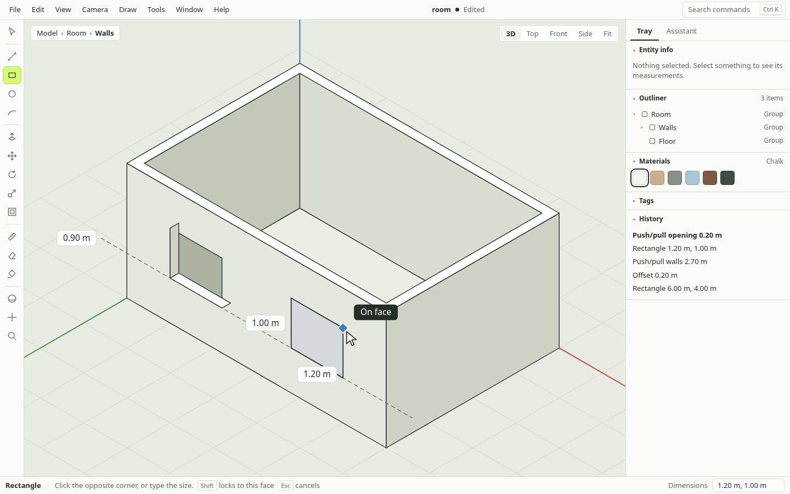
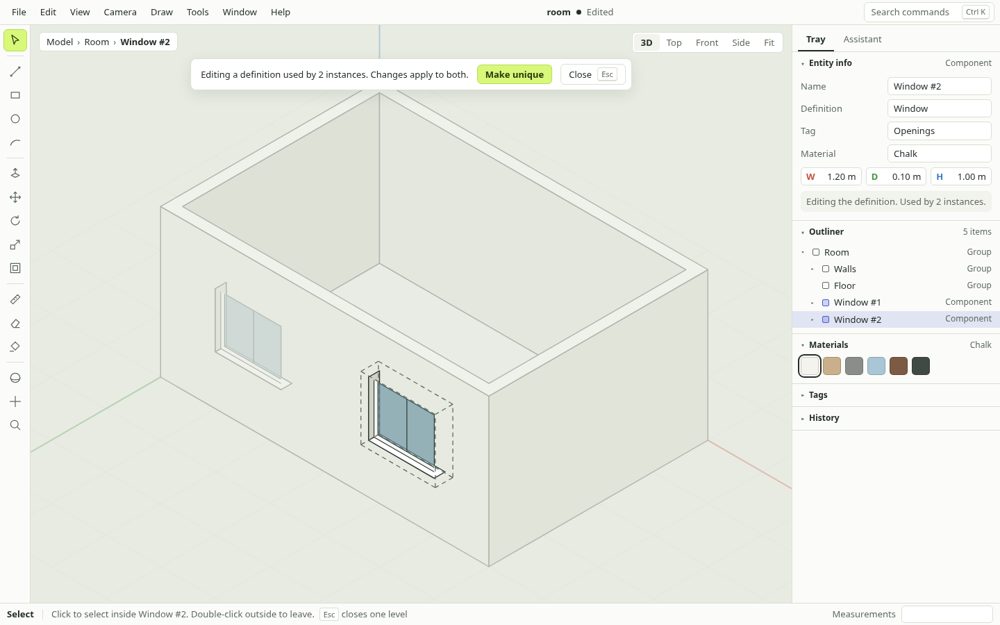
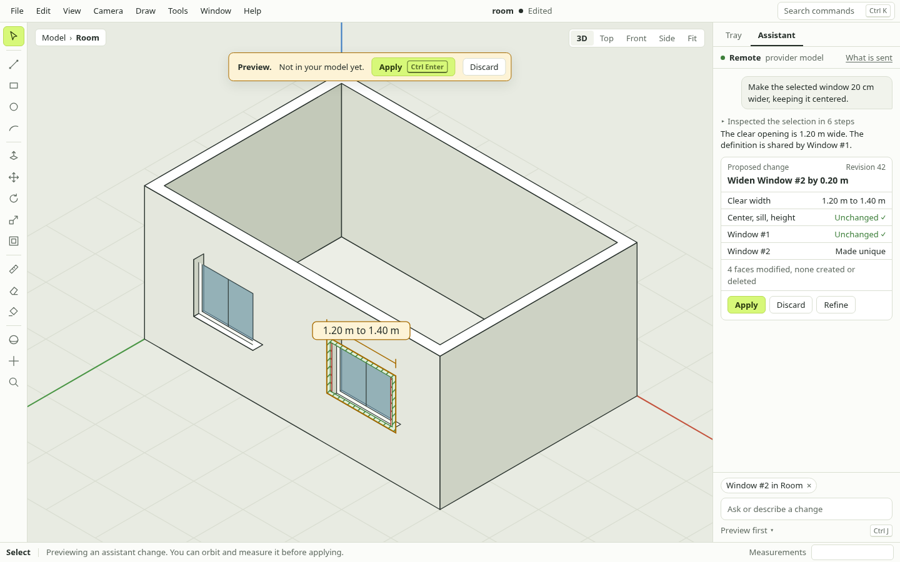
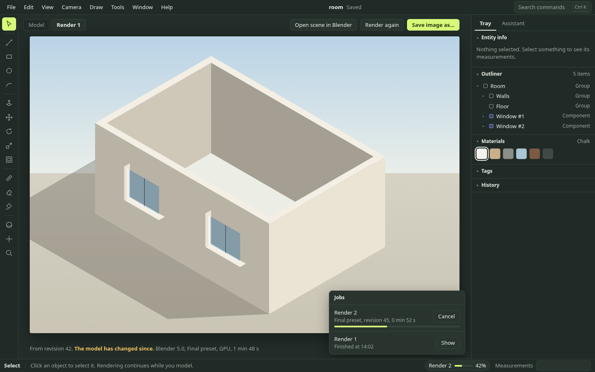
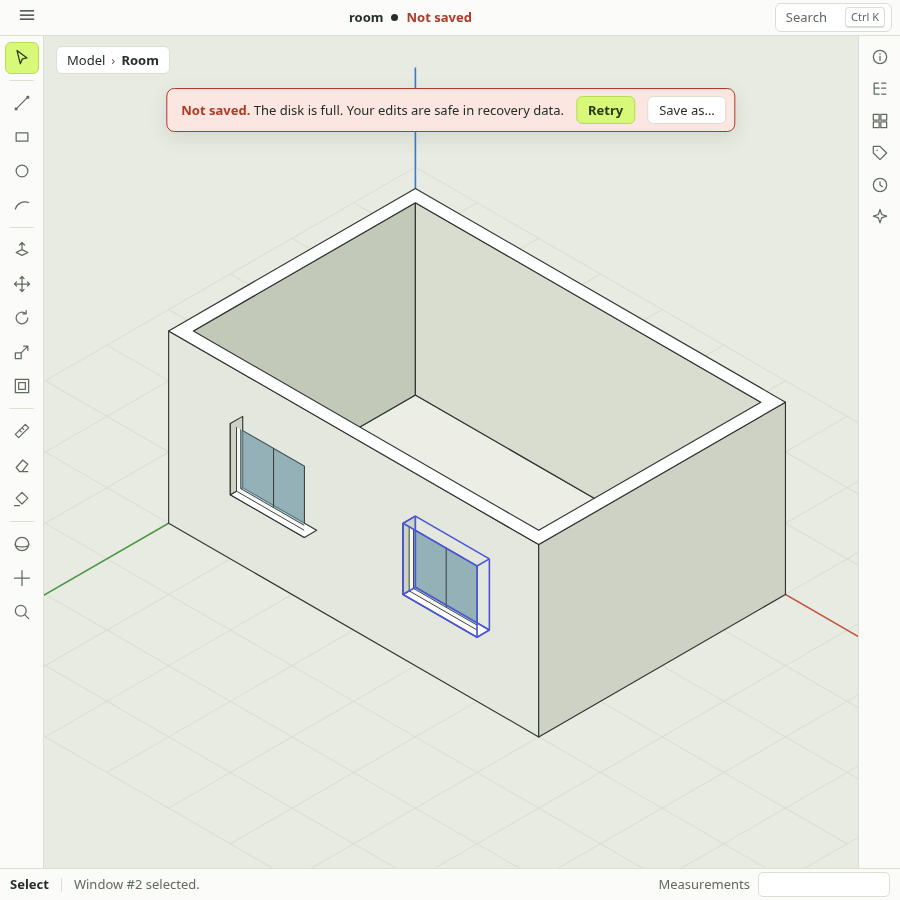
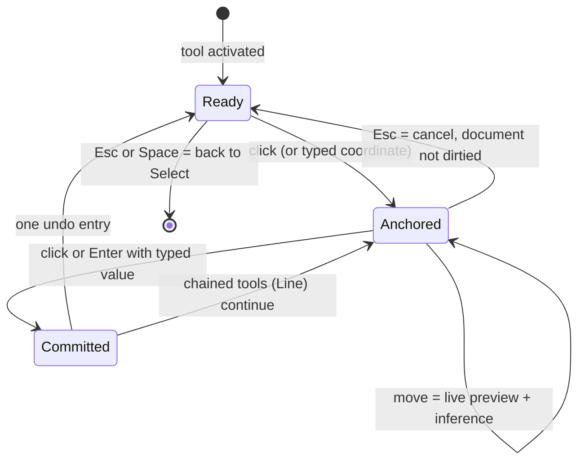
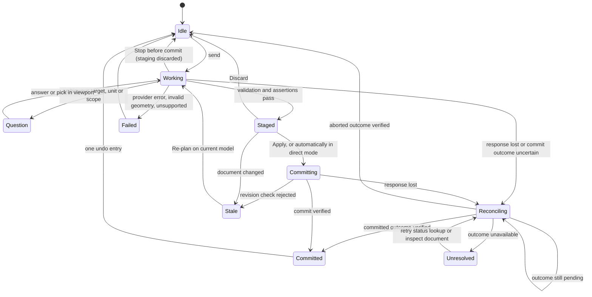

# SketchyUp UX design

Status: proposed design, not an implemented interface. Updated: 2026-10-03.

This document designs the user experience for the native editor described in
the [build plan](BUILD_PLAN.md). It covers the window, tools, numeric entry,
inference feedback, organization panels, the AI assistant, Blender rendering,
document safety and accessibility. Scope IDs refer to the
[scope matrix](SCOPE.md); AI behavior follows the
[AI modeling contract](AI_MODELING.md). Shortcut letters, panel names and visual
tokens here are defaults to validate in the M0/M1 spikes, not frozen decisions.
The [PR roadmap](PR_ROADMAP.md) sequences implementation and records clarifications
C1–C6 for recovery, commit reconciliation, component scope, numeric re-entry,
responsive layouts and command discovery. The supplied screenshots remain
original design references, not evidence of implemented behavior; their simplified
status copy must follow the verified states specified below.

## 1. Design principles

1. **The viewport is the product.** Chrome stays thin and docked. Nothing floats
   over the model except feedback about the operation in progress.
2. **Draw first, type to be exact.** Every tool works by click–move–click, and
   every tool accepts typed values at any moment without clicking a field.
3. **One model, two hands.** A human and the assistant edit the same document
   through the same commands. An AI edit looks, undoes and saves like any other
   edit; it is never a separate mode with separate rules.
4. **Nothing happens silently.** Rejected geometry, lossy imports, stale AI
   plans, failed saves and failed renders all say what happened and what was
   preserved. Preview geometry never looks like committed geometry.
5. **Optional things fail alone.** With no provider, no network and no Blender,
   the interface has no dead ends, nag screens or broken panels.
6. **Keyboard-complete, tiling-friendly.** The primary desktop is Hyprland:
   the window can be any size or shape, has no title bar, and its user expects
   to reach everything from the keyboard.

## 2. Platform constraints that shape the design

| Constraint (Omarchy / Hyprland / Wayland) | Design consequence |
| --- | --- |
| Tiled windows of arbitrary size, often half a screen | Single window with docked, collapsible regions and defined breakpoints (section 3.3); no floating palettes or satellite windows |
| No server-side title bar | Document name, save state and edit context are shown inside the window |
| `Super` belongs to the compositor | No default shortcut uses `Super`; app shortcuts use plain keys, `Ctrl`, `Shift`, `Alt` |
| No global menu | In-window menu bar; collapses to one menu button when narrow |
| Trackpads without a middle button | Orbit/pan available as tools (`O`, `H`) and as modifier drags, not only middle-drag |
| Fractional and mixed-DPI scaling (N04) | Vector icons, overlay markers sized in logical pixels, hit targets independent of zoom |
| File access through portals | Native Open/Save dialogs only; no custom file browser |
| User-controlled theme | Follow the system light/dark preference; never edit Omarchy or compositor configuration |

## 3. Window anatomy

### 3.1 Regions

```text
┌────────────────────────────────────────────────────────────────────────────┐
│ File Edit View Camera Draw Tools Window Help      room ● Edited   ⌕ Ctrl+K │ 1
├────┬───────────────────────────────────────────────────┬───────────────────┤
│ ▸  │ Model › House › Window #2          3D Top Front ⛶ │ Tray │ Assistant  │
│ ╱  │                                                   ├───────────────────┤
│ ▭  │                                                   │ ▾ Entity info     │
│ ◯  │                                                   │   Window #2       │
│ ⌒  │                                                   │   Component (2)   │
│ ── │                    VIEWPORT                       │ ▾ Outliner        │
│ ⇕  │                                                   │   ▸ House         │
│ ✥  │                                                   │     ▸ Walls       │
│ ⟳  │                                                   │ ▸ Materials       │
│ ⤢  │                                                   │ ▸ Tags            │
│ ── │                                                   │ ▸ History         │
│ ✎  │ ┌ Scene 1 ┬ Scene 2 ┬ + ┐                         │                   │
├────┴───────────────────────────────────────────────────┴───────────────────┤
│ Line │ Click next point · Shift locks · Esc cancels  │ ⟳ Render 42% │ Length [ 3.5 m ] │ 5
└────────────────────────────────────────────────────────────────────────────┘
  2                         3                                    4
```

1. **Top bar.** Menu bar, document name with save state, command palette entry.
   Every command lives in the menus with its shortcut shown; the menu bar is
   the discoverable, screen-reader-friendly index of the application.
2. **Tool rail.** One column of tools grouped Select / Draw / Modify / Measure /
   Camera. Tooltips show name, shortcut and a one-line description. Related
   tools (arc variants, rectangle variants) share a slot with a flyout.
3. **Viewport.** Overlays are limited to: edit-context breadcrumb (top left),
   view controls (top right), scene tabs (bottom left, from M7), and transient
   operation feedback. A removable scale figure stands at the origin in new
   documents so the first shape has a sense of size.
4. **Side panel.** Two tabs. **Tray** stacks collapsible sections: Entity info,
   Outliner, Materials, Tags, History, and later Styles, Scenes, Shadows,
   Components and Diagnostics. **Assistant** holds the AI conversation
   (section 8). On wide windows the Assistant can split into its own column
   so Entity info stays visible during AI edits.
5. **Status bar.** Active tool, a context-sensitive instruction with the
   modifier keys that currently apply, background job chips, and the
   Measurements box. The Measurements box is the last thing ever hidden.

### 3.2 Command palette

`Ctrl+K` opens a palette over the viewport that searches user-facing actions in
the shared command registry (A01), recent documents, scenes and named entities.
The registry marks user-facing actions with labels, enabled contexts and input
forms, so modeling operations share handlers across UI, CLI and assistant.
Internal queries and transaction plumbing need not appear as raw menu entries.
Each action result shows its shortcut, so the palette also teaches the keyboard.

### 3.3 Responsive behavior

| Window width (logical pixels) | Layout |
| --- | --- |
| ≥ 1500 px | Tool rail, viewport, Tray and Assistant as separate columns |
| 1100 ≤ width < 1500 px | Tray and Assistant share one tabbed side panel |
| 800 ≤ width < 1100 px | Side panel collapses to an icon strip and opens as an overlay sheet; menu bar becomes one menu button |
| < 800 px | Tool rail shows the active group only; status instruction truncates; Measurements box and job chips remain |

Validate at 640, 900, 1200 and 1600 logical pixels, including fractional scale.
On the smallest tile collapse job detail before reducing Measurements access.
The supplied narrow illustration is 900 px; add 640 px and split-column wide
references during M0.

`F6` cycles focus between regions. `Ctrl+\` hides all chrome for a
viewport-only view; the Measurements box stays.

### 3.4 Mockup screens

Static illustrations of this design, using the M5 demonstration room. They
are HTML drawings, not application code; regenerate them by opening
`mockups/index.html?screen=<name>` (`draw`, `context`, `assistant`, `render`,
`narrow`).

| Screen | Shows | Sections |
| --- | --- | --- |
|  | Rectangle tool drawing the second window opening: on-face inference, a tape guide at sill height, live dimensions and the Measurements box | 3.1, 4.1–4.4 |
|  | Editing a shared component: breadcrumb, dimmed surroundings and the definition banner with Make unique | 4.6, 5 |
|  | A staged assistant change: hatched preview in the viewport, the change card, context chip and provider line | 8.1–8.4 |
|  | Dark theme. Render result tab with its provenance line, plus the Jobs list with a second render running | 7, 9 |
|  | A 900 px tile: single menu button, side panel collapsed to an icon strip, and the persistent save-failure banner | 3.3, 6.1 |

## 4. Tools and direct manipulation

### 4.1 One interaction grammar for every tool



- Click–move–click and press–drag–release are equivalent everywhere.
- `Esc` backs out one step: cancel the operation, then leave the tool, then
  leave the edit context. A canceled operation never dirties the document or
  adds an undo entry (D03).
- The tool stays active after a commit so shapes can be drawn repeatedly.
- Middle-drag orbits and `Shift`+middle-drag pans **without leaving the active
  tool**; an operation in progress survives camera movement (M3 exit
  criterion: no camera/tool input conflict).
- A rejected operation leaves the previous document intact and explains why at
  the cursor and in the status bar, for example "No face created: the outline
  is not planar" (G02).

### 4.2 Default shortcuts

Defaults follow the muscle memory of the reference workflow; all are
configurable (N05). The prototype's `V` remains an alias for Select. Its `F`
(fit) moves to `Shift+Z` so `F` can be Offset.

| Key | Tool | Key | Tool |
| --- | --- | --- | --- |
| `Space` | Select | `M` | Move |
| `L` | Line | `Q` | Rotate |
| `R` | Rectangle | `S` | Scale |
| `C` | Circle | `F` | Offset |
| `A` | Arc | `T` | Tape measure / guides |
| `P` | Push/pull | `E` | Eraser |
| `B` | Paint | `G` | Make component |
| `O` / `H` / `Z` | Orbit / pan / zoom | `Shift+Z` | Zoom to fit |

| Modifier during an operation | Effect |
| --- | --- |
| `Shift` | Lock the current inference (axis, plane, direction) |
| `→` `←` `↑` | Lock to the red, green, blue axis; press again to release |
| `↓` | Lock parallel/perpendicular to the hovered edge |
| `Ctrl` | Toggle copy in Move/Rotate; toggle "create new face" in Push/pull |
| `Tab` | Cycle between overlapping pick or inference candidates |

The status bar always lists the modifiers that apply to the current step, so
none of this has to be memorized.

**Keyboard ownership rule:** the viewport owns the keyboard by default. Plain
keys are tool shortcuts and digits go to the Measurements box. Text fields
(entity name, assistant composer) take keys only while focused, and `Esc`
returns focus to the viewport.

### 4.3 Measurements box (G10)

Typing never requires clicking the box. Its label follows the active step:
Length, Dimensions, Radius, Distance, Angle, Sides, Copies.

| Input | Meaning |
| --- | --- |
| `3.5` | Value in document units |
| `350cm`, `12'6"`, `3/4"` | Explicit unit overrides document units for this entry |
| `6,4` | Two dimensions (rectangle); `;` is the separator in comma-decimal locales |
| `[1,2,0]` / `<1,2,0>` | Absolute / relative coordinate for the next point |
| `x5`, `/5` | After a copy: five copies / divide the span into five |
| `24s` | Segment count for the circle or arc being drawn |

- `Enter` applies. Until the next operation starts, typing a new value
  **revises the operation just completed** rather than starting another, only
  while its amend token matches the current content revision and context. Keep
  one undo entry but increment the revision for each successful replacement.
  An intervening human or AI content edit invalidates re-entry; never roll it
  back to revise an earlier operation. A replacement also makes existing AI
  previews stale. Pure camera movement does not change content revision.
- Before `Enter`, the box shows the live measured value of the preview.
- An entry that cannot be parsed or applied keeps the operation active, marks
  the box and states the reason ("Height must be greater than 0").
- Typed coordinates make every drawing tool usable with no pointer at all,
  which is also the keyboard-accessible modeling path (N05).

### 4.4 Inference feedback (G06, G07)

Inference is the feel of the product. Each inference has a marker shape, a
color and a text label near the cursor; shape and label carry the meaning so
color is never the only signal.

| Inference | Marker | Label |
| --- | --- | --- |
| Endpoint | Filled circle | Endpoint |
| Midpoint | Filled triangle | Midpoint |
| Center | Ring with dot | Center |
| On edge | Square on the edge | On edge |
| On face | Diamond on the face | On face |
| Intersection | Cross | Intersection |
| Along axis | Rubber band takes the axis color, drawn thicker | On red / green / blue axis |
| Parallel / perpendicular | Band in the reference color; reference edge highlights | Parallel / Perpendicular to edge |
| From point | Dotted line back to the reference point | From point |
| Locked | Band drawn bold with a lock glyph | Locked: blue axis |

Snapping distance is a fixed number of logical pixels at every zoom and scale
factor. It selects a constraint; it is never used as geometric tolerance.
Hovering a point for a moment "arms" it as a reference for from-point
inference, shown by a small persistent marker.

### 4.5 Selection (G08)

- Hover pre-highlights exactly what a click would select.
- Click selects one entity; double-click a face adds its bounding edges;
  triple-click selects all connected geometry. `Ctrl` adds, `Shift` toggles.
- Drag left-to-right draws a solid box and selects what is fully inside; drag
  right-to-left draws a dashed box and selects anything touched.
- Selected faces get a dot pattern plus outline; selected edges a heavier
  stroke; selected groups and components a bounding box.
- Entity info always summarizes the selection ("3 faces, 5 edges"), and the
  Outliner mirrors it in both directions.

### 4.6 Editing contexts (O01, O02)

Groups and components are the main defense against sticky geometry and the
main source of confusion, so the current context is always visible.

- Double-click or `Enter` opens a group or component; `Esc` or a click outside
  closes one level. The breadcrumb `Model › House › Window #2` is clickable.
- Everything outside the active context dims and cannot be picked or merged.
- Editing a shared component shows a persistent banner in the viewport:
  "Editing a definition used by 2 instances" with a **Make unique** action.
  The same instance-versus-definition question is put explicitly by the
  assistant (section 8.4), in the same words.

## 5. Tray panels

| Panel | Purpose | Notes | Gate |
| --- | --- | --- | --- |
| Entity info | Name, type, tag, material, dimensions, position, area/volume | Editable fields accept the same unit syntax as the Measurements box; volume appears only for valid solids, otherwise "Not a solid" with a link to Diagnostics (O06) | M4 |
| Outliner | Nested hierarchy with search | Rename, hide, lock, drag to re-parent; fully keyboard navigable; this is the accessible view of the model (N05) | M4 |
| Tags | Visibility and folders | Toggling visibility never edits geometry (O04) | M4 |
| Materials | In-model and library swatches | Paint tool samples with `Alt`-click; front/back shown separately (P01) | M4 |
| History | Labeled undo stack | AI entries are marked and carry the request text; click to step back; redo branch disappears on a new edit | M4 |
| Diagnostics | Open edges, non-manifold regions, reversed faces | Each finding selects and frames its entities; repairs are explicit, previewed and undoable (E09) | M6 |
| Styles, Scenes, Shadows | Display modes, saved views, sun | Scenes also appear as tabs in the viewport (P02, P03, P06) | M7 |
| Components | Local library with thumbnails | Missing assets shown as such, never silently substituted (O05) | M8 |

## 6. Document lifecycle

### 6.1 Save state is always visible

| State | Top bar shows | Behavior |
| --- | --- | --- |
| Saved | `room` | — |
| Edited | `room ● Edited` | Recovery journal is kept current in the background |
| Saving | `room · Saving…` | Editing continues; save is atomic |
| Failed | `room ⚠ Not saved` (persistent) | Banner with the reason and **Retry** / **Save as…**; never just a toast |

A save failure may also prevent recovery writes. Show the last verified recovery
revision/time separately from in-memory edits; do not promise the newest edits
are safe on disk unless the journal write succeeded. The narrow mockup's recovery
assurance is illustrative and must be replaced with the verified state.

Autosave is recovery data and never overwrites the user's file (D04). Closing
a window with unsaved edits, including a compositor close request, asks
**Save / Discard / Cancel**.

### 6.2 Recovery

After an unclean exit the next launch shows one dialog listing each affected
document: its name, when it was last explicitly saved, and how many edits were
recovered. Choices per document: **Open recovered version** (opens as Edited;
the saved file is untouched), **Open last saved**, **Discard recovery data**.
Missing textures or assets are listed rather than hidden.

### 6.3 First run and new documents

No account, sign-in or tour. First run asks one question — default units
(meters, millimeters, feet and inches) — and opens an empty document. A
start view lists recent documents and recovered work. Templates (D05) replace
the units question at M8. Assistant and Blender setup are offered only when
those features are first opened.

### 6.4 Import, export and reports

One **report sheet** component is reused wherever an operation has an outcome
worth reading: imports and exports (per-feature loss report, X02–X04), Formline
migration (X01), recovery, diagnostics and AI changes. It lists what was
converted, approximated and skipped, with counts and clickable entities.

## 7. Visual system

- **Themes.** Light, Dark, and Follow system. The viewport background belongs
  to the model style, not the theme.
- **Identity.** Carry the prototype's calm warm-gray surfaces and single lime
  accent forward as the starting token set, with a dark counterpart. The
  accent marks the primary action and active tool only.
- **Reserved colors.** Red, green and blue mean the X, Y and Z axes everywhere:
  viewport, inference, coordinate fields. Selection has its own blue-violet.
  Amber means warning or stale; red text means failure.
- **Not-yet-real geometry is hatched.** Tool previews are drawn as thin
  outlines; staged AI changes use a diagonal hatch (section 8.3). Hatch, not
  hue, is what says "this is not in your document".
- **Type and density.** System UI font, tabular numerals for all measurements,
  28 px controls on a 4 px grid, original line icons at 1.5 px stroke.
- **Motion.** Camera transitions between standard views and scenes animate
  briefly; everything else is immediate. Respect reduced-motion preferences.

## 8. AI assistant

### 8.1 Panel anatomy

```text
┌ Assistant ──────────────────────────────────┐
│ ◉ Remote · <provider/model>   What is sent ▾│  provider chip
├─────────────────────────────────────────────┤
│ You: Make the selected window 20 cm wider,  │
│      keeping it centered.                   │
│                                             │
│ ▸ Inspected selection · 6 steps             │  collapsible activity
│   Clear opening is 1.20 m wide.             │
│                                             │
│ ┌ Proposed change ────────── rev 42 ──────┐ │
│ │ Widen Window #2 by 0.20 m               │ │
│ │ Clear width      1.20 m → 1.40 m        │ │
│ │ Center, sill, height        unchanged ✓ │ │
│ │ Window #1 (other instance)  unchanged ✓ │ │
│ │ Made unique: Window #2                  │ │
│ │ Modified 4 faces · created 0 · deleted 0│ │
│ │ [ Apply  Ctrl+Enter ] [ Discard ] Refine│ │
│ └─────────────────────────────────────────┘ │
├─────────────────────────────────────────────┤
│ ⌖ Window #2 · in Model › House         ✕    │  context chips
│ [ Ask or describe a change…            ] ➤  │
│ Preview first ▾                    ■ Stop   │
└─────────────────────────────────────────────┘
```

`Ctrl+J` toggles the panel and focuses the composer. The current selection and
edit context are attached automatically as chips the user can remove; "this",
"the selected window" and "here" resolve to them.

### 8.2 Request lifecycle



| State | What the user sees |
| --- | --- |
| Working | A plain-language activity list ("Measured clear width: 1.20 m"), not raw tool calls; raw calls are one disclosure away. **Stop** is always available. The model stays fully editable. |
| Question | A card with concrete choices, for example "Width of the clear opening or of the frame?", and **Pick in viewport** when the target is unclear. Never a silent guess on anything that changes the result. |
| Staged | Hatched preview in the viewport plus the change card: before → after measurements, what was verified unchanged, entity counts, warnings. |
| Committed | The card collapses to a summary with **Undo** and the new revision. The History panel gains one labeled entry (A03). |
| Stale | "The model changed while this was prepared. Nothing was applied." with **Re-plan on current model**. Human edits always win; there is no silent rebase. |
| Committing | Applying the validated transaction; the card does not report success until the outcome is verified. |
| Reconciling / unresolved | "Checking whether the change was applied" or "Outcome unknown"; query the request/transaction identity before retrying. Do not claim the document is unchanged. |
| Failed | What failed, the verified transaction outcome, and a supported alternative if one exists. Say this request made no changes only after confirming it did not commit. "Unsupported" is said plainly, never disguised as success. |

### 8.3 Preview in the viewport

Staged changes render in place: added geometry hatched green, removed geometry
hatched red, modified faces outlined amber with before/after dimension labels.
A banner at the top of the viewport reads "Preview — not in your model yet"
with Apply and Discard. The user can orbit, measure and inspect the preview.
Editing the real model during a preview is allowed and turns the card Stale.

### 8.4 Modes and confirmations

The composer has a mode switch: **Preview first** (default) or **Apply
directly**. In direct mode routine requests commit after validation and report
with an Undo button. Regardless of mode the assistant stops to ask before:

- changing a shared definition when the intended scope is ambiguous — "Used 2
  times. Change only this one (make unique) or all 2?". When the user explicitly
  requests only one instance, make it unique and report that without asking again;
- deleting or replacing content beyond what was requested;
- a paid render beyond configured limits, or sending anything outside the
  machine other than the configured provider request.

### 8.5 Trust, privacy and absence

- The provider chip always shows remote versus local and the model in use.
  **What is sent** lists the context of the current request: selection
  summary, hierarchy excerpt, screenshots. The first remote request per
  provider asks once for consent with this list.
- Text inside imported models, names and metadata is displayed as data. If it
  resembles instructions the assistant does not follow it, and says so.
- Keys are entered in Preferences, stored through the OS credential facility
  and never shown in documents, logs or the conversation.
- With no provider configured the panel shows a single setup card and the rest
  of the application is unaffected. A dropped connection triggers transaction
  outcome reconciliation. Say "Nothing was applied" only for a verified
  non-commit; otherwise report the committed result or unresolved outcome.
  Committed work is never rolled back by a timeout.
- A render image is never presented as evidence that a modeling request was
  correct; correctness is reported from measurements.

## 9. Rendering with Blender

- **Start.** `Camera › Render…` or the palette opens a small sheet: camera
  (current view or a scene), preset (Final / Preview from M7), resolution,
  device (Automatic, GPU, CPU). One primary button: **Render**.
- **While running.** The job appears as a chip in the status bar with
  progress. Modeling continues. Clicking the chip opens the Jobs list with
  progress, elapsed time, **Cancel** and logs. Canceling a render never
  touches the document and is not an undo.
- **Result.** Opens in a Render tab beside the model view, with **Save image
  as…**, **Render again** and, from M7, **Open scene in Blender**. Each result
  carries a provenance line: "From revision 42 · model has changed since",
  plus Blender version, preset and device from the manifest (P08).
- **Failure.** The job shows the actual reason and its log. A success state is
  shown only when an image exists.
- **Blender absent.** The Render sheet becomes a setup card: what Blender is
  used for, the detected status, a path chooser and the install hint for the
  platform. No other part of the interface mentions Blender.
- **Handoff (P09).** "Open scene in Blender" states up front that it is one
  way: changes made in Blender do not return to the model.

## 10. Accessibility and preferences (N05)

- Every command is reachable from the menus and the palette; every control
  has a label, a visible focus ring and a tooltip with its shortcut.
- The viewport cannot be fully screen-reader accessible. The documented
  alternative is the Outliner (structure), Entity info (measurements) and
  typed coordinates (creation), all keyboard operable. The assistant is a
  further non-pointer path to the same commands.
- Color is never the only carrier: inference uses shape and label, previews
  use hatch, states use icon and text. Text contrast meets 4.5:1 in both
  themes; UI text scales independently of display scaling.
- Preferences: units and precision, theme and accent, shortcut editor with
  conflict detection, navigation style (mouse or trackpad), assistant mode and
  provider, Blender path, autosave interval. Preferences persist across
  upgrades.

## 11. Delivery by milestone

The interface grows with the engine; no gate ships controls for capabilities
that do not exist yet.

| Gate | UX delivered |
| --- | --- |
| M0 | Spike validates: overlay markers and hatch rendering in the chosen viewport path, keyboard ownership rule, tiled-window breakpoints, fractional-scale picking |
| M1 | Window shell, menus, command palette from the registry, camera navigation, status bar, save states, themes, native dialogs |
| M2 | Push/pull on real faces with live dimension, rejection messages for invalid geometry |
| M3 | Full tool rail for drawing, inference markers and locks, Measurements box syntax, selection model, standard views, guides |
| M4 | Tray (Entity info, Outliner, Tags, Materials, History), edit-context breadcrumb and definition banner, recovery dialog, Formline import report |
| M5 | Assistant panel with preview/apply and direct modes, provider setup and "What is sent", basic Render sheet, job chip and result tab |
| M6 | Offset, follow-me, intersect and solid tools; Diagnostics panel; placement feedback for hosted components |
| M7 | Styles, Scenes tabs, sections, dimensions and text, shadows, full Jobs list, Blender handoff |
| M8 | Component library, templates, import/export report sheets, extension management |
| M9 | Shortcut editor, accessibility audit against section 10, scaling and multi-display verification, preference migration |

## 12. Decisions to confirm

| Decision | Proposed default | Why it matters |
| --- | --- | --- |
| Shortcut scheme | Reference-workflow letters (section 4.2); prototype `F` fit moves to `Shift+Z` | Familiarity is the product objective; the prototype's keys conflict with Offset |
| Assistant default mode | Preview first | Builds trust before speed; one click to switch |
| Assistant placement | Tab beside Tray, own column when wide | Keeps Entity info visible during AI edits without a second window |
| Render result location | In-window tab, not a separate window | Predictable under a tiling compositor |
| Visual identity | Evolve the prototype palette, add dark theme | Continuity; needs an accent check against the reserved axis green |
| Native menu bar versus single menu button | Menu bar when width allows | Discoverability and accessibility versus vertical space |

Validate sections 4 and 8 with the M5 demonstration in the build plan: a
person should be able to complete every step using only what this document
describes, and each failure case in step 8 should land in a state named here.
