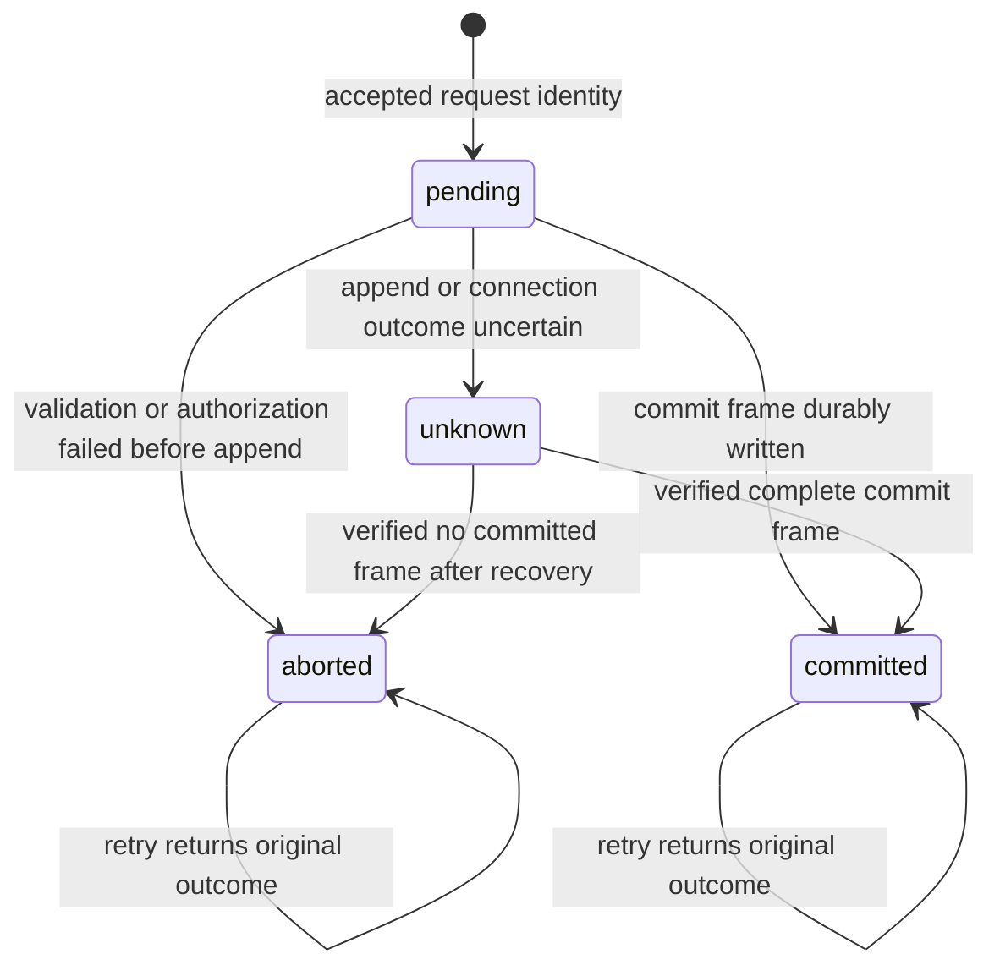

# ADR 0005: document, container and durable command contracts

Date: 2026-10-03. R004.b. Status: selected contract for implementation; the current
v1 JSON spike does not implement this container or recovery protocol.

## Identity and coordinates

A document has a random 128-bit identity. Content revisions are unsigned 64-bit
monotonic integers within a persisted document epoch, serialized as decimal
strings in JSON. Opening a saved checkpoint restores its epoch/revision; recovery
continues from that checkpoint. Fork/Save Copy creates a new document identity;
Save As renames the same document. New document always creates a new identity.
Exhausted counters fail before mutation, never wrap.

Entity references carry document ID, editing context ID, entity kind and stable
ID. Context owns vertex/edge/face IDs; definitions own reusable geometry;
instances reference definitions. Allocator high-water marks survive undo and
save. Undo can restore deleted records with the same identity, but a new unrelated
entity cannot reuse them. Views, selection and camera movement do not increment
content revision. Successful edits, undo, redo and amendments each increment it.

Canonical units are double-precision meters and radians, Z-up, right-handed.
Instance transforms are finite column-major 4×4 affine matrices acting on column
vectors, composed `world = parent × local`. Translation occupies column four.
Mirror transforms are permitted; determinant sign affects winding/normal handling.
Singular transforms are rejected for editable instances. Display units are
metadata and never rescale canonical geometry implicitly.

## Worked identity maps

The wall-ring fixture in R003.b starts with face 9. Its x=3 split produces faces
14 and 15: `face:9 -> [face:14, face:15]`. The edge namespace is distinct:

```json
{"1":[9,10],"2":[2],"3":[3],"4":[11,12],
 "5":[5],"6":[13,16],"7":[14,15],"8":[8]}
```

Four unaffected edges survive. Four divided edges retire and map to eight new
edges. The reverse merge maps those eight children into four fresh merged IDs;
it does not resurrect retired edges as unrelated entities. An undo, in contrast,
restores the exact prior records and IDs while retaining allocator high-water
marks. Selection resolution exposes one-to-many results instead of arbitrarily
choosing the first descendant.

## Encoding experiment and selected container

`persistence_benchmark` compares compact JSON, Qt CBOR conversion, and zlib level-6
compressed JSON on 1/100/1000 original wall-ring solids. Each variant is measured
five times, verified field-for-field, then decoded through the document validator.
Raw results: [R004-codecs.json](../verification/R004-codecs.json).

For 1000 bodies, JSON is 888793 bytes (encode/decode about 43/40 ms); CBOR is 677250
bytes (10/77 ms including Qt's JSON conversion); compressed JSON is 59696 bytes
(72/39 ms including compression/decompression). Full geometry validation adds
roughly 360–600 ms. Peak process RSS across the experiment is about 76 MiB. These
repetitive fixtures favor compression and are not representative texture assets.
The CBOR result measures this adapter, not every possible binary implementation.

Select **uncompressed JSON document chunks in a bounded binary envelope** for M1.
It keeps inspectable records and fast decoding; compression is optional later
only with declared and enforced decoded-size limits. Geometry chunks can move to
a binary encoding after M1 benchmarks justify it, without changing the envelope.
Embedded images/assets use raw content-addressed chunks; no base64 expansion or
filesystem extraction is needed. Renderer buffers never enter the format.

Envelope v2 contract (little endian): 8-byte magic `SKUPDOC\0`; uint32 version 2;
uint32 manifest byte count; UTF-8 JSON manifest; then concatenated chunk payloads.
Chunk offsets are relative to the payload region. Manifest contains document ID,
epoch, revision, writer version, units/up, required feature set, allocator floors,
and chunk descriptors `{kind, encoding, offset, bytes, sha256}`. Integers that
could exceed JSON's exact range are decimal strings. Exactly one `document`
chunk is required. Its initial encoding is `json-v1`; asset chunks use `raw`.
An optional thumbnail is non-authoritative. Chunk SHA-256 covers the exact bytes.

Readers reject overflow, overlapping ranges, duplicate required chunks, bad
hashes, unknown required features, unsupported future envelope/schema versions,
invalid identities and geometry before replacing the current document. Optional
unknown chunks may be preserved verbatim if their size/hash validate. No chunk
name is a filesystem path. Initial limits: 1 MiB manifest, 32 MiB document chunk,
256 MiB total file, 4096 chunks, 64 MiB per asset, 128 MiB aggregate assets. Limits
are checked before allocating or decoding. R033 revisits these with real assets.

The experimental raw JSON v1 is recognized explicitly and migrated in memory to
the envelope model. Migrations run on a copy, preserve IDs and original source,
and require an explicit successful save before replacing any file. Forward
migration chains are versioned fixture-tested functions. No downgrade or silent
unknown-required-field dropping. A file requiring persistent edges cannot claim
it is readable by the original spike reader.

## Save and recovery ordering

Explicit Save serializes a validated immutable snapshot, writes a sibling temp
file, flushes and fsyncs it, preserves a verified last-known-good backup, atomically
renames the new target, then fsyncs the parent directory. Only then acknowledge
the snapshot's saved revision; edits made while it was being written remain dirty.
Failure before replacement preserves the prior target. Failure after rename but
before directory sync reports uncertain durability, not a fictional rollback.
Never delete the last-known-good copy before a replacement is durable. Permission,
full-disk, partial-write, disconnect and process-kill fixtures belong to R012.

Recovery uses an application data directory keyed by document ID and epoch,
including unnamed documents. It never overwrites the explicit save. A checkpoint
contains authoritative records and allocator floors. Append-only journal frames
contain a sequence, previous-frame hash, document/epoch, base/result revisions,
validated changes, optional request outcome and checksum. Length precedes payload;
maximum frame size is 32 MiB. No replay of arbitrary executable commands.

Recover only a complete, checksummed, contiguous prefix consistent with the
checkpoint. Ignore an incomplete tail while reporting the exact last recovered
revision. Interior corruption stops recovery and preserves the original files
for diagnosis. Compact by writing/fsyncing a new checkpoint and durable pointer
before retiring older frames. Never claim recovery protection beyond the last
verified fsync and revision. A full disk can prevent both Save and recovery.

## Commit reconciliation and idempotency

A document actor serializes commits. Request identity is `(document, epoch,
requestId)` plus a hash of normalized command payload. Same identity/different
payload is an explicit conflict. Validate/stage at expected revision before any
mutation. A commit frame co-records changes and terminal outcome in the same
journal record; fsync before publishing committed state or acknowledging success.
A staged preview is immutable and invalidated by every intervening content edit.



Transport timeout does not change engine outcome. After losing a response, query
by request ID; retry only with the same identity. While durability is unknown,
freeze dependent mutations until journal reconciliation completes. Never say
“Nothing was applied” merely because a provider/client timed out. Recovery replays
the committed frame at most once and restores its result revision and created-ID
map; user undo is a separate new revision, not erasure of the original outcome.

Retain terminal outcomes for at least 30 days. Initial ledger cap: 10000 outcomes
or 64 MiB; prune only expired outcomes after checkpointing. If retained outcomes
fill the cap, reject new remote mutations with a storage-limit error before
execution, rather than silently weakening the guarantee. Expired/unknown request
identities return an explicit reconciliation-required error and are never
silently replayed. Authentication and authorization are checked on every retry.
R041 implements and fault-injects this contract; it is not enabled in today's CLI.

## Budgets and verification

Initial live-model limits remain 10000 bodies and 100000 each of vertices, faces
and wires. Retained undo history is 64 MiB; stage plus validation scratch has a
separate 128 MiB target. One over-budget operation fails before publication.
Estimate shared allocations once, then compare RSS and allocator telemetry on
empty, room, 1000-body, large single-mesh and import fixtures. Track checkpoint,
undo, redo and branch invalidation. Current changed-body copying is an interim
implementation; large topology edits need granular deltas.

Repeat `persistence_benchmark` on each format change, recording build mode,
platform, fixture hash, bytes, encode/decode/validate time and peak RSS. Add random
geometry and texture-heavy fixtures before choosing compression defaults. M1/M4
must test truncated headers/chunks, every journal tail boundary, failed fsync,
rename interruption, post-commit response loss and duplicate retry. Any revised
limit or durability guarantee requires an ADR update and measured rationale.
