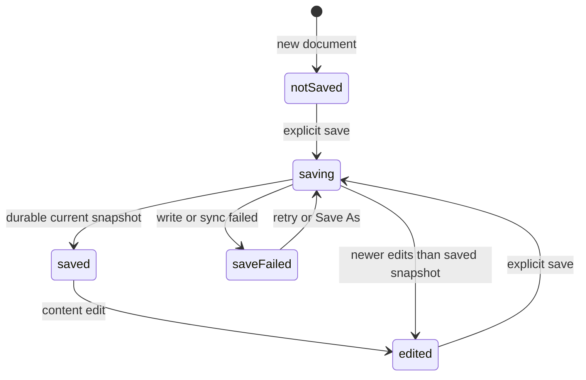
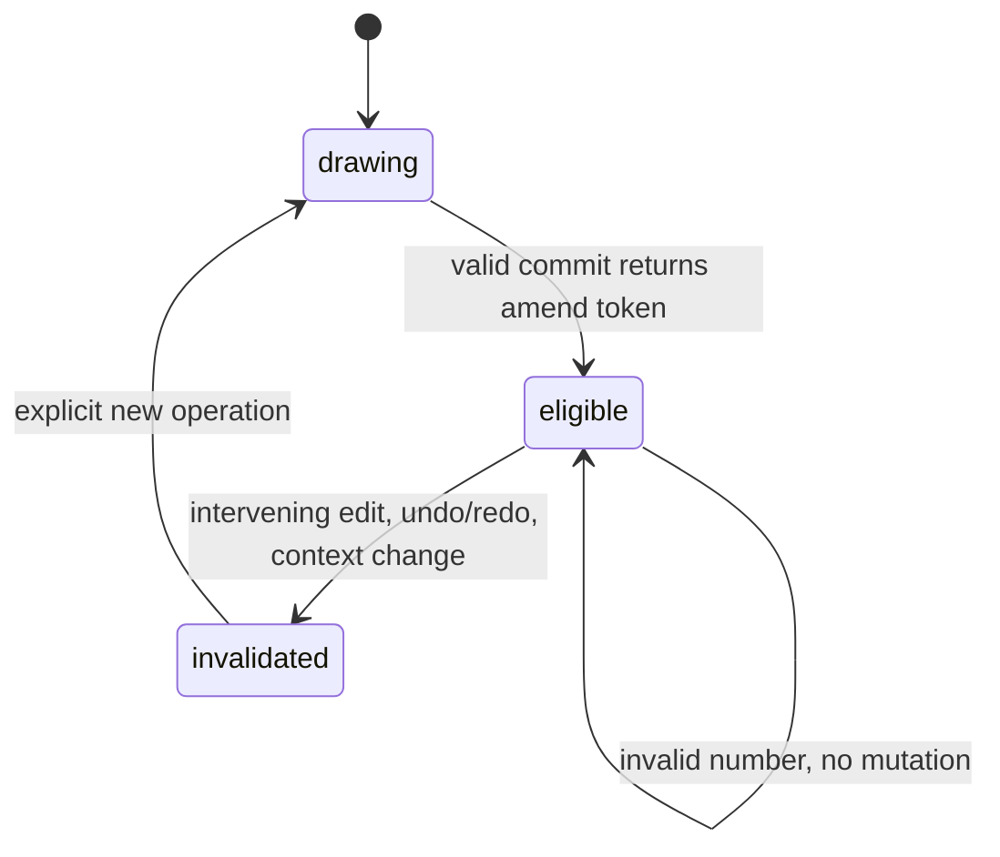

# ADR 0006: interaction states and responsive native shell

Date: 2026-10-03. R006. Decision: adopt the supplied visual references, with C1–C6
below taking precedence over illustrative text/counts in their screenshots.
This is the implementation contract; provider, recovery and component workflows
remain their respective later roadmap entries.

## C1: truthful save and recovery

Maintain separate `contentRevision`, `savedRevision`, and optional verified
`recoveryRevision/recoveryTime`. A new untitled document says “Not saved” even if
it has no edits. “Saved” requires a completed explicit save of current content.
Dirty plus verified older recovery says “Edited · recovery through revision N”.
Failure does not update either durability marker.

On full disk: “Save failed. Edits remain in memory.” Add “Recovery verified through
revision N at TIME” only if known. If journal writes also failed, say so. The
supplied narrow screenshot's unconditional recovery claim is **not** adopted.
Keep Retry and Save As available; Cancel never discards current work. Opening a
malformed file fails before asking to discard the current document.

## C2: lost commit response

Use the outcome state machine in ADR 0005. Pending shows progress and cancellation
semantics; committed shows the actual resulting revision and one undo action;
aborted shows a verified reason; unknown shows “Checking whether the edit was
applied” with a reconciliation action. Disable a new duplicate Apply while unknown.
A post-commit network timeout is not “Nothing was applied”. Query the same request
identity and show its recorded result, even if a later user edit has occurred.

Acceptance scenario: stage at r42; durable commit produces r43; response is lost;
UI queries request ID; outcome reports committed r43; no second mutation occurs.
If the user has since edited to r44, show both the original outcome and current
revision. An expired outcome does not authorize replay with a new identity.

## C3: instance scope

An explicit “only this instance” request authorizes making that instance unique.
Show “Made Window #2 unique; Window #1 unchanged” in preview/result, and make the
uniqueness plus geometry edit one transaction/undo item. Do not ask again merely
because the implementation uses make-unique. If scope is ambiguous and the edit
would affect siblings, ask which scope before committing. Definition-wide edits
list the affected instances. Direct mode follows the same explicit scope contract.

Acceptance scenario: two instances share definition D; direct edit names only
instance B; transaction creates D2 and redirects B; A still references unchanged
D; one undo restores the original sharing and geometry. Failed validation changes
neither definition nor instance reference.

## C4: numeric correction and amendment

Invalid input remains selected in Measurements with its error and focus intact.
Enter commits valid input; Escape cancels the uncommitted preview. Text fields own
letter/number shortcuts. Tab order reaches Measurements without a camera action.

A successful amendable user operation returns an opaque token binding operation,
post-operation content revision, context and parameters. Re-entry can replace
that operation only while this token still matches the current revision/context.
Stage a replacement from its original before-state, validate atomically, replace
the top history item, and increment content revision. Do not implement amendment
by undoing the document then attempting a new command.

Acceptance: draw rectangle r10→r11; enter corrected dimensions at r11; one amended
operation at r12, one Undo restores r10 content. If a material edit advances r12
before re-entry, reject the old token and preserve that material edit. A staged
AI preview at any previous revision becomes stale after amendment. The current
spike now retains invalid text, but does not yet implement amendment (R009/R027).

## C5: responsive layouts and themes

All boundaries are logical pixels; device scale affects rasterization only.

| Width | Required layout | Native feasibility evidence |
| --- | --- | --- |
| <800 (test 640) | Compact toolbar, Tray/Assistant drawers; no persistent job details | Current tray hidden; Measurements and viewport retained |
| 800–1099 (test 900) | One tabbed side panel; collapsed jobs | Current single Tray visible |
| 1100–1499 (test 1200) | Roomier viewport and one tabbed Tray/Assistant panel | Current Tray and viewport visible |
| ≥1500 (test 1600) | Optional split Tray plus Assistant; compact job details | Current native shell tested; future split illustrated separately |

Collapse jobs first, then optional panel detail; never evict Measurements. Drawers
restore prior focus on close. A narrow error banner wraps without covering input.
Viewport picking always uses logical coordinates. The current shell fixture uses
an embedded fixed-width native QMainWindow to avoid compositor tile constraints;
it tests the actual 640/900/1200/1600 widget widths at effective scale 1.6.

System theme follows Qt's color-scheme notification. Light and Dark overrides use
semantic surface, ink, border, selected, hover, input, accent, muted and canvas
tokens. Theme changes never edit the document. Color is supplemental: selection,
preview hatching, error text and state labels also communicate meaning.

The original `narrow.png` and `assistant.png` were reviewed as references. Their
sample counts and recovery claims are illustrative. `wide-contract.svg` is a
1600-logical-pixel design for simultaneous panels and unknown commit outcome,
not a screenshot or a claim that the assistant exists. The separately labeled
native capture records the actual 640-pixel shell.

## C6: public actions and input routing

Each public action has a stable action ID, translated label, category, shortcut,
enabled predicate, context requirements and optional typed form. Tooltips and
command search use these labels. UI and automation route edits through common
validated command handlers; raw begin/commit/status/schema queries are not menu
items. The current QAction list is a feasibility registry, not the final typed
command service (R009/R013).

Keyboard: Ctrl+K searches commands; Escape cancels previews/dialogs; Ctrl+Z/redo
act on content history. Single-letter modeling shortcuts require viewport focus.
Middle drag or Orbit tool rotates; right drag or Pan tool translates; Shift while
orbiting pans. Wheel zoom is view-only. Focus/grab loss ends navigation without
committing geometry. Trackpad pixel deltas and configurable navigation gestures
must be implemented/tested at R011/R029; do not infer them from wheel support.

## Acceptance records and remaining integration

Native `interaction_tests` verifies invalid-input retention/correction, focus,
Escape, drawing, extrusion, undo/redo, camera cancellation and view-only themes.
`shell_tests` verifies all four logical widths, Measurements containment, usable
viewport width and theme rendering. `viewport_tests` still passes depth/picking,
transparency, clipping and context lifecycle checks. Dialog tests cover C1's
current save/open failure boundary. CI exercises the native widgets under Xvfb.

These state diagrams/scenarios are requirements for later recovery, provider,
component and amendment PRs. They are not satisfied merely by adding text to the
current shell. Original reference screenshots remain unchanged and labeled as
references in the documentation.
