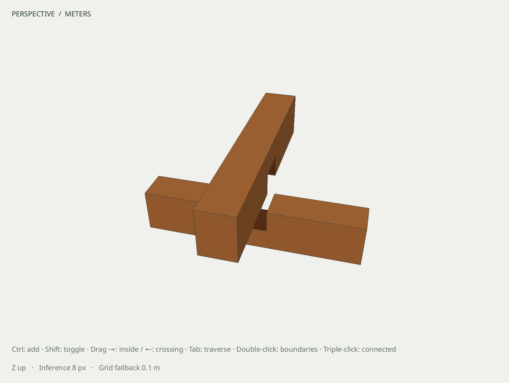
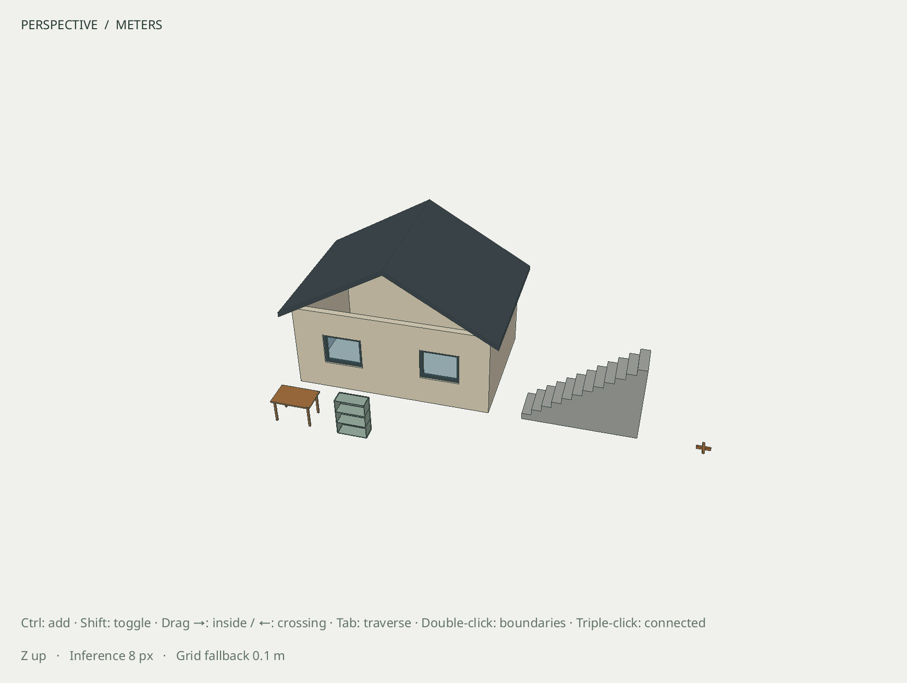
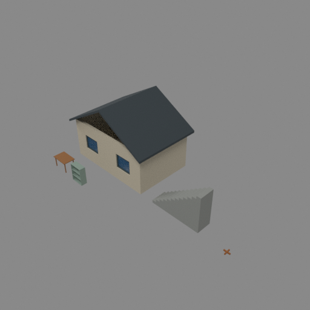

# M6 advanced-modeling acceptance

Date: 2026-10-06 UTC. **Local acceptance passes; CI/dependency merges remain pending.**
[Reproduction procedure](../M6_ACCEPTANCE.md). The prior [M5 gate](M5.md) is complete.

## Exit criteria

| Required behavior | Evidence |
| --- | --- |
| Roof, staircase and furniture geometry | Dedicated R060 fixtures plus the integrated study: validated roof/stair volumes, furniture envelopes/member volumes, actual repeated components and unchanged hosted room |
| Joinery | Complementary half-lap cuts in 400 × 60 × 80 mm stock; independently measured 40 mm floor/ceiling, 0.001776 m³ per member and empty material overlap |
| Solid prerequisites | Open stock reports `BOOLEAN_INVALID_SOLID` / `open_boundary` before mutation; existing Boolean, shell, trim/split/outer-shell and diagnostics suites pass |
| Chained material and entity mappings | Every generated joint face resolves to retained source geometry, with independently checked normal parity/material sides; later edge styling and site placement retain local topology and materials |
| Hosted/shared scene preservation | Adopted room/windows, roof, stairs, furniture and unrelated geometry survive the joint edits, one-task Undo/Redo and distant site placement |
| Native editing and persistence | Four X11/Wayland DPR variants, plus Wayland DPR 2 sanitizers; actual 120 mm member Move/Undo at the distant coordinates and exact native reopen |
| Live assistant | ChatGPT-plan `gpt-6-astra` creates and measures all four advanced assemblies, then a separate trial places the full site; both preview/apply results pass independent saved-geometry and preservation checks |

The [measurement receipt](R060g-measurements.json) retains actual face provenance
from both joint cuts. The roof remains 4.554 m³ and the stair 4.368 m³. Furniture
retains its independently expected envelope, shared definitions and summed member
material. Unsupported whole-assembly volume stays unavailable; separate furniture
members are not mislabeled as one solid.

The integrated fixture passes ASan, UBSan and leak detection in **13.55 seconds**.
The native fixture passes X11 and Wayland at DPR 1 and 2, plus Wayland DPR 2 with
the same sanitizers. It moves only the upper joint member by 120 mm, preserves every
other local record, restores exact joined records through Edit → Undo, and saves
and reopens byte-for-byte. The visible explosion is a temporary native edit, not
the saved final joined model.

The [camera-relative viewport fix](R060f-viewport-precision.md) has its own red/green
projection, color, picking, clipping, inference and preview checks. Original
far-coordinate failures remain in the R060.e evidence; native model geometry never
lost its double precision.

## Live evidence

The [published summary](R060g-live-provider.json) contains only whitelisted synthetic
measurements and evidence hashes. The four-assembly task completes in **98.05 seconds**;
its staged roof/stair measurements are 4.553999923660505 and 4.368 m³. Staged table
and cabinet envelopes match 1.2 × 0.8 × 0.75 m and 0.9 × 0.4 × 1.2 m; their
`multiple_records` volume status remains explicit. All starting records/resources
are preserved and the result publishes in one revision.

The separate site task completes in **60.84 seconds**, using explicit millimetres,
world frame and π/6 yaw. The saved origin is [100000.125, 200000.25, 12.5] m, with
unchanged local geometry, materials, shared definitions and hosted relationships.
Both tasks reach a private preview, inspect staged measurements and apply through
the host reviewer for the disposable fixture. Both output models reopen byte-for-byte.
Full transcripts, provider payloads and correlation data remain private under the
local build evidence directory; no account metadata or credentials are published.

## Offline and installed evidence

The final [offline artifact inventory](R060g-offline.json) records **100/100 CTest
suites passing in 91.30 seconds**, with real Blender enabled, all five executable
recipes, native models and source hashes. The roof/stair/table/cabinet recipes each
complete eight steps; site placement completes eleven. Native editing and rendering
are recorded on owned isolated X servers inside the disposable Arch container:
[native workflow](videos/R060g-native.mp4) and [render workflow](videos/R060g-render.mp4).

The real Blender render uses the framed study camera and 512 × 512 pixels at 32
samples. Its [verified manifest](R060g-render-manifest.json) identifies the same
document/revision as the joined native study and exported GLB. Rendering and
cancellation leave the document unchanged; an edit during the successful job is
correctly labeled as newer than the result. The first retained offline run also
passed, but used the broad default render camera; the final run explicitly passes
the framed camera from the native viewport.

The temporary-prefix installed CLI completes the eleven-step site recipe, with
matching staged/committed measurements. All three installed integration fixtures
match source bytes and reopen exactly; installed schemas and the acceptance
procedure match the source. The offline runner does not claim live or CI acceptance:
those are evaluated independently in this report.

## Retained native models

| Artifact | SHA-256 |
| --- | --- |
| [m6-joinery-before.sketchyup](../../examples/m6-joinery-before.sketchyup) | `46975a251788e0368d650f8370e9746c7512d6ac4f860ef0b9e7c5cc8a613305` |
| [m6-joinery-after.sketchyup](../../examples/m6-joinery-after.sketchyup) | `ab523cc3a17b6ce0713044229d64cd6bd845e8e4b2a7a421cd478256d14cd5c8` |
| [m6-study-after.sketchyup](../../examples/m6-study-after.sketchyup) | `3983594e83fdb8389f60749b8ce21302d42213c94ef8f14c4e8695c27cfa5c2d` |

The before model includes both stock members and explicit cutting tools. The joined
model records the two finished members after a chained edge-style edit. The placed
study moves the complete assembly, including its joint, to the distant site.

## CI recipe timing follow-up

The retained offline inventory above describes its recorded source tree. Later
sanitizer CI exposed two timing limits in the shipped full site example: the
harness's 30-second child deadline and the default 60-second transaction lifetime.
[R060.e's correction](R060e-site-placement.md#sanitized-full-recipe-timing-correction)
requests the existing bounded 300-second lifetime for this example and gives that
one test child 360 seconds. Production defaults, expiry enforcement and all
geometry assertions remain unchanged. The direct sanitized example passes all
11 steps in 65.76 seconds, retains equal preview/committed measurements and reopens
byte-for-byte. The complete corrected sanitizer recipe suite passes in 184.54
seconds. The native model, live-provider and rendering artifacts remain the
original evidence; this follow-up changes recipe timing and failure diagnostics.

## Remaining gate conditions

The implementation PRs and this acceptance layer must pass exact-head CI and merge
in dependency order before M6 is marked complete. M7 work may prepare stable
interfaces meanwhile; this report does not accept the next milestone as delivered.
