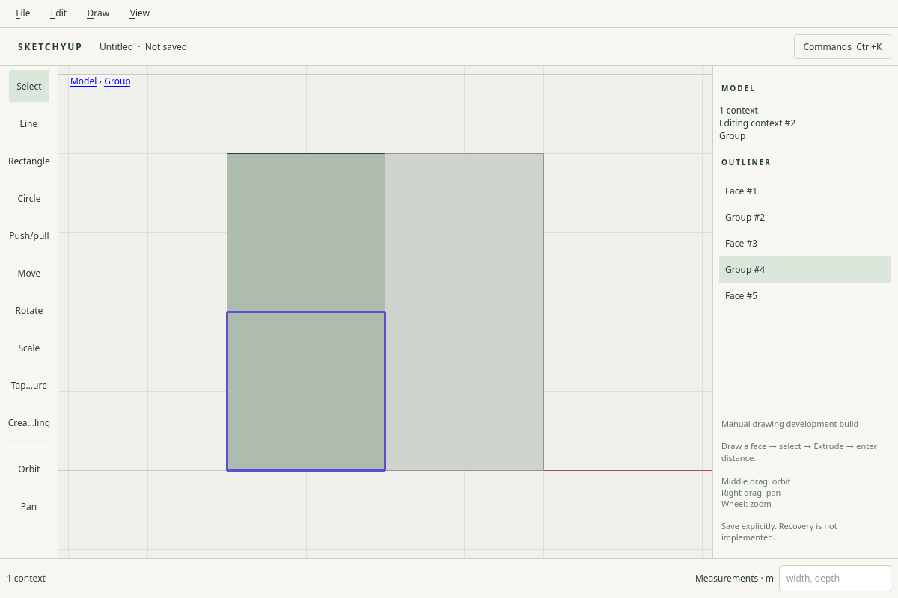

# R032.b: raw selection grouping and native nested editing

Date: 2026-10-04. Local validation passed; CI pending. Requires merged R032.a, PR #35.

Make Group (`Ctrl+G`) transfers selected faces, edges and guides into a new group,
retaining per-source raw records so colors, analytic curves and local identities
survive. Whole selected contexts are reparented with their world placement intact.
Unselected faces retain shared boundary vertices/edges; group extraction cannot
tear a neighboring face. Grouping within a legacy raw editing context promotes
that record to an explicit group without changing its identity. One undo restores
the complete pre-group state.

The public `group.selection` command returns typed `transfers` maps, separate from
`copies`. Both transfer and copy maps omit targets removed later in the same batch.
Typed grouping and deletion accept an explicit editing `context` and boolean
`showHidden`; inactive, locked or hidden targets reject before publication.
Geometry subset extraction is shared with the existing transform/copy core.

Closed groups resolve face, edge and guide hits to their enclosing selectable
group. Crossing selection accepts visible group fragments; an enclosing window
requires all visible member geometry. Group contents become editable after
Enter/double-click; nested groups retain another boundary. Esc or a blank click
closes one level, and the clickable Model/ancestor breadcrumb can leave several
levels. Surroundings dim while the active group's contents keep their normal
appearance. Persistent lock ancestry is cached by document snapshot for picking.

Native Make Group, Explode (`Ctrl+Shift+G`), persistent hide/lock/reveal/unlock and
context navigation use the public command path. The two grouping shortcuts are
owned by the modeling viewport. Temporary view hide/lock remains available.
Group selection includes guide highlighting, including guide-only groups.

Drawing splits/merges geometry only in the raw record selected by its initial
anchor, and cannot merge into a closed/inactive group. Explode currently promotes
records while preserving world placement. Consolidating separate raw records
within a context and merging geometry on explode remains **R032.c**; the overall
R032 gate is not yet claimed.

Validation passed:

- 24 development suites and 19 ASan/UBSan suites, including all 36 public commands.
- Shared-boundary transfer, retained identity maps, one-step undo, raw-context
  promotion, group hit resolution and nested deletion isolation.
- Native X11 and isolated Wayland at DPR 1 and 2: Ctrl+G, group/guide picking,
  crossing/enclosed windows, dimming, scoped drawing/deletion, nested Enter/Esc,
  outside click, breadcrumb navigation, persistent hide/lock, save/reopen and
  explode/undo. Coincident drawing over a closed group creates separate model
  geometry and leaves the group's records unchanged.
- Full native X11 regression and Wayland rendering smoke with zero GL errors.

The replay exposed a C++ fixture initializer that constructed two segments ending
at the origin rather than the intended single divider. The grouping and existing
selection fixtures now use explicit Vec3 endpoints and assert the intended areas.
No geometry algorithm was changed to accommodate that fixture error.

These are implementation-agent checks, not independent human/physical-device acceptance.

