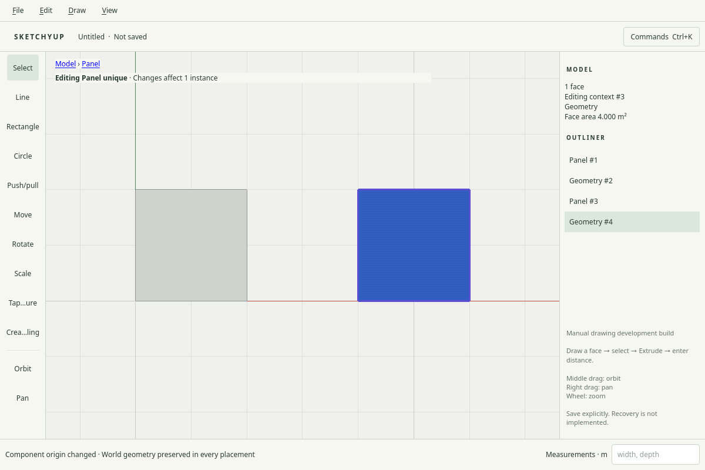

# R033.c: native shared component editing

Date: 2026-10-04. Local checks passed; CI pending.
Requires merged [PR #39](https://github.com/zygote55/sketchyup/pull/39).
No independent human component acceptance is claimed.

## Native workflow

Edit offers Make component, Place component, Replace component, Change component
axes and Make unique. `G` opens Make component while the viewport has focus.
Component creation accepts whole contexts or typed raw
face/edge/guide selections and commits one undo item. Name entry labels the
new definition and placement. Placement uses world coordinates in the active
context; axis entry uses component-local origin, normal and X direction and
preserves world geometry in every placement. Invalid form input stays in the
dialog with an error. Definition choices retain their IDs separately from labels.

Double-click or Enter opens a component using the same context mechanics as a
group; Escape, outside click and ancestor breadcrumbs close it. The persistent
viewport banner names the innermost definition, counts every affected instance
and offers Make unique while the definition is shared. Nested make-unique clones
the required ancestor ownership path, preserving peer placements and scene IDs.

Drawing, push/pull, transforms, copy arrays, paint, grouping and typed deletion
use the explicit shared scope. Tool previews, cancellation and guarded numeric
amendment retain their existing lifecycle. Newly created geometry and copies
select only the initiating placement; geometry and lineage reports cover all
peers. Group/explode preserves nested identities, and merge selection follows
geometry moved out of the empty canonical root into a raw member.

Persistent reveal/unlock remains available for shared members and their peers.
The global actions update canonical and resolved flags together. Clear all guides
also updates placed definitions with their resolved geometry. Persistent locks
still reject geometry changes that would affect a locked instance.

## Public contract and implementation

`component.selection` adds typed-selection component creation to the public
catalog. `component.edit` may include an `instance` that must belong to its
explicit `definition`; its inner body/context/parent/member IDs then address that
placement's resolved scene records. IDs outside the scope reject. Materialized
nested references are mapped by their canonical paths rather than numeric-ID
coincidence. Commands targeting nested definition geometry still require opening
that nested shared scope; boundary operations may promote its members.

The private definition draft uses the initiating instance's world frame for
world-coordinate commands. Publication removes that temporary frame and retains
only canonical local geometry. New world-root records are transformed back into
the definition frame. Root-owned drawing normalizes into a geometry member.
Shared boundary-only explode reuses existing scene member IDs, including nested
members promoted into the parent definition. Instance result copy/transfer maps
and created selection are translated back to the initiating placement.

`scene.state` accepts body `"0"` only with false state flags, to reveal/unlock all
canonical and placed records atomically. It cannot globally hide or lock the
model. File schema remains 8. Resolved geometry is still materialized per instance;
instanced rendering, component libraries, hosted cutting and parametric component
features belong to later roadmap entries.

## Validation

- Targeted core component, placed-scope and public-command suites passed.
- Native component workflow passed on X11 and isolated Weston Wayland at DPR 1
  and DPR 2, with no GL errors. It covers creation through the native form,
  mirrored shared line drawing, push/pull and array amendment, typed deletion,
  grouping/explode and selection, nested component creation/make-unique, the scope
  banner, independent painting, local axes and exact save/reopen.
- Scope tests cover nonuniform mirrored world drawing, immutable preview, exact
  world placement of newly created members, scene-ID rejection, copy selection,
  array count amendment, one-step undo, shared guide cleanup and global state reset.
- Development: 29/29 suites passed. ASan/UBSan: 23/23 suites passed.
- Final native regression passed: groups, selection, arrays, transforms, navigation,
  guides, constraints, inference, curves, drawing, numeric entry, tool lifecycle,
  interaction, viewport, dialogs, responsive shell and application smoke.
- Final component checks passed on X11 and Weston at DPR 1 and DPR 2 after the
  G shortcut and axes-dialog validation tests were added. Invalid input retained
  the form and left the exact document unchanged before a valid retry.

- Isolated compositor tests are synthetic implementation evidence. The physical
  Hyprland/output-scale checkpoint remains part of the M4 integrated gate.
