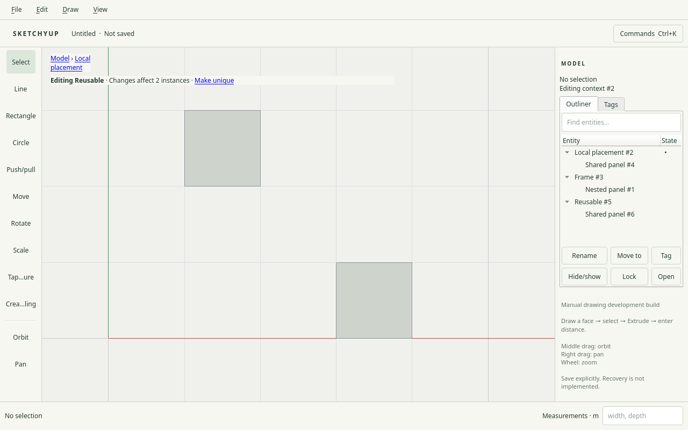
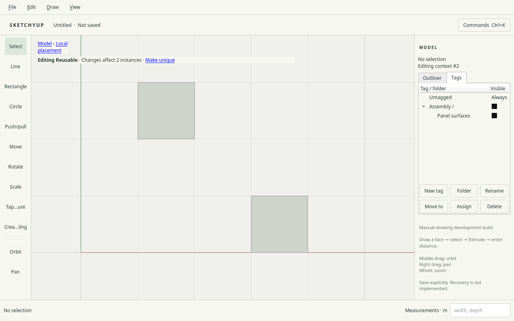

# R034.b: native Outliner and tag organization

Date: 2026-10-04. Local checks passed; CI pending.
Requires the R034.a foundation in [PR #41](https://github.com/zygote55/sketchyup/pull/41).

The Model panel provides Outliner and Tags tabs. The Outliner renders actual
scene parentage, keeps matching ancestors during search, and mirrors eligible
viewport selections. Hidden, locked and out-of-scope rows remain inspectable;
viewport selection still enforces the existing context and visibility policy.
Enter/double-click explicitly opens a context, with existing breadcrumbs and
shared-component banner feedback. Escape closes the active context.

Rename, Hide/show, Lock, Move to and Tag buttons share command paths with keyboard
actions. F2 renames, Space toggles local visibility, Ctrl+Shift+L toggles a lock,
Ctrl+Shift+M chooses a parent, and Ctrl+Alt+T chooses a tag. Folder/tag creation
also has Ctrl+Alt+F / Ctrl+Alt+N bindings in Tags. F6 region traversal reaches the
active organization tab. Local hide flags remain distinct from inherited tag
visibility and temporary viewport visibility.

Entity and tag trees support reparent drops. Dropping onto a row chooses that
parent; empty space chooses the model/tag root. Compound entity moves preserve
world frames and retain one undo item. Selected descendants travel with selected
ancestors. Invalid parent kinds, cycles, locks and shared-definition ownership
reject through the command/core contract. The drag payload is tied to its source
tree and exact document snapshot/revision; stale or foreign drags cannot publish.
Qt never removes source rows independently of a committed document operation.

Tags remain independent of scene ownership. Their visibility checkboxes and
Space action affect descendants through folder inheritance. Untagged is always
visible and cannot move or be deleted. Folder/tag rename and parent forms retain
invalid input with an inline error. Used-tag and nonempty-folder deletion reject
without a confirmation dialog or document mutation.

The adapter recognizes global tag-table operations, placement-local root state
and explicit shared member scope. Editing a canonical member while its component
is open propagates to peers. Renaming the active placement root remains local.
Mixed placement/member batches reject rather than hiding their scope.

## Validation

- Native workflow passed on X11 and isolated Weston at DPR 1 and DPR 2.
- Tests exercise hierarchy ownership, search, bidirectional selection, F2/button
  rename, keyboard/button hide and lock, context entry, world-preserving reparent,
  one-step undo, tag/folder forms, assignment, keyboard/pointer visibility,
  component shared/local naming and exact save/reopen.
- Native drag-enter/move/drop events use the tree's real MIME payload and command
  adapter, covering successful scene and tag moves, stale snapshots and cycles.
  Final drag-motion checks passed on X11 and Weston DPR 2, including Qt drop
  feedback. These are synthetic event-path checks, not an independent physical mouse test.
- Development: 30/30 suites passed. R034.a core ASan/UBSan evidence remains
  24/24; this child changes desktop adapters and tests, with no core mutation change.
- Full native X11 regression passed components, groups, selection, arrays, transforms,
  navigation, guides, constraints, inference, curves, drawing, numeric entry,
  lifecycle, interaction, viewport, dialogs, responsive shell and application smoke.
- Invalid tag names retain the form and unchanged document before a valid retry.
- A tag-checkbox regression exposed synchronous row deletion inside Qt's item
  delegate. A debugger backtrace identified the Space-key checkbox path; row
  refresh is now deferred until the input event returns. Selection/context
  handlers also preserve Qt's in-flight row pointers.

The physical Hyprland/output-scale checkpoint remains with the M4 integrated
acceptance. No independent human acceptance is claimed.

