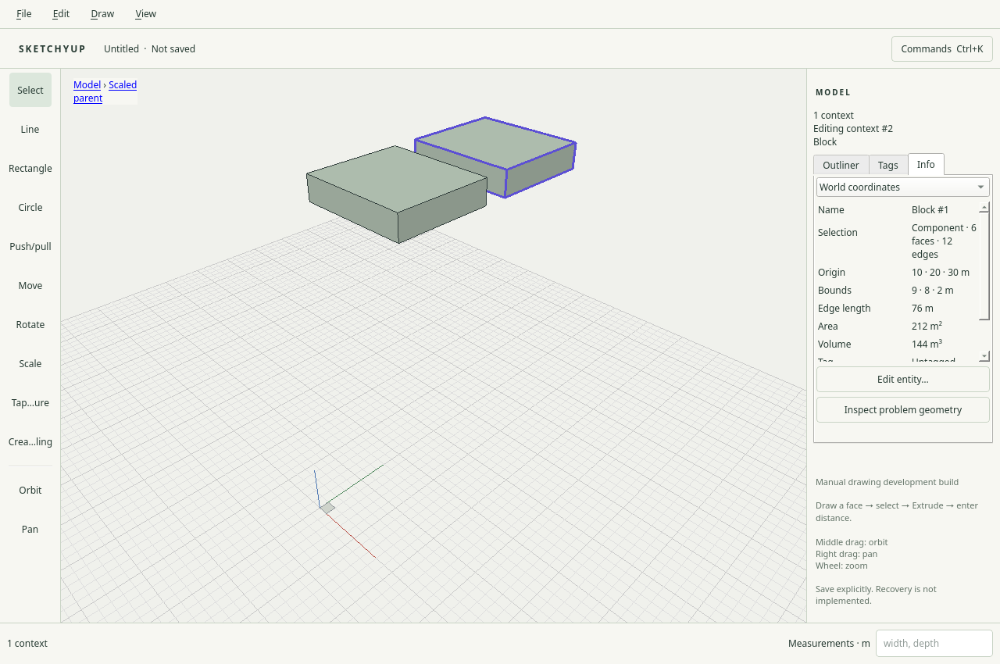

# R035.b: native Entity info

Date: 2026-10-04. Local checks and both CI jobs passed; merged in
[PR #44](https://github.com/zygote55/sketchyup/pull/44).
Requires the measurement foundation in [PR #43](https://github.com/zygote55/sketchyup/pull/43).

The Model tray's Info tab measures the single selected context, face, edge or
guide in explicit world, parent or intrinsic coordinates. It reports identity,
ownership/type, bounds, origin, unique edge length, face area, color, tag and
semantic fields. Closed single-shell geometry receives a volume only after the
[measurement contract](../decisions/0009-entity-measurements.md) passes. Other
cases show a reason; infinite guides do not acquire invented finite lengths.
Whole-context measurements include hidden descendants, as the query API does.
The panel caches measurements until the selected entity or document changes.

Edit entity (F2 within the Info tab) opens one native form for name, tag, origin
and dimensions. Editable coordinates are world or parent; intrinsic dimensions
remain read-only because intrinsic measurement removes placement scale. Numeric
fields accept metric, imperial and locale-aware values. Only modified numeric
fields are parsed, preserving exact original values in untouched fields.
Resizing uses the bounds minimum, followed by any explicitly entered origin;
a repeated original origin still wins after resizing off-origin/mirrored bounds.
The complete form is one atomic command batch and one undo step.

Invalid inputs and transaction errors remain inline with the user's text intact;
Cancel leaves the document unchanged. A changed document or editing context
rejects the stale form. Closed component roots edit local placement; members in
an opened component edit the shared definition. Existing locks and context rules
remain authoritative. Face/edge/guide readouts do not offer whole-entity editing.
Semantic fields are read-only here; recipes edit their typed values through
`entity.properties`.

Inspect problem geometry opens the offending record's context and selects the
available boundary edges/faces without mutating geometry. Vertex diagnostics
select their incident edges. This is selection feedback, not automatic repair
or the later full Diagnostics panel.

## Validation

- Development: 32/32 suites passed. Core code is unchanged from the R035.a
  baseline that passed 26/26 ASan/UBSan suites.
- Native Entity info checks pass on X11 and isolated Weston at DPR 1 and 2.
- Fixtures cover rotated/mirrored nonuniform parents, intrinsic versus world
  volume, metric/imperial and decimal-comma input, combined position/dimension
  edits, one-step exact undo, rejected collapse with retained input and retry,
  cancellation, stale form rejection, component placement versus shared member
  edits, invalid-solid boundary selection, infinite guides and exact save/reopen.
- X11 component, selection and responsive shell regressions passed.
- The inherited Outliner workflow passes on X11 and Weston; the PR #43 test
  correction waits for modal activation before rapidly submitting dialogs.
- CI runs the new native suite on both platforms at both scales.

The screenshot is implementation-agent evidence, not independent human
acceptance or physical Hyprland output-scale verification. Both child PRs passed CI and R035 is complete.

