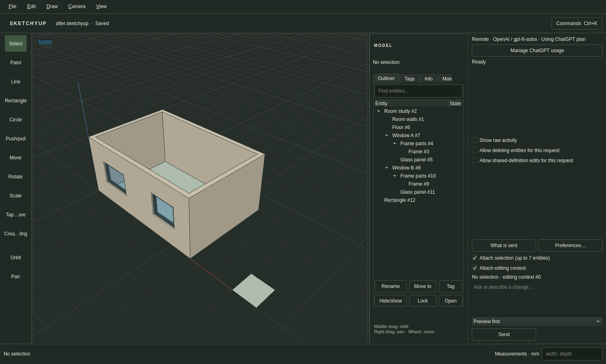
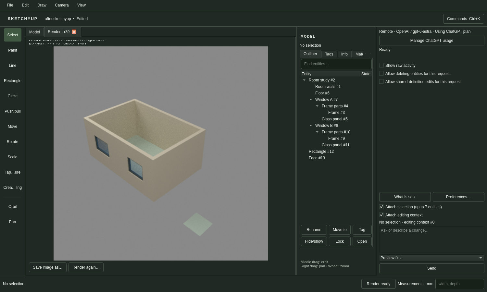

# R051.c — Ordinary component edits and live manual-target acceptance

Date: 2026-10-05 UTC. The previously failing, manually drawn window now passes
live native acceptance with **gpt-6-astra through ChatGPT plan**. It has no recipe
metadata. M5's local workflow evidence passes; CI and dependency merges remain required.
[Gate record](M5.md), [sanitized measurements/hashes](R051c-live-summary.json).
[Command and lifetime contract](../decisions/0042-instance-only-component-edits.md).

## Changes and independent verification

`component.edit_instance` makes only the selected placement and its enclosing
ownership path unique before editing member geometry. It uses existing inspected
scene IDs and rejects commands affecting global resources or shared definitions.
The native routine allowlist exposes it without shared-edit permission. Recursive
authorization still checks every nested command, including deletion permissions.
Published command schemas retain their descriptions and explain matrix layout.

The live model inspects the actual frame, glass and wall vertices, then batches
ordinary vertex transforms for the two jamb sides. Member vertices move with the
jambs, preserving 80 mm members; the real opening moves in the wall separately.
It does not invent recipe bindings or substitute a whole-window scale.

Flat and nested-component tests independently verify exact geometry, unchanged
siblings and original definitions, read-only preview, coherent persistence,
one-entry Undo/Redo, outside-target rejection and atomic rollback. Shared command
wrappers cannot bypass the assistant's nested authorization. All 63 enabled CTest
suites pass (38.65 s; opt-in real Blender CTest skipped); the native live runs
exercise real Blender separately. Component scope and assistant orchestration,
including injected-clock draft expiry/recovery, pass ASan/UBSan/leak checks.

## Retained live attempts

The first metadata-free attempt in R051.b remains a failure: the recipe refused
missing metadata and the assistant accurately reported no edit. The second
attempt, after adding the ordinary command, staged the correct width but its
60-second draft expired during verification. An attempted replacement hit the
stale ownership marker, then cumulative task tokens stopped the run. No live
geometry was published (15 turns, 14 calls, 241,728 accepted reported tokens,
132.849 s).

Assistant drafts now default to the remaining task time, capped at five minutes;
explicit shorter lifetimes remain honored. Confirmed dispatcher expiry clears
the ownership marker so a fresh bounded attempt is possible. Neither change
extends the task deadline or applies a proposal automatically.

**Manual attempt 3 passes:** 13 turns and calls, 225,544 reported tokens,
113.601 s to preview. The independent native oracle measures 1.4 m selected width,
1.2 m sibling width and 9.848 m³ wall volume. Center, sill, height, depth, 80 mm
members and every unrelated body record are preserved. Apply is one history entry;
Undo, Redo and save/reopen preserve the expected geometry and component structure.
The manual fixture's millimeter display units and materials survive reopening.

Blender **5.2.1 LTS**, CPU, 512², 32 samples renders the reopened document while an
additional manual edit occurs. The verified manifest identifies the source
revision before that edit. Native model and render screenshots were inspected.

Raw synthetic transcripts and recordings stay in the private local evidence
folder. Sanitized measurements and artifact hashes accompany the gate record. Earlier failures remain part of that record.

The native room-from-empty trial also passes: 10 turns/calls, 133,970 reported
tokens and 68.314 s through preview, followed by measured geometry, one-entry
Undo/Redo, reopening and real rendering. The runner's `room` mode requires an
empty native input. The final repeated resize corpus passes 3/3 under the native
subscription limits (10/12/14 turns; 98,807/121,570/149,877 tokens). The original
12-turn corpus and its failures remain unchanged. Reports now include task limits.

A separate CLI inspection of the four successful native output files compares
world-transformed frame and glass vertices with explicit analytical coordinates.
All four match; widened glass spans the 1.24 × 0.84 m clear opening. This supplements
the original native oracle, and future native trials check the glass explicitly.
The retained `verify-members.py` and its report are included in the hashed local
artifacts. Native panel regression passes X11 DPR 1 and Wayland DPR 2; all three
new MP4s fully decode. No CI success is claimed before the PR checks complete.
