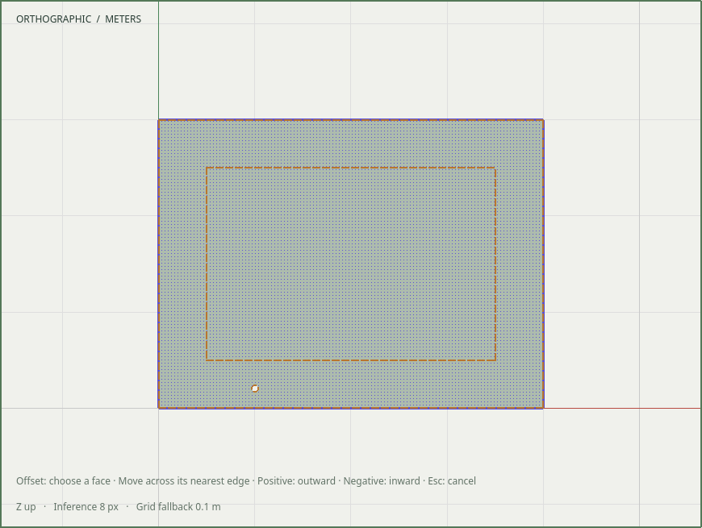
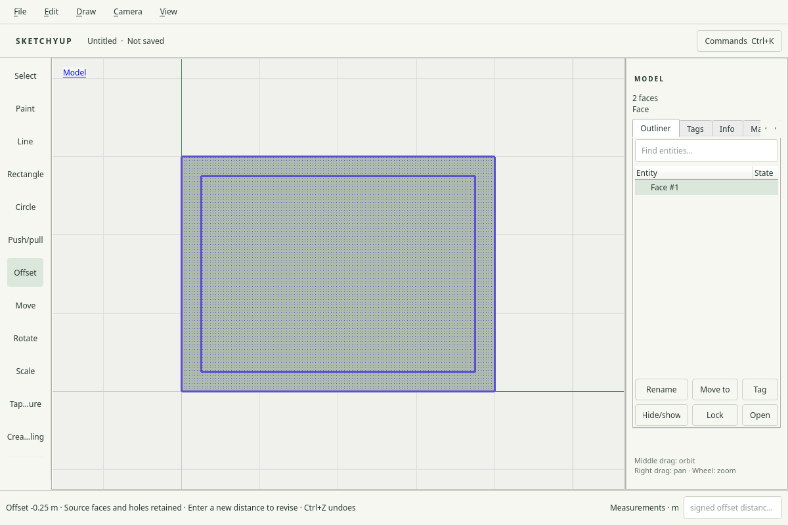

# R052.c — Native Offset tool

Date: 2026-10-05 UTC. Local kernel, command and native acceptance passes;
CI/dependency merges remain required before R052 delivery.

The Draw menu and tool rail expose Offset with shortcut **F**. Select a face and
enter one signed length in Measurements, or click a face and move perpendicular
to the nearest boundary to preview. Positive expands outward; negative insets.
The pointer reference respects outer/hole material sides regardless of loop
winding. Click again or finish a drag to commit; Escape discards the proposal.

The viewport invokes the registered `geometry.offset` command in world space.
The preview uses the same command and document revision as publication. Exact
numeric input accepts document units and explicit units; re-entry replaces the
last eligible offset as one Undo item. Failed/collapsed re-entry retains the
previous edit. Intervening edits, Undo/Redo and document replacement invalidate
the old operation. Camera navigation remains available during preview.

Source-face descendants and generated faces are selected after publication,
including after numeric amendment replaces their IDs. No surviving island is
chosen by size. Source coverage and explicit holes follow the command's
[documented insertion policy](R052b-offset-command.md); the tool does not silently
delete collapsed source regions or heal holes. Shared component editing retains
the existing visible editing context and explicit make-unique controls.

R052 acceptance still requires kernel, command and native evidence plus CI and
dependency merges. M6 delivery remains behind the M5 gate.

## Validation

All 65 enabled CTest suites pass (39.62 s); the opt-in real Blender test is skipped,
and no new live-provider/render claim is made for Offset. The command PR's first
CI exposed stale installed discovery schemas; all three generated transaction,
session and MCP artifacts now match the registry and their regression tests pass.

`offset_input_tests` passes on isolated X11 and Wayland at DPR 1 and 2. It checks
the F shortcut, visible framebuffer preview pixels, cancellation, keyboard-only
explicit units, one-entry numeric revision, selected replacement faces,
collapse/stale-edit rejection, Undo/Redo, persistence, pointer drag, outward
material direction at a hole boundary, and committing after camera navigation.
Adjacent numeric-input and tool-lifecycle regressions pass on X11. The final
native Offset test passes ASan/UBSan/leak checks on Wayland DPR 2; kernel and
command sanitizer checks are recorded in the preceding slices.

The preview image is captured from the actual viewport framebuffer; the applied
image shows the native window after revising the inset to 250 mm. Both were
visually inspected. The isolated X11 recording fully decodes and is retained at
`build/evidence/r052c/native-offset-final.mp4` (SHA-256
`23d51bdd09ae9bf73fd8543491ca3e7ceb48f7bba96a73e6ba4ea72a24e65232`).
These are programmatic native interaction checks, not an independent usability
study. No capture includes the user's desktop or account preferences.

