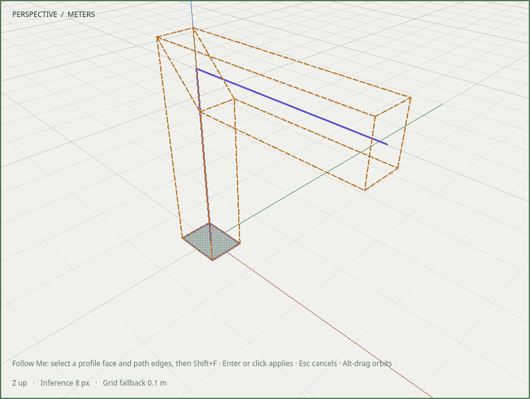
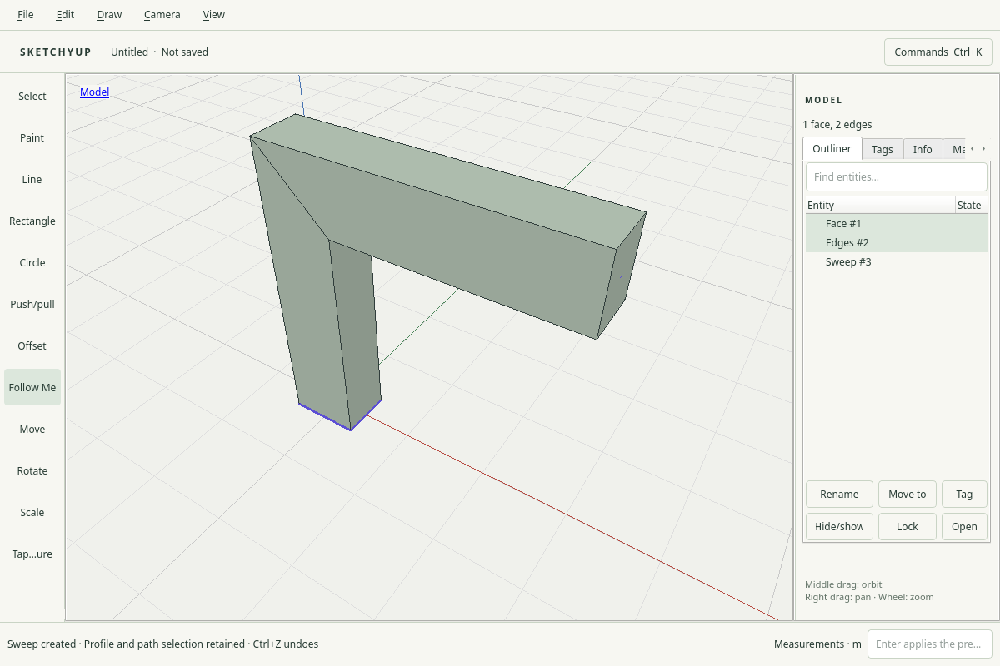

# R053.c — Native Follow Me acceptance

Date: 2026-10-05 UTC. Depends on R053.b; CI/dependency merges remain pending.
The R053 contract is [0044](../decisions/0044-profile-sweep.md).

Follow Me is available in Draw, the tool rail and Shift+F. Select one profile face
and connected path edges with ordinary click/Ctrl-click, then preview. Enter or
click creates a separate editable solid; Escape preserves source, path, selection,
allocator and history. Alt-drag orbits while the validated preview remains visible.
Intervening document changes cancel the preview. Invalid short/branched paths have
actionable messages and cannot publish.

`sweep_input_tests` uses real Qt mouse selection and keyboard shortcuts, verifies
more than 100 amber preview pixels in the actual framebuffer, and checks one
history item, source/path record retention, selection, Undo/Redo and native
save/reopen. Independent solid checks verify a 2.88 m³ elbow, a 6.72 m³ closed loop
without seam caps, and a 16-segment faceted curved path against its analytical
profile-area × chord-length sum. Native editing inside an explicit shared
component scope creates both instance results in one history item and retains
the profile/path selection. Core/command evidence separately covers twist,
holes, global crossings, mappings, materials and transformed instance scope.

Local native runs pass X11 at DPR 1 and 2, and isolated Weston Wayland at scale 1
and 2. The Wayland scale-2 run also passes ASan, UBSan and leak checks, with the
existing generic/Fusion/no-decoration test settings. Native input is programmatic
Qt input, not an independent human usability study. The closed-holed-profile
limitation remains explicit; no live-provider quality trial is claimed here.

The complete 68-entry CTest run had 66 passes, the opt-in real-Blender skip, and
one command-catalog coverage failure. The sweep command was added to that existing
all-published-commands fixture in R053.b commit `cb8771a`; its targeted rerun
passes (2.01 s). All 67 enabled suites therefore pass with that correction.
Adjacent native Offset, Measurements and tool-lifecycle regressions also pass on
X11. The final shared-component interaction passes all four native display runs
and the Wayland scale-2 sanitizer run.

Retained captures were visually inspected:

The retained local recording `build/evidence/r053c/native-sweep.mp4` fully decodes.
SHA-256: `5209f0ddf6fe6e4875cf84310e1d9e7a8607f351c9bd432a7f2f0f532c3b2f6f`.
The preview PNG hashes to
`9b0189fc12911f95829e7cb25f9a1031f54685c98dcc67474a166734dfb961d9` and the applied PNG
to `52144f2d984af62457e08403cffac866278a05e9d4700c5e1cf6e6f720783fac`.
