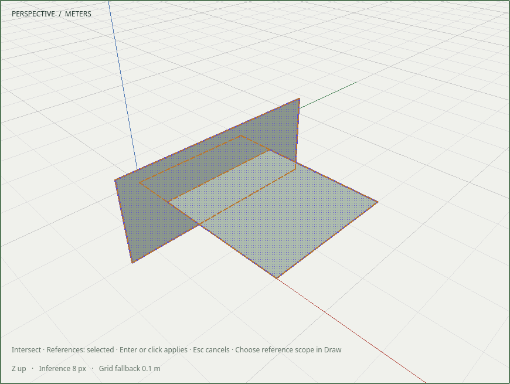
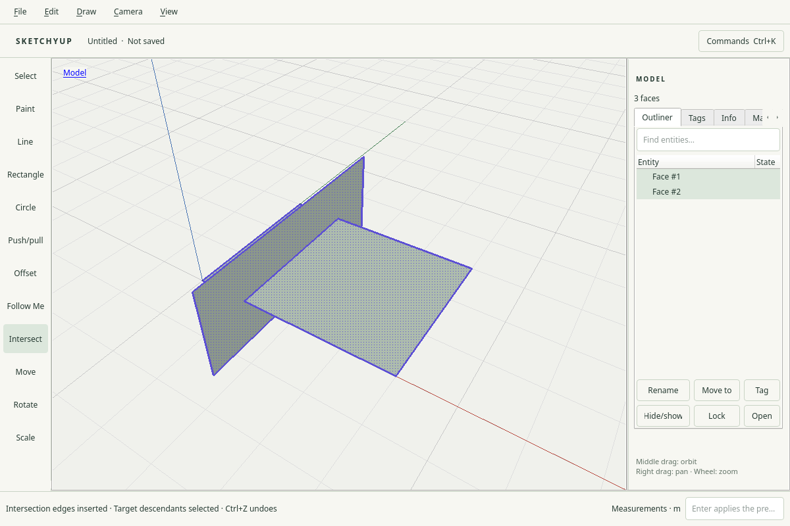

# R054.c — Native intersection acceptance

Date: 2026-10-05 UTC. Depends on R054.b; CI/dependency merges remain pending.
The R054 contract is [0045](../decisions/0045-face-intersections.md).

Intersect is available in Draw, the tool rail and I. Select target faces with
ordinary click/Ctrl-click; Selected references compares those faces, Active
context reads the current raw-geometry context, and Model reads persistently
visible scene faces across group boundaries. Enter or click applies; Escape
preserves source, selection, allocator and history. Alt-drag orbits with the
preview intact. Changing reference mode rebuilds the active preview. Existing
seams produce a no-new-edges message. Intervening document edits invalidate the
pending preview. Unselected reference bodies are retained.

`intersection_input_tests` uses real Qt mouse selection and shortcuts, checks
more than 100 amber preview pixels in the actual framebuffer, and independently
locates the expected (1,0,0)–(1,3,0) seam in both crossing faces. It checks one
history item, source-to-descendant selection, Undo/Redo and exact native
save/reopen. Context mode edits only the target; Model mode reaches across a
group boundary. Native component editing reads an outer-scene reference and
maps selected descendants back to scene identities. Both no-op and stale
previews cannot publish.

Local native runs pass X11 at DPR 1 and 2 and isolated Weston Wayland at scale
1 and 2. The Wayland scale-2 run also passes ASan, UBSan and leak checks
with the existing generic/Fusion/no-decoration test settings. Input is
programmatic Qt input, not a human usability study. This adds
no live-provider quality claim. The command's persistent visibility policy does
not incorporate viewport-only temporary hiding of references.

The full 70-entry CTest run passes all 69 enabled suites (19.62 s); the
opt-in real-Blender trial is skipped. Adjacent native Follow Me, Offset,
Measurements and tool-lifecycle regression runs also pass on X11.

Retained captures were visually inspected:

The retained local recording `build/evidence/r054c/native-intersection.mp4` fully
decodes. SHA-256:
`63a2cc24442a4a423b2e9506cb41d50a786039a845f944c1670854a535eb5103`.
The preview PNG hashes to
`3fa5d4ec014571254fa797110c77994fb550beabc2d54ad25b07df23cc549ad9` and the applied PNG
to `2773a87426c0aa5ebfa5d0259fbf7c11dcd025620e31c9c4790fa1c88b51dcdd`.
