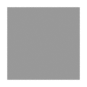
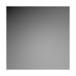
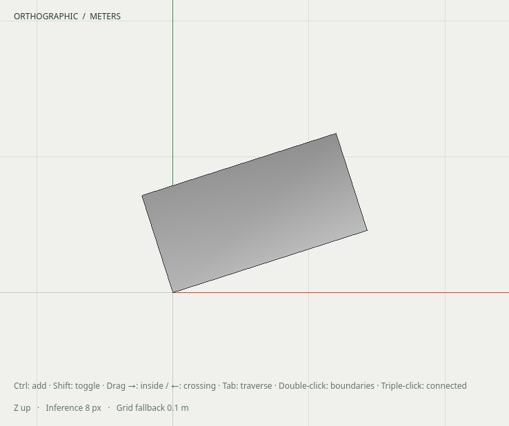
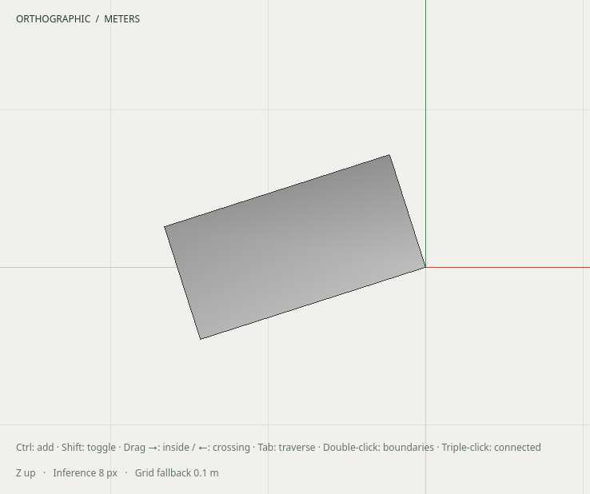

# R057.g — Shared smooth normals in viewport and export

Date: 2026-10-06 UTC. Depends on R057.f. Local shading-kernel, export and native
framebuffer acceptance pass. CI/dependency merges and native edge display controls
remain. [Contract](../decisions/0052-smooth-shading.md).

The full development build and **81/81 CTest tests** pass in **58.77 seconds**,
including the real Blender worker. A fresh installation includes the shading
contract and creates/reopens/exports the installed edge-style example with its
original two triangles. The existing native viewport cache/context/picking suite
also passes on X11 at DPR 1.

The immutable helper derives area-weighted face-corner fans using authoritative
edge incidence and independent smooth flags. It joins only consistently oriented
two-face edges, leaves hard and disconnected corners separate, and preserves the
surface, topology and tessellation. Flat defaults and hidden/soft independence
remain intact. Quantized triangulation corners resolve through the original face
projection rather than nearest-coordinate welding.

Kernel fixtures pass normally and under ASan/UBSan/leak detection: unequal-area
perpendicular faces at small/normal/large scales, all eight three-face cube fans,
partial hard seams, inconsistent winding, non-manifold edges, disconnected
coincident identities, cancelled opposite normals, hole-subtracted weights and
oblique faces translated hundreds of kilometers from the origin.

Four exported fixtures independently decode every front/back corner normal:
flat cube, fully smooth cube, shared reflected/nonuniform component instances and
a smooth cube with an explicitly hard top. All preserve the original twelve
physical triangles (paired GLB sides emit twenty-four). Mesh sharing is retained.
The pinned glTF validator reports zero errors and warnings for all four fixtures.

Actual Blender 5.2.1 LTS imports through the application's fixed worker adapter,
retains split normals, removes only redundant back primitives and retains shared
mesh storage. Imported normals match analytic face/corner normals within 0.0005,
including independently calculated mirrored/nonuniform world-space normals.
Four actual Cycles renders use a fixed directional light and a common opaque
interior top-face probe. Flat and explicitly hard-top RGB are 0.59608; smooth RGB
is 0.64314, unchanged by adding the reflected shared instance. Original GLB hashes
remain unchanged and temporary derived import files are removed.

Native framebuffer tests pass on X11 and Wayland at DPR 1 and 2. Cube triangle
centroids match independently calculated corner lighting with nonuniform, rotated
and reflected placements. Changing only edge flags causes one appearance upload
without rebuilding local triangles or world geometry. Undo restores flat pixels;
native reopen renders without GL errors. Existing front/back material, opacity,
reflection and picking regression checks pass on X11 at DPR 1.

The kernel and decoded-export suites also pass together with ASan, UBSan and leak
detection (2/2, 0.30 s). The native framebuffer suite passes under the same sanitizers
on Wayland at DPR 2. CI includes the kernel, exporter, four native display variants,
actual Blender normal/pixel checks and the native sanitizer run.

Retained local artifacts are in `build/r057g-smooth-fixtures`. SHA-256:

- Validator JSON: `90f871cf8341f2d800395de7550c543d52623b8d3e246ebce0c5e9f0ceef1e72`.
- Blender JSON: `6118649a3651c64073ed7a1855001591badcae87c0f715d3ee5a9fd39b03a1d6`.
- Native smooth framebuffer: `dc461ea0a13ddd8bb5a139928569657060a9f4729bcac80bc9fd817128b380db`.
- Native mirrored framebuffer: `f33a8cac5011f924676a8a3e855a27678bf25c542f34d3f8ae151914a5e8fd96`.

No native hide/soften/reveal UI or new live-provider acceptance is claimed here.
