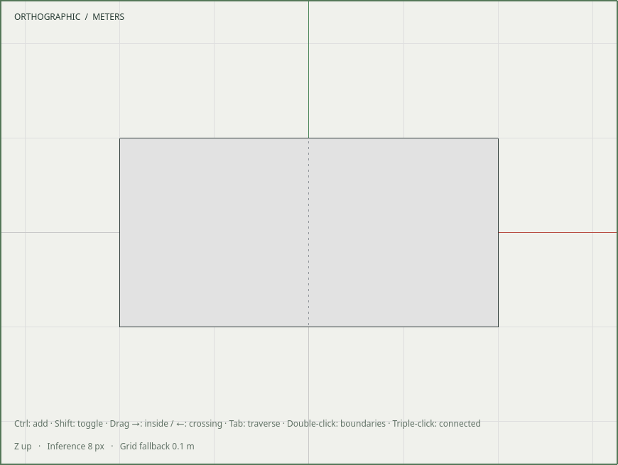

# R057.h — Native edge appearance and explicit reveal

Date: 2026-10-06 UTC. Depends on R057.g. Local native and full application
regression acceptance pass; CI/dependency merges remain pending.
[Contract](../decisions/0051-edge-appearance.md).

Edit → Edge appearance exposes Hide/Reveal, Soften/Harden and Smooth/Flat for
selected typed edges. Each action changes only its named flag through the shared
command, including canonical component scope and one Undo item. Selection and
geometry identities remain stable; newly suppressed edges leave ordinary selection.

View → Show hidden geometry draws hidden/softened edges with display-scaled
dashes and exposes them to picking and inference. Disabling it prunes those
selections without editing the document. Transient reveal never clears persisted
flags, and locks/editing boundaries still apply. The normal surface remains
intact: hiding or softening a seam does not remove adjacent faces or change shading.

`edge_visibility_tests`, existing selection tests and edge command tests pass
normally (3/3, 0.18 s). Visibility and command suites pass with ASan, UBSan and leak
detection (2/2, 1.62 s). They verify independent flags, selection pruning, temporary
versus persistent reveal, explicit typed-ID clearing, ancestor locks and contexts.

`edge_input_tests` passes on X11 and Wayland at DPR 1 and 2, and under ASan/UBSan
with leak detection on Wayland at DPR 2:

- All six real QAction entries publish the intended flag independently.
- Framebuffer probes distinguish an ordinary solid seam, an absent suppressed
  seam and a revealed dashed seam. Smooth alone retains its ordinary stroke.
- Picking updates immediately with visibility; point inference follows the same
  reveal mode. Isolated endpoints of a hidden loose wire cannot attract inference.
- Hide creates one history entry; Undo restores both picking and pixels. Reopen
  preserves appearance and native edge identity without changing topology.
- Clearing hidden does not clear soft; hardening does not clear smooth.
- Shared component actions update a reflected instance. Make Unique isolates
  later edits; group boundaries and persistent ancestor locks remain enforced.

The revealed-line buffer participates in GL context cleanup/recreation. Dash
scaling is set before its first draw on every frame, including display changes.

A recording of the test's real native actions is retained at
`build/evidence/r057h/native-edge-controls.mp4`. It captures only an owned isolated
X server and decodes fully with FFmpeg; the user's desktop is not captured.

SHA-256: native recording
`b4c92677b392f2782c3c859002c06e963788abb7e0dd07ac2824748ff969338f`;
revealed-edge framebuffer
`00f3ffad406eccf80ae178d957ce304d98cbb3f9dcf0d0e53523a783c9c276fb`.

Existing native shell/layout, typed selection, inference and viewport regression
suites pass on X11 at DPR 1, including context recreation and cache reuse. A fresh
temporary installation runs and reopens the installed edge-style example and
includes the updated native-control contract. Owned temporary artifacts are removed.

The full development build and **82/82 CTest tests** pass in **70.90 seconds**,
including the real Blender worker. CI includes the edge visibility and command
sanitizers, all four native display variants and the native Wayland sanitizer run.
