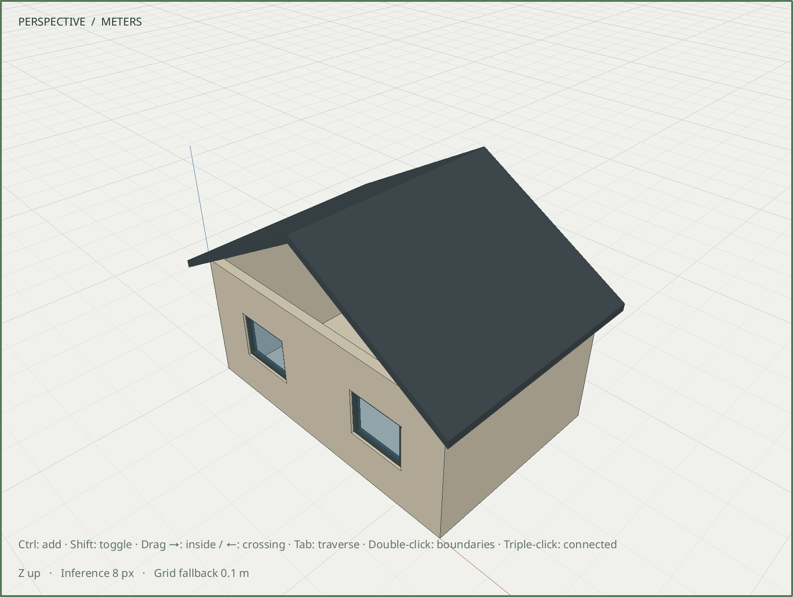

# R060.b — Editable gable roof

Date: 2026-10-06 UTC. Depends on R060.a in the review stack.
[Geometry and parameter contract](../decisions/0056-gable-roof-recipe.md).

`assembly.roof` expands into ordinary face, extrusion, group, transform, material,
property and measurement-assertion commands. It produces one closed native solid
inside an ordinary group, with an explicit world origin and ridge parallel to Y.
Thickness is vertical; pitch is in degrees. Existing geometry, canonical component
and hosted attachment records remain unchanged. Publication is one Undo item.

The dedicated core suite verifies:

- Default pitch from actual ridge/eave vertices; plate, underside eave/ridge and
  top-ridge heights; overhang, vertical thickness, outward closed-solid orientation
  and independently expected 4.554 m³ material volume.
- Private preview versus commit, exact save/reopen, one-step Undo/Redo and preserved
  room bodies, IDs, poses, materials, component definitions and both adopted windows.
- Minimum/maximum published spans and thicknesses, pitches of 5°, 45° and 75°,
  translated origins, and later ordinary mirrored/nonuniform group transforms.
- Atomic rejection of invalid pitch/thickness, nonpositive eaves, translated
  coordinate overflow and unknown fields, including rollback of preceding commands.

All **96/96 development CTest suites** pass in **63.23 seconds**, including real
Blender, legacy room/window recipes, hosted adoption, schema and transaction suites.
The roof, legacy model-recipe and adopted-room suites pass ASan, UBSan and leak
checks (117.39 seconds); the final strengthened roof fixture also passes separately
(19.43 seconds).

The native fixture passes X11 and Wayland at DPR 1 and 2, plus Wayland DPR 2 with
ASan, UBSan and leak detection. It uses an adopted room, adds the roof, performs an
actual native numeric Move, checks the unchanged room, invokes Edit → Undo, and
verifies exact persistence and a clean OpenGL render. The captured image below is
from the actual native Wayland DPR 2 viewport after Undo.

An installed CLI executes all eight steps of `roof-recipe-v1.json`, checks five
successful completion assertions, agrees between staged and committed measurements,
and saves at revision 1. The measured roof volume is 4.553999923660505 m³, within
the published tessellation tolerance of the analytic 4.554 m³ value. The model and
both installed native fixtures reopen byte-for-byte. Installed examples, contracts
and generated headless/MCP schemas match the source.

Retained artifacts:

| Artifact | SHA-256 |
| --- | --- |
| [Adopted starting room](../../examples/m6-roof-before.sketchyup) | `3bd0ff4056ed9d56ab640afa9abbd06b90985851086370a865809736ae23d0ed` |
| [Editable roof result](../../examples/m6-roof-after.sketchyup) | `772e251b36d2d18c717c82f84bb41adac6304bdc2379da28c1d8596cb4961355` |
| [Native capture](images/R060b-roof.png) | `8aa13e980e418cd87fd44413561725785ed5dcedc7ff9f99fcd2b1ee88664833` |

Authored parameters are creation metadata, not persistent constraints. Gable infill,
trusses and inferred wall attachment are outside this command. Stairs, furniture,
site placement and the integrated M6 gate remain subsequent R060 work.
