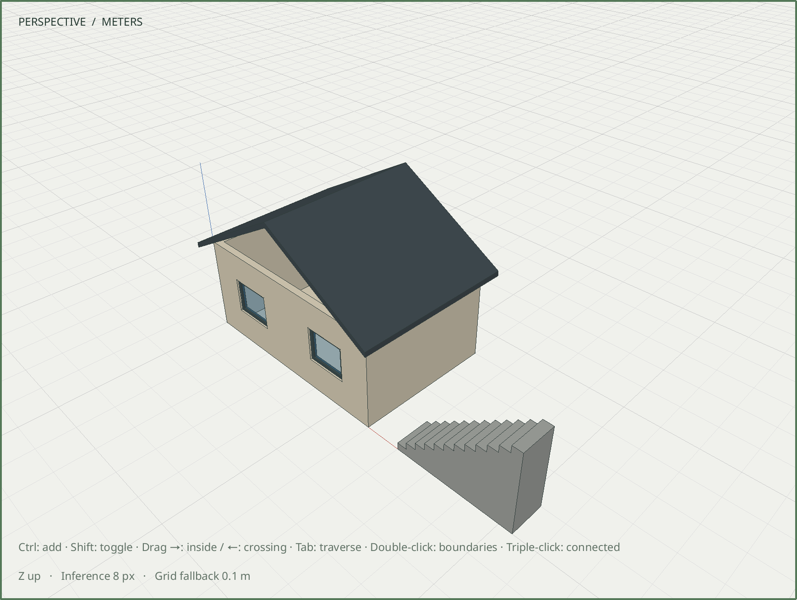

# R060.c — Editable solid straight stairs

Date: 2026-10-06 UTC. Depends on R060.b in the review stack.
[Geometry and parameter contract](../decisions/0057-straight-stair-recipe.md).

`assembly.stairs` creates a closed, filled stair flight inside an ordinary group.
Step count, width, total rise, tread depth and world origin are explicit. The first
and final tread positions follow the documented convention; no landing or host is
inferred. The expansion uses ordinary modeling commands and completion assertions.

The dedicated suite verifies each actual tread/riser endpoint and its rise/run,
the complete envelope, outward shell orientation and independent material volume.
The default twelve-step flight has twelve 200 mm risers, twelve 280 mm treads,
3.36 m total run, 1 m width and 4.368 m³ material volume. Minimum and maximum
published step counts, dimensions and widths also pass. Both inclusive derived-rise
bounds pass, including the floating-point boundary 1.2 m / 24; values just outside
each bound reject. The suite checks private
preview, one Undo/Redo, exact persistence, reflected/nonuniform ordinary edits and
preservation of the existing adopted room, roof, component definitions and windows.
Invalid/fractional step count, zero tread depth, invalid derived rise, unknown
fields and translated coordinate overflow roll back preceding batch edits.

All **97/97 development CTest suites** pass in **66.93 seconds**, including the
real Blender worker, command catalog, generated schemas and transaction recipes.
The dedicated stair suite passes ASan, UBSan and leak detection in **27.68 seconds**.

The native fixture passes X11 and Wayland at DPR 1 and 2, plus Wayland DPR 2 with
ASan, UBSan and leak detection. It creates the flight beside the adopted room and
roof, performs exact native numeric Move, verifies unchanged existing body records,
invokes Edit → Undo, and checks solid volume, exact save/reopen and clean GL state.
Capture waits for a completed repaint after the tool/camera changes.

The installed CLI executes all eight steps of `stair-recipe-v1.json`, validates
five completion assertions, and measures identical staged/committed geometry:
4.368 m³ volume and 3.36 × 1 × 2.4 m bounds. The composed room/roof/stair transaction
saves at revision 1. Both native fixtures and the recipe output reopen byte-for-byte;
installed examples, contract and headless/MCP schemas match the source.

| Artifact | SHA-256 |
| --- | --- |
| [Adopted room and roof](../../examples/m6-stairs-before.sketchyup) | `7e94f4d88bb985a44b4b95813e2dfe829973467259b2395cf5c2ca6e307a10d4` |
| [Editable stair result](../../examples/m6-stairs-after.sketchyup) | `df4d6e28393352c3aef3e8d350ac2a20c490cb8f7a32a3dd63b20ac438b285be` |
| [Native capture](images/R060c-stairs.png) | `d90a5187b2f1221cbb5cf3631655ba0c5feb4dd0915b920f598e441597aa0a62` |

The authored values are creation metadata, not persistent constraints. This is a
solid flight; rails, stringers, hollow flights and winders remain separate geometry.
Furniture, site placement and the integrated M6 gate remain subsequent R060 work.
