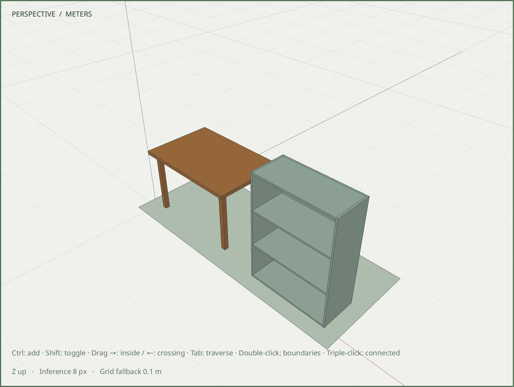

# R060.d — Editable table and cabinet assemblies

Date: 2026-10-06 UTC. Depends on R060.c in the review stack.
[Parameter and geometry contract](../decisions/0058-furniture-recipes.md).

`assembly.table` creates a top with four shared component legs. `assembly.cabinet`
creates an open-front cabinet whose side panels share one definition and whose
top, bottom and shelves share another. Ordinary commands construct each closed
member, place the assembly and verify its dimensions and material volumes before
one-task publication. Existing model and component records remain unchanged.

The dedicated fixture independently verifies every actual member's local dimensions,
world position/bounds, thickness and outward solid orientation. The independently
expected bounds imply non-overlapping member interiors. It verifies the root envelope,
shared definition identities, private preview, one-step Undo/Redo and exact reopen.
An ordinary instance-only edit makes just one leg/side unique and preserves every
sibling and unrelated body record. The starting scene contains an adopted room,
roof and stairs; its materials, definitions, instances and hosts remain unchanged.

Both minimum/maximum size variants and zero/six cabinet shelves pass. Invalid
sizes, fractional shelf count, impossible clearances, unknown fields and translated
coordinate overflow roll back preceding batch edits. Each member has dimension
and validated-volume assertions; the root has envelope assertions. Whole-assembly
measurement retains its conservative multiple-record volume classification.

All **98/98 development CTest suites** pass in **80.95 seconds**, including real
Blender, schema, command catalog and executable recipe checks. The final furniture
suite passes ASan, UBSan and leak detection in **119.84 seconds**.

The native fixture passes X11 and Wayland at DPR 1 and 2, plus Wayland DPR 2 with
ASan, UBSan and leak detection. It creates a table and cabinet above an existing
study base, performs actual numeric Move and Edit → Undo, preserves every other
body record, verifies exact persistence and checks clean OpenGL state. The image
below is an actual Wayland DPR 2 framebuffer of that compact native study.

Both installed eight-step recipes pass. The table reports 13 successful completion
assertions and 0.0455 m³ summed member material; the cabinet reports 17 assertions
and 0.05970585599999999 m³, matching the independent 0.059705856 m³ expectation.
Staged and committed measurements agree, and each composed scene saves at revision 1.
The models and all three native fixtures reopen byte-for-byte. Installed examples,
contract and headless/MCP schemas match the source.

| Artifact | SHA-256 |
| --- | --- |
| [Adopted starting scene](../../examples/m6-furniture-before.sketchyup) | `f345aa254d515cd634d732a2d9420801ad01c77289766a7228536f5bd5d4365c` |
| [Editable table result](../../examples/m6-table-after.sketchyup) | `d98f46f196070d9be3f2984ccf2d844b0db637e3cdb7daab84e1d977f478b5d1` |
| [Editable cabinet result](../../examples/m6-cabinet-after.sketchyup) | `15713af94b2e92c231fde2b79c8e3400e998629bd58aa7dc32abb50f36ff15e4` |
| [Native capture](images/R060d-furniture.png) | `91584f9401f3c0f0df40992c094014b95477cb40c9c46f736f1941461b5e4a68` |

Authored parameters are creation metadata, not persistent regeneration rules.
Cabinet doors/hardware and table braces are separate geometry. Site placement and
the integrated M6 gate remain subsequent R060 work.
