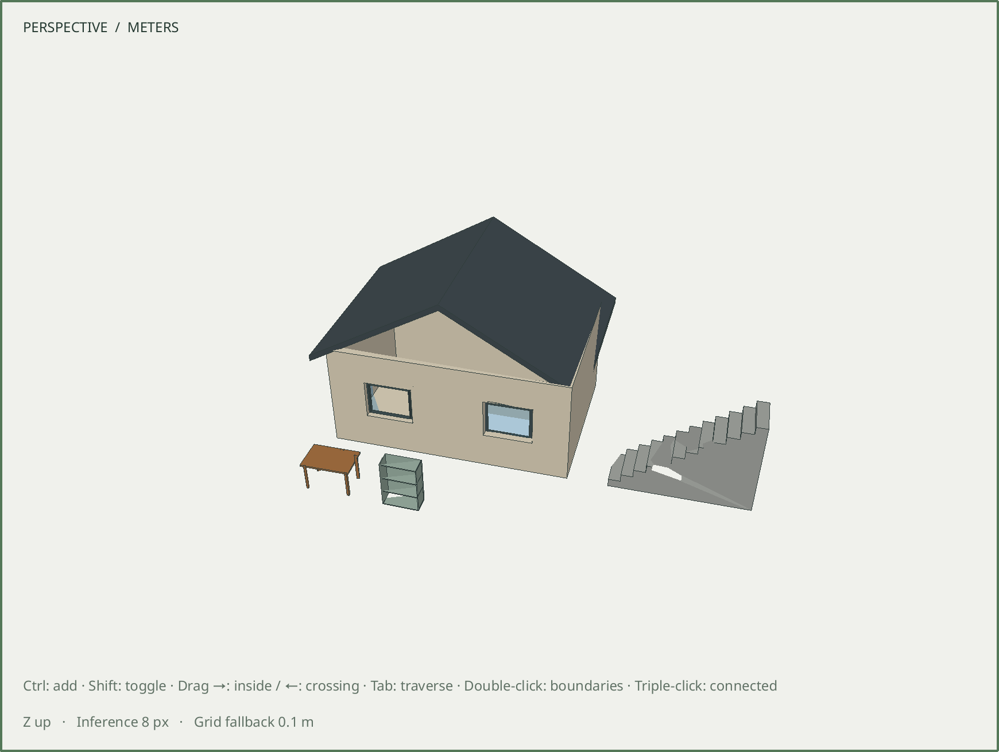
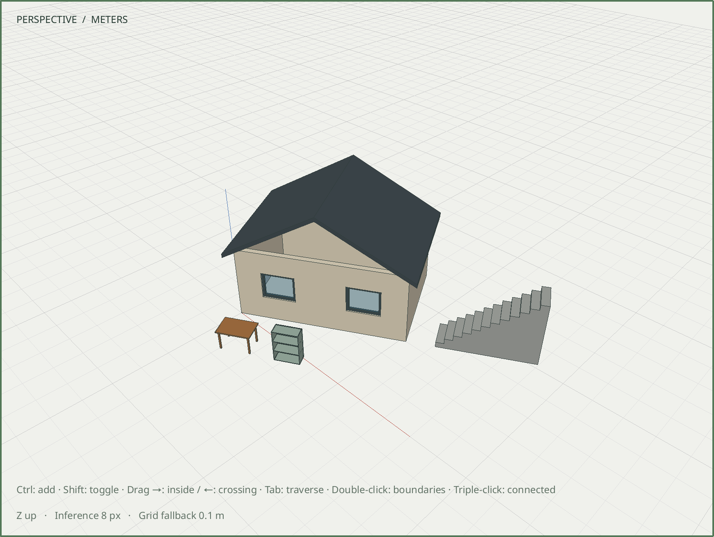

# R060.e — Explicit site placement

Date: 2026-10-06 UTC. Depends on R060.d in the review stack.
[Unit/frame and preservation contract](../decisions/0059-site-placement-recipe.md).

`assembly.site_place` requires an existing root, explicit input units, a world or
parent frame and a yaw delta. One ordinary transform preserves local geometry,
parent identity, component sharing, materials and complete hosted assemblies.
Three completion assertions verify world bounds and unchanged local dimensions.

The core fixture starts with an adopted room, roof, stairs, table and cabinet in
one group, plus unrelated geometry. It places the group at
[100000.125, 200000.25, 12.5] m with π/6 world yaw. Every actual world vertex matches
an independent transform to 1e-7 m. All local records and relationships stay exact;
an unrelated triangle and validated roof volume remain unchanged. Private preview,
one Undo/Redo and byte-for-byte native reopen pass. Five input units and both
frames pass under mirrored, nonuniform, rotated and sheared parents. Invalid units,
frames, IDs, angles, overflow, partial hosted assemblies, locks and canonical
component ownership reject atomically, including preceding batch commands.

All **99/99 development CTest suites** pass in **91.79 seconds**, including real
Blender, protocol, schemas and the shipped eleven-step recipe. The site core suite
passes ASan, UBSan and leak detection in **62.42 seconds**. The new recipe comparison
initially held references to temporary JSON objects; retaining owned QJsonValue
objects fixes that test-only crash, and the complete recipe suite now passes.

The native workflow passes X11 and Wayland at DPR 1 and 2, plus Wayland DPR 2 under
ASan, UBSan and leak detection. It loads the adopted fixture, places the group,
performs an actual one-millimetre numeric Move at the distant coordinates, checks
the result to 1e-8 m, invokes Edit → Undo, preserves local records and relationships,
and reopens exactly. OpenGL reports no error and the window closes cleanly.

The installed eleven-step example creates all five assemblies, discovers the new
group through bounded inspection, places it and publishes revision 1. All three
placement assertions pass; staged and committed measurements match. Its output and
both shipped native fixtures reopen byte-for-byte. Installed schemas, examples and
contract match the source. The command and document schema remain backward-compatible;
no persistent site metadata or geographic coordinate system is introduced.

## Rendering limitation found by acceptance

The actual Wayland DPR 2 capture at the distant origin shows triangle artifacts,
including a gap on the staircase. A controlled capture after translating the same
assembly to zero, keeping its yaw and framing its bounds, removes those artifacts.
The viewport currently converts world vertices and camera matrices to floats before
projection. Correct native geometry and a clean GL error state do not prove correct
rasterization. Viewport precision remains required follow-up work before closing M6.

The near capture is diagnostic evidence, not the saved result of site placement.
No screenshot has been retouched.

| Artifact | SHA-256 |
| --- | --- |
| [m6-site-before.sketchyup](../../examples/m6-site-before.sketchyup) | `5bee5dde6b5325e1e15c6d3122fc30b409c6e2bd2d9754bcfbcf8618df43c2ca` |
| [m6-site-after.sketchyup](../../examples/m6-site-after.sketchyup) | `fde297a539283834959cdd88a26513b4996ed2c27436d73b55026a416c679403` |
| [R060e-site-far.png](images/R060e-site-far.png) | `edc19e478549e19a8388ba42f3975c70e77724e214bb32984dd2af37eb778e95` |
| [R060e-site-near.png](images/R060e-site-near.png) | `47232ad208801e2711ac574385f1fcf8d9f63eeeeac7c794bed59ad3b89f6d20` |
