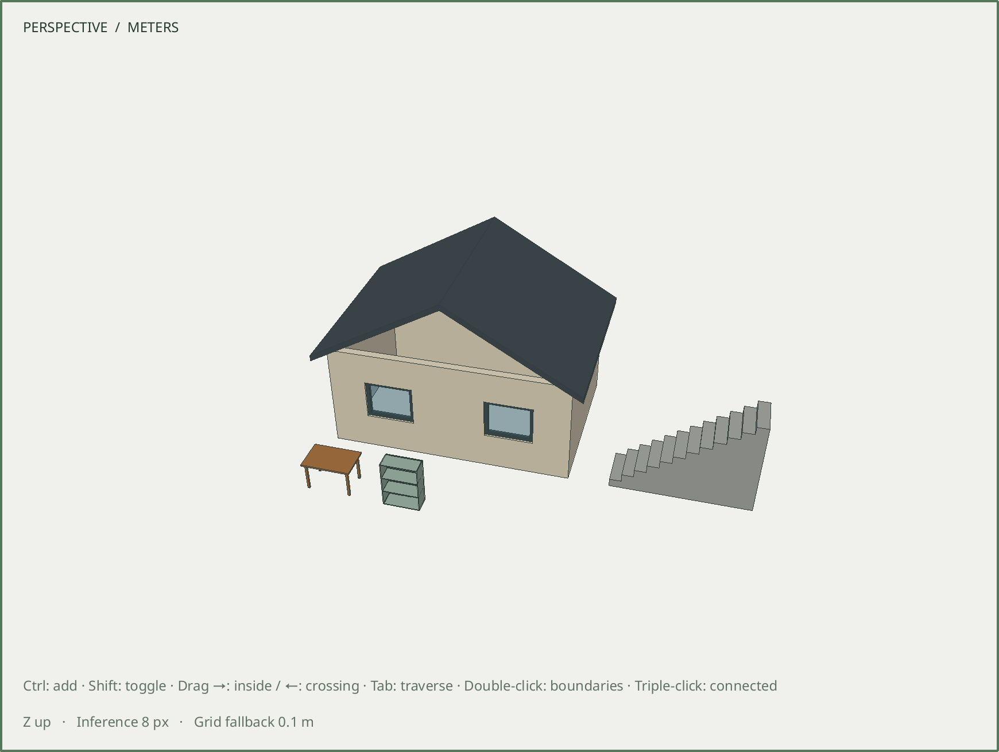

# R060.f — Distant-coordinate viewport precision

Date: 2026-10-06 UTC. Depends on R060.e in the review stack.
[Camera-relative rendering contract](../decisions/0060-camera-relative-rendering.md).

The [site comparison](R060e-site-placement.md) exposed triangle artifacts despite
correct double-precision geometry. A new regression independently translates an
opaque blue face and a transparent red face, separated by 20 mm, to two origins:
[100000.125, 200000.25, 12.5] m and [−800000.25, 700000.125, 600000.5] m. The original
viewport fails with about 1.7 logical pixels of projection error.

The fix retains double camera targets and CPU positions, subtracts a nearby snapped
origin before GPU float conversion, and uses that origin consistently for camera
projection, picking, clipping, selection and assistant previews. The GPU format and
OpenGL 3.3 requirement remain unchanged. The contract records the increased CPU
presentation-cache size and temporary upload allocation.

The new native fixture checks 361 interior probes in each of two projection modes
at both origins. Projection stays within 0.02 logical pixels; rendered color channels
stay within two levels of the near-origin capture. CPU rays hit the nearest face,
actual mouse selection resolves the group, and a world clipping plane exposes the
correct lower face. Public inference matrices match projection; their rays pass
within 1 mm of each probe. Exported render-camera targets retain double coordinates.

Moving the camera across origin cells and back preserves the exact model and reuses
body triangulation. The restored view renders correctly, and an unchanged view
performs no extra geometry upload. A private assistant face renders at its distant
world position and survives camera rebasing without publication.

The precision and site-workflow fixtures pass X11 and Wayland at DPR 1 and 2. Ten
existing native suites pass on both platforms at DPR 2: viewport, navigation,
inference, transforms, selection, assistant preview/panel, material rendering,
smooth shading and edge appearance. These 28 native runs include GL state, context
recreation, buffer reuse, keyboard interactions, clipping and save/Undo checks.
Both precision and site workflows pass Wayland DPR 2 with ASan, UBSan and leak
detection; the final expanded precision fixture was checked again under sanitizers.

All **99/99 development CTest suites** pass in **91.93 seconds**, including real
Blender. No native geometry, persistence schema or document contents change as a
result of camera navigation.

This actual Wayland DPR 2 capture removes the staircase gap and roof artifacts in
the retained R060.e capture. SHA-256:
`0580f0969e296007e2e84da4d70aa219e58b62d873ef81a3a6b0120b16d89421`.

The installed executable passes X11 DPR 1 and Wayland DPR 2 smoke checks, including
actual picking and clean GL state. Retained [smoke/benchmark results](R060f-native-smoke.json)
exercise 100,000 independent triangles and 1,000,000 repeated instances on Mesa
llvmpipe software rendering: 20.93 ms and 343.39 ms mean GPU-complete frames,
respectively. These are diagnostic smoke workloads, not the M9 hardware/performance
gate or a claim that its budgets are met. The installed contract matches the source.
