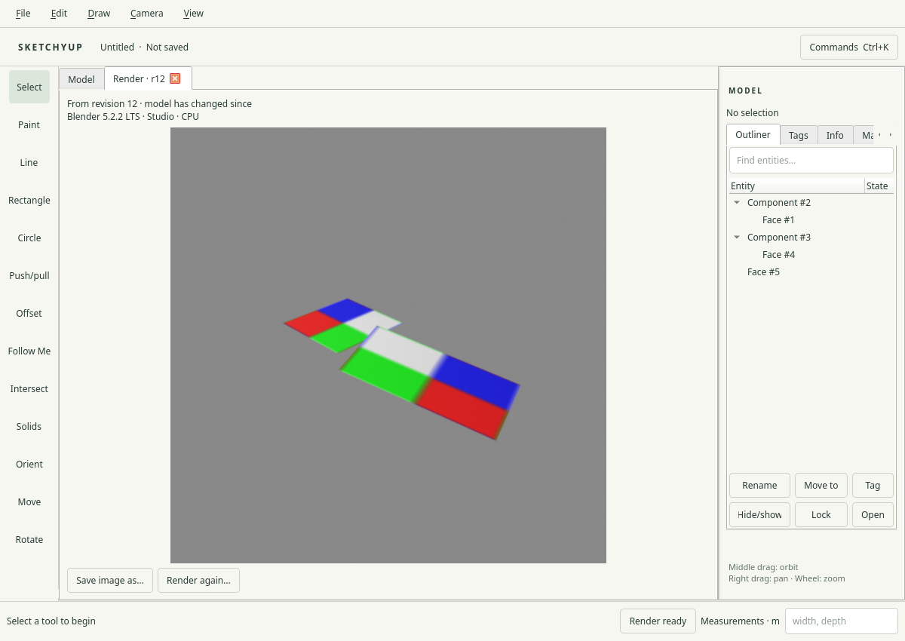
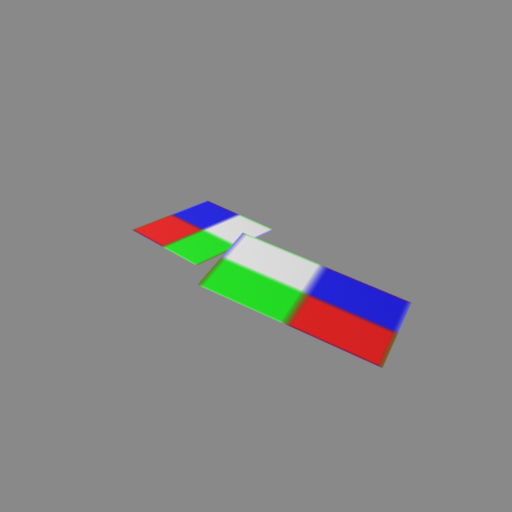

# R061.d — Textured GLB and Blender transfer

2026-10-06 UTC. Depends on R061.c.
[Transfer contract](../decisions/0064-textured-glb-export.md).

All **104/104 development CTest suites** pass in **105.20 seconds**, including the
actual Blender job lifecycle with a packaged image and independent side mappings.
All **8 targeted ASan/UBSan/leak-detection suites** pass in **20.74 seconds**:
projection math, image decoding, face records, textured GLB, existing GLB/smooth
export, Blender jobs and persistence. The actual Blender lifecycle also passes
under sanitizers in **6.12 seconds**. The final retained-source fixture write is
covered by a targeted sanitizer rerun in **11.82 seconds**.

The new `texture_export` suite checks decoded UV buffers against analytic local
coordinates, repeat seams, mirrored mappings and offsets near a billion repeats.
Implicit horizontal/vertical planes, coplanar subdivision and reversed winding
retain the declared phase/basis. Different UVs cannot share an exported mesh;
Undo restores sharing. Shared reflected/nonuniform instances retain one mesh.
PNG/JPEG source bytes remain exact, normalized PNG pixels retain color/coverage,
later asset edits cannot change a captured export, and native relocation produces
byte-identical GLBs. Missing, unsupported, invalid and oversized image fallbacks
retain color/opacity and report their individual reasons.

The suite accepts exactly **256 MiB of aggregate decoded images** and rejects one
additional pixel without changing the source. Coordinate conversion rejects both
inexact excessive spans and huge exact endpoints whose float spacing cannot
resolve the required fractional detail. Invalid error bounds and nonfinite UVs
reject. The initial large-offset fixture correctly exceeded the model's existing
offset bound; it was corrected to remain within that bound. Repeated synthetic
material names were also made unique, preserving the existing identity policy.

All **12 GLBs** pass the pinned Khronos validator with **zero errors and zero
warnings** ([complete report](R061d-gltf-validation.json)). Actual Cycles renders
verify **108 physical-side pixel samples**: default and independent projections,
different images, plain/textured side pairs, mirrored instances, transparent image
regions, large offsets, face reversal, holes, independent front/back swatch tinting
and JPEG. Image alpha multiplies swatch opacity. Black dielectric texels retain
their expected neutral specular reflection under the white test environment.
Eleven malformed image/binding/UV variants reject before import
([complete renderer report](R061d-blender-validation.json)).

Retained pre-texture GLBs are copied into new local evidence directories before
reverification, preserving the historical artifacts. All seven legacy sided
checks, seven malformed-pair rejections and four smooth-normal fixtures still
pass the updated Blender worker.

The actual native render-window workflow passes on **X11 and Wayland at DPR 1
and 2**, using the two-image panel and mirrored component models. Preparation and
running-job cancellation, editing during rendering, revision provenance, result
tabs and exact PNG saving remain correct. An additional native run captures a
512 × 512 render at 32 samples through the normal result tab:

The image hash matches the [verified result manifest](R061d-native-render-manifest.json).
These are raw application/Blender captures; no image editing was applied. The
capture directory was created inside the owned container after a host permission
failure prevented the first screenshot write; the corrected capture workflow
passes without a product change.

The [installed CLI smoke](R061d-installed-smoke.json) runs without display variables
and exports relocated two-image, mirrored and JPEG native files. All three GLBs
match their source fixture exports byte-for-byte; no external image references
are present. The installed transfer contract matches source.

The [native fixture inventory](R061d-native-fixtures.json) records exact hashes for
the retained [sided panel](../../tests/fixtures/texture-sides-v16.sketchyup),
[mirrored instances](../../tests/fixtures/texture-mirror-v16.sketchyup) and
[JPEG panel](../../tests/fixtures/texture-jpeg-v16.sketchyup).

Local logs include `r061d-complete-{build,ctest}.log`,
`r061d-final-{target-tests,sanitize-tests,blender}.log`,
`r061d-real-sanitize-tests.log`, `r061d-packaged-fixture-sanitize-tests.log`,
`r061d-legacy-{sides,smooth}.log`, `r061d-native-{matrix,capture}.log` and
`r061d-installed-smoke.log`. The complete render fixture trees remain under
`build/evidence/r061d-*`.

This is export/render-job acceptance. Native viewport texture display, scoped
authoring commands and texture controls remain required before R061 closes.
M7 delivery also awaits the M6 gate.
