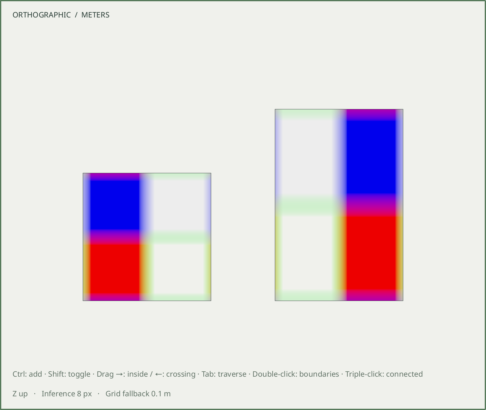

# R061.e — Native textured viewport

Verified 2026-10-06 on Arch Linux, Qt 6.11.2 and software OpenGL in isolated
X11/Wayland sessions. [Contract](../decisions/0065-viewport-textures.md).
This layer follows R061.d; mapping authoring commands and native controls remain
pending, and it does not close the M7 gate.

The native fixture exercises two managed images, independent side projections,
fully transparent and fractional-alpha pixels, material opacity multiplication,
linear-RGB tinting and four-texel filtering. A device-pixel-position oracle accounts
for the difference between a projected world point and the framebuffer sample
center. CPU ray picking and GPU ID selection both pass through transparent image
areas and retain nonzero coverage. Negative repeats, billion-repeat offsets and
excessive UV-span fallback are checked independently.

Asset replacement invalidates old alpha before repaint and updates appearance
without retriangulation. Undo/Redo restores pixel coverage; reflected, nonuniform
shared instances retain the physical side and body-local mapping. Save/reopen is
read-only, and translation near site bounds retains image phase across camera
rebasing. Clipping and context recreation preserve image-aware picking.

The cache suite verifies byte and image-count admission, previously deferred
images becoming eligible, immutable-payload reuse across renames, same-ID payload
and MIME replacement, cached decoder failures, empty-scene release, request
supersession and destruction during a deliberately blocked decode. The worker
does not need a widget or a running GUI event loop to finish safely.

The first sanitizer run of the new reparenting case found 3,208 bytes of retained
OpenGL dispatch backends from the previous context. The viewport now obtains
context-owned functions through Qt's version-functions factory. The same
reparenting case then passed with leak detection enabled; no suppression was
added. Ordinary material rendering also passes the sanitizer checks.

Final checks:

- **105/105 CTest suites passed in 106.31 seconds**, with the actual Blender
  lifecycle enabled. Final development build had no compiler warnings.
- **32/32 native checks passed in 102.914 seconds**: textured viewport, material
  viewport, site precision, smooth shading, general viewport, material panel,
  assistant preview and selection; each on X11 and Wayland at scale 1 and 2.
  [Individual results](R061e-native-matrix.json).
- **4/4 ASan/UBSan suites passed in 2.74 seconds**: texture cache, image decoder,
  face projections and mapping kernel. Textured viewport, material viewport and
  precision additionally passed under ASan/UBSan on Wayland at scale 2, with
  `detect_leaks=1` and `halt_on_error=1`.
- Installation into a fresh prefix preserved the exact desktop binary and
  installed contract. The installed CLI, with display variables removed, reopened
  and exported three relocated textured containers byte-identically to their
  accepted GLBs. [Installed checks](R061e-installed-smoke.json).

The raw native framebuffer below shows two shared panels at site coordinates.
The right placement is reflected and stretched; the eight-pixel fixture makes
repeat seams, filtering and transparent regions visible. The image was captured
directly at Wayland scale 2 without editing.
[Capture record](R061e-native-capture.json).

Reproduction targets are `texture_cache_tests` and `texture_viewport_tests`.
The latter accepts `SKETCHYUP_TEXTURE_EVIDENCE` as an optional raw framebuffer
output filename. CI runs the cache through CTest, the viewport on both native
backends/scales, and the cache plus native viewport under sanitizers.

Preview limits remain explicit: 128 admitted images / 128 MiB per completed
decoded snapshot and GPU image set, with additional transitional/codec storage;
no mipmaps; existing centroid sorting for intersecting transparent surfaces;
color fallback for unavailable images or excessive UV precision spans. These
are preview policies and do not remove managed resources from the document.
