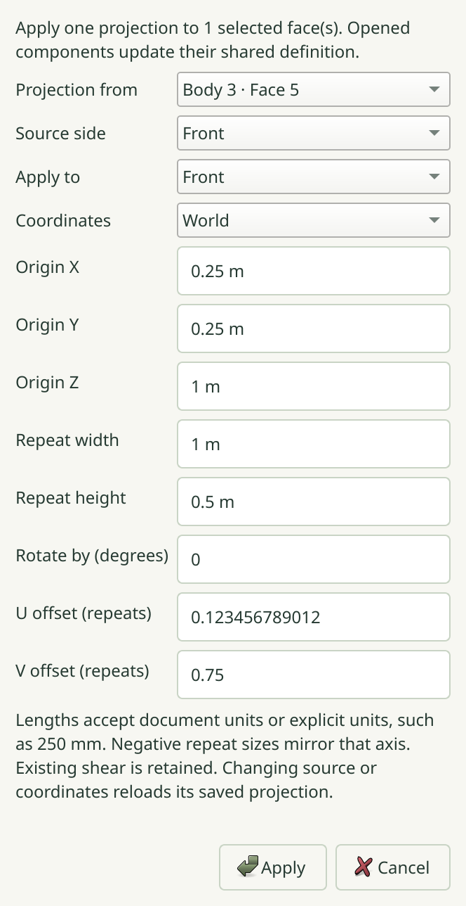

# R061.g — Native texture mapping editor

Verified 2026-10-06 on Arch Linux, Qt 6.11.2, isolated X11/Wayland and software
OpenGL. [Editor contract](../decisions/0067-native-texture-editor.md).
This completes the planned native R061 controls; delivery still awaits dependency
CI and the M6 gate.

The new native suite opens the actual Materials dialog and types document-unit
and explicit-unit lengths. Independent gradient expectations verify mirrored
repeat sizes, a quarter-turn rotation and retained shear. Origin and UV offset
edits preserve untouched full-precision doubles and the other physical side.
Untouched acceptance preserves exact bytes/history, including a Both-sides editor
loaded from two distinct mappings. Explicit back-source/Both-target editing copies
one projection to both sides.

The same test verifies atomic multi-face world projection, world repeat lengths
through a reflected/sheared component placement, explicit local repeat lengths,
shared-definition propagation, Undo/Redo, native container reopening and reset.
Repeated reset of implicit mappings creates no empty history item. Zero repeat
sizes retain an inline error. Changed document, selected faces or editor locks
reject publication; closed components require opening the editing context.

Validation:

- **106/106 regression suites passed in 111.21 seconds**, including real Blender.
- **16/16 native checks passed in 58.173 seconds**: texture editor, material panel,
  textured viewport and assistant preview on X11 and Wayland at scales 1 and 2.
  [Individual results](R061g-native-matrix.json).
- Texture editor and material panel both passed ASan/UBSan on Wayland at scale 2,
  with leak detection and halt-on-error enabled. An initial expanded-test assertion
  compared container bytes across an intentional Undo; the test now captures its
  baseline after that Undo, preserving the revision check rather than ignoring it.
- A fresh installed prefix matches the tested desktop binary and installs the new
  contract. Its headless CLI executes the installed texture example; export after
  relocation is byte-identical to the development export of that same document.
  [Installed evidence](R061g-installed-smoke.json).
- All **102 source files referenced by `install(FILES)`** are byte-exact in the
  generated source archive. [Archive evidence](R061g-source-package.json).
- Development and sanitizer builds had no compiler warnings; whitespace checks pass.

The archive check includes the inherited R060.g packaging correction: both
installed milestone acceptance procedures are included in the explicit source
list. Build output and Git metadata remain excluded.

The raw scale-2 dialog capture below was inspected without editing. Length and
side choices, relative rotation, retained-shear behavior and source/frame reload
semantics remain visible. [Capture record](R061g-native-capture.json).

Reproduce with `texture_input_tests`. Set `SKETCHYUP_TEXTURE_EDITOR_EVIDENCE` to
capture its final editor. CI runs the suite on both native backends/scales and
under sanitizers. Numeric projection editing is supported; viewport pin handles,
perspective warps and automatic unwrapping remain outside this layer's contract.
