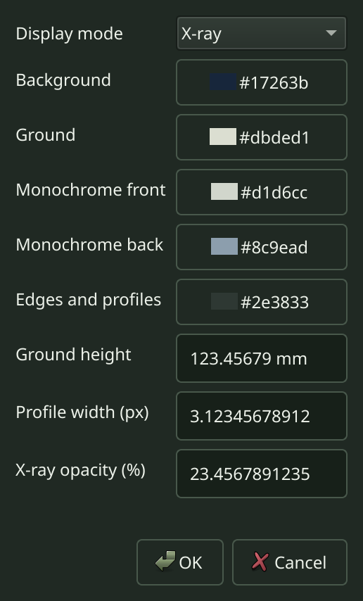
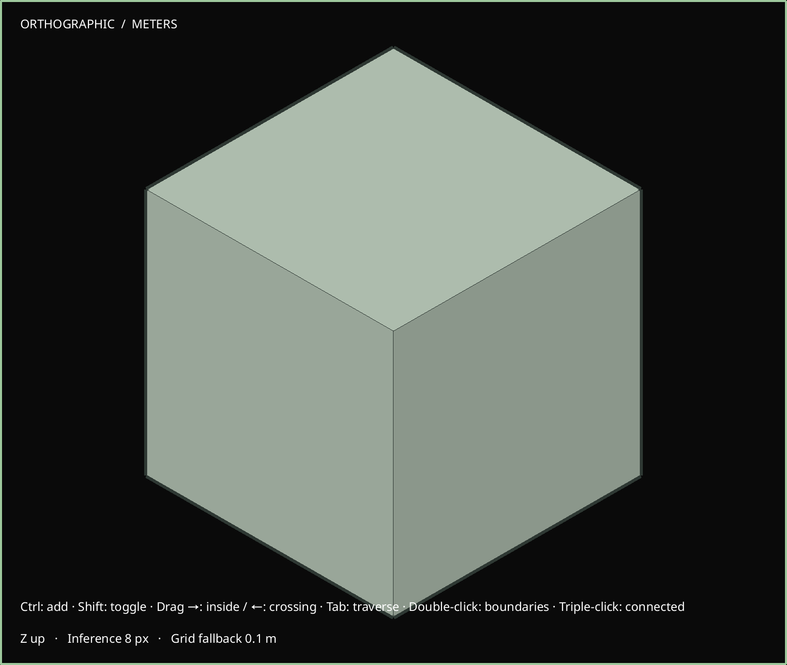

# R062.b — Native model styles, profiles and controls

Verified 2026-10-06 on Arch Linux and Qt 6.11.2, with isolated X11/Wayland and
software OpenGL. [Native contract](../decisions/0069-native-model-styles.md).
R062's planned style controls are locally verified; delivery still requires the
stack's checks and the M6 gate.

The viewport supports textured, shaded, monochrome, wireframe and X-ray display,
independent physical front/back monochrome colors, background/ground colors,
ground height, grid/axes/edge visibility and camera-facing profiles. Geometry,
materials and texture projections remain intact. CPU and GPU picking retain
material opacity and image-cutout policy across modes. Profiles use screen-space
triangles with logical-pixel widths; softened silhouettes remain visible while
explicit hiding is respected. Camera/projection and mirrored-placement checks
retain six silhouette edges on a closed cube without retriangulation.

View → Model styles opens the new tab. Quick controls and the Colors and details
dialog use `document.style`; legacy and bounded `document.describe` expose the
same complete record. Tests verify native units, color selection, one-step history,
precise untouched fields, reset, invalid drafts, cancellation and stale-document
rejection. Staging and mixed geometry/style batches preserve atomicity and shared
component scopes reject document-style changes.

Validation:

- **109/109 regression suites passed in 115.02 seconds**, including real Blender.
- **44/44 native checks passed in 144.896 seconds**: style editor, style viewport,
  texture editor, texture viewport, material viewport, smooth shading, camera
  precision, selection input, general viewport, assistant preview and native MCP,
  each on X11/Wayland at scales 1 and 2. [Results](R062b-native-matrix.json).
- **4/4 targeted ASan/UBSan suites passed in 95.86 seconds**: commands, inspection,
  staging and model-style commands. Leak detection and halt-on-error were enabled.
- Four native sanitizer targets passed on Wayland at scale 2: style editor, style
  viewport, texture viewport and assistant preview. The style editor and viewport
  were rerun after their final precision/benchmark changes and exited cleanly.
- Independent JSON Schema Draft 2020-12 validation accepted **15 valid mode cases**
  and rejected **117 malformed cases** across all three published command catalogs.
  [Schema evidence](R062b-schema-validation.json).
- A fresh installed prefix passed **15 historical migration/relocation/export
  cases**, retains explicit old-reader rejection, and executes the installed
  three-command example with matching queried/stored style. Installed schemas,
  contract and desktop binary match the tested artifacts.
  [Installed evidence](R062b-installed-smoke.json).
- All **105 `install(FILES)` inputs** match the source archive byte-for-byte, with
  build output and Git metadata excluded. [Archive evidence](R062b-source-package.json).
- A 10,000-triangle native Wayland scale-2 diagnostic recorded the complete style,
  zero synthetic profile edges, and **8.630 ms mean GPU-complete frame time** across
  20 measured frames after five warmups. This is a software-rendered synthetic
  throughput check, not a general model-performance claim.
  [Benchmark record](R062b-style-benchmark.json).
- Final development/sanitizer builds had no compiler warnings; whitespace checks pass.

A new no-op color-picker regression exposed Qt's initialization conversion from
stored float channels to 8-bit chooser values. Acceptance now compares against the
initialized chooser baseline and preserves the original floats if unchanged.
The corrected regression passes on both native backends/scales and under
sanitizers. A failed assertion run also reported a 96-byte Wayland allocation on
teardown; successful final sanitizer runs are clean, with no suppression added.
This does not establish a root-cause fix for the earlier intermittent assistant
Wayland shutdown report.

The raw captures below were inspected without editing. The dark-theme editor fits
its fields/actions at 258×427 logical pixels; the viewport shows the mirrored
cube's geometric silhouette against a document-owned dark background.
[Capture dimensions and hashes](R062b-native-captures.json).

Reproduce with `style_input_tests` and `style_viewport_tests`. Optional
`SKETCHYUP_STYLE_EDITOR_EVIDENCE` and `SKETCHYUP_STYLE_VIEWPORT_EVIDENCE` paths capture
the raw dialog and framebuffer. Local logs use the `build/r062b-` prefix, including
`final-ctest.log`, `native-matrix.log`, `sanitize-ctest.log`,
`final-sanitize-style_input_tests.log` and `final-sanitize-style_viewport_tests.log`.
