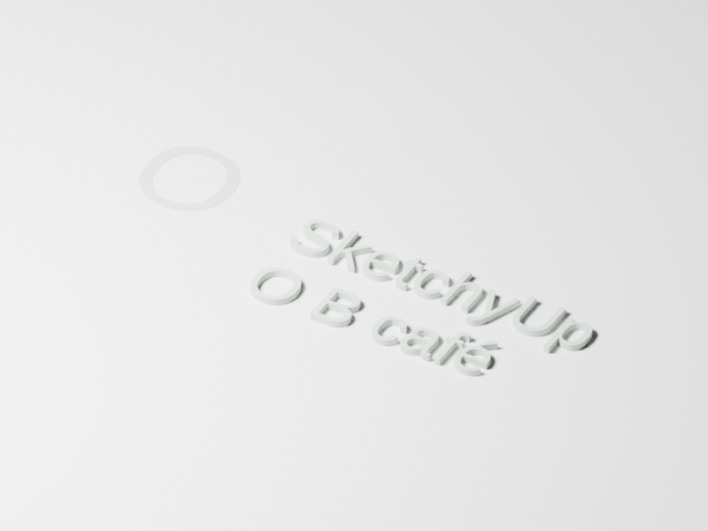

# R066.d — Shared editable-text workflows

2026-10-06. Implementation `c75653f`, integrated acceptance head `80f1988`.
Parent: PR #150. Contract: [0085](../decisions/0085-editable-text-workflows.md).

The complete Debug build and **125/125 CTest suites pass** in **118.50 s**,
including actual Blender. Five shared command/inspection/staging/dispatch suites
pass ASan/UBSan with leak detection and halt-on-error in **172.19 s**.

Dedicated cases cover create/update/bake, explicit font substitution and fingerprint
acceptance, immutable snapshots, atomic failure and batch rollback, Undo/Redo,
reflected placement, manual-geometry protection and component edit scopes. Glyph
regeneration retires prior entity identities with explicit empty descendant sets;
attached annotations become missing instead of binding to coincident new geometry.
One Undo restores source, geometry and references.

[Independent JSON Schema validation](R066d-schema-validation.json) checks 21 valid
and 90 invalid command requests across three catalogs, plus six valid and six
invalid inspection requests. All seven published capability artifacts are generated
from executable catalogs. [Four Wayland 2× native regressions](R066d-native-matrix.json)
pass in **14.746 s**, covering desktop/native MCP inspection, rendering and history.

[Installed acceptance](R066d-installed-smoke.json) runs the installed example with
display variables removed, updates Unicode/multiline source, verifies that a missing
font leaves the output file unchanged, checks exact baked geometry, read-only
inspection and relocated helper discovery. Seven installed catalogs, both example
files, the desktop binary and the contract match their source/build bytes.

[GLB validation](R066d-glb-validation.json) reports zero errors and warnings for the
two-body sign, with one editable source explicitly omitted while geometry remains.
[Blender 5.2.2 LTS](R066d-blender.json) imported both meshes and measured an extrusion
of **0.0150000539 m**, within 1e-6 m of the requested 15 mm. Its independent render
was inspected for glyph counters, multiline layout and visible extrusion:

[Source-package verification](R066d-source-package.json): **128 installed inputs**
match byte for byte; build and Git artifacts are excluded. Archive SHA-256:
`318739fc1f5ec65e7baf3579e76f0416049bfe07ce45cf5032c0b0b907cd96ec`.

The native editor follows separately. Remote CI and ordered dependency merges remain
delivery gates.
