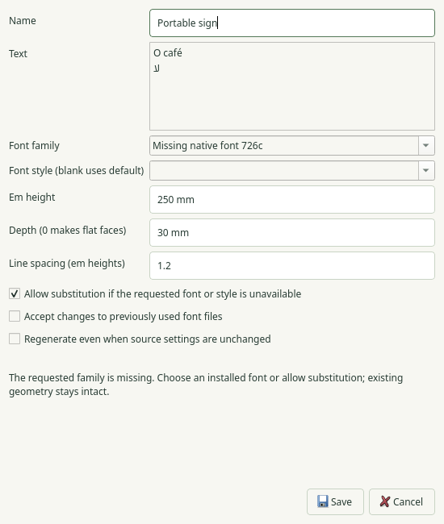
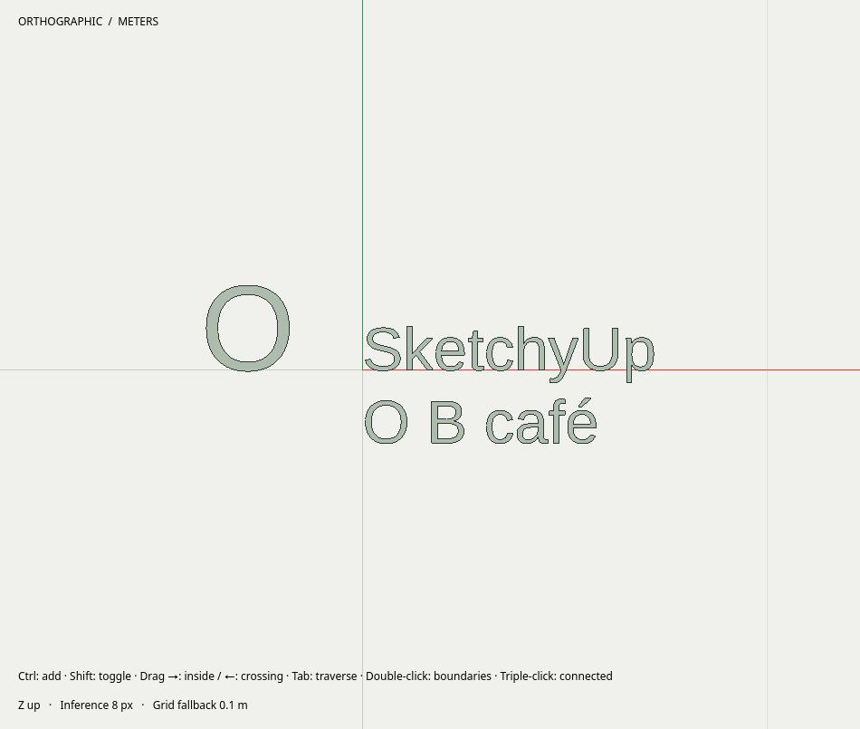

# R066.e — Native editable 3D text

2026-10-06. Implementation `866778e`, integrated acceptance head `de91379`.
Parent: PR #151. Contract: [0086](../decisions/0086-native-editable-text.md).

The complete Debug build and **125/125 CTest suites pass** in **118.20 s**,
including actual Blender. The integrated source, tests and CMake tree are identical
to the development build used for the dedicated native matrix.

[Eight native cases](R066e-native-matrix.json) pass on Wayland and X11 at 1× and 2×:
four normal cases in **31.010 s** and four ASan/UBSan cases in **134.702 s**.
Sanitizers use leak detection and halt-on-error. Wayland sanitizer cases use the
previously documented [private destroyed-proxy reference fix](R062b-wayland-proxy-reference-fix.md),
without suppressions or system-library changes. The worker and shared text-command
sanitizer suites also pass together in **17.53 s**.

Native input fixtures cover unit-aware height/depth, accented Unicode and Arabic,
multiline text, event-loop responsiveness, one-edit history, unchanged-editor no-op,
Cancel, revision changes during generation, missing-font reporting, explicit
substitution, font-free rename, exact baking and Undo, save/reopen and instance-only
component editing. The worker has a separate interrupted-process fixture. Panel
shutdown interrupts, joins and deletes outstanding thread objects even when no
further event-loop iteration can deliver deferred deletion.

The editor preserves a missing saved family until the user chooses a replacement
or explicitly allows substitution. This native capture shows the requested family,
unit-aware dimensions and the substitution/fingerprint/regeneration controls:

The example's native framebuffer retains multiline glyph outlines and counters:

These captures precede only the shutdown lifetime correction, which changes no
rendering. The [independent Blender render](R066d-editable-text-workflows.md) also
verifies the example's 15 mm extrusion and surface-export portability.

[Installed acceptance](R066e-installed-smoke.json) reruns the headless authoring,
Unicode, atomic failure, exact bake and relocated-helper checks with the installed
build. The installed desktop, seven catalogs, examples and native-editor contract
match their build/source bytes.

[Source-package verification](R066e-source-package.json): **129 installed inputs**
match byte for byte; build and Git artifacts are excluded. Archive SHA-256:
`b9e548a61174809ae1b1d734409b08ff1aee2067b2a3338c14eff2c6a3a4ae6a`.

R066 implementation and local acceptance are complete. Remote CI and ordered
dependency merges remain delivery gates. Provider preferences and credentials are
unmodified.
