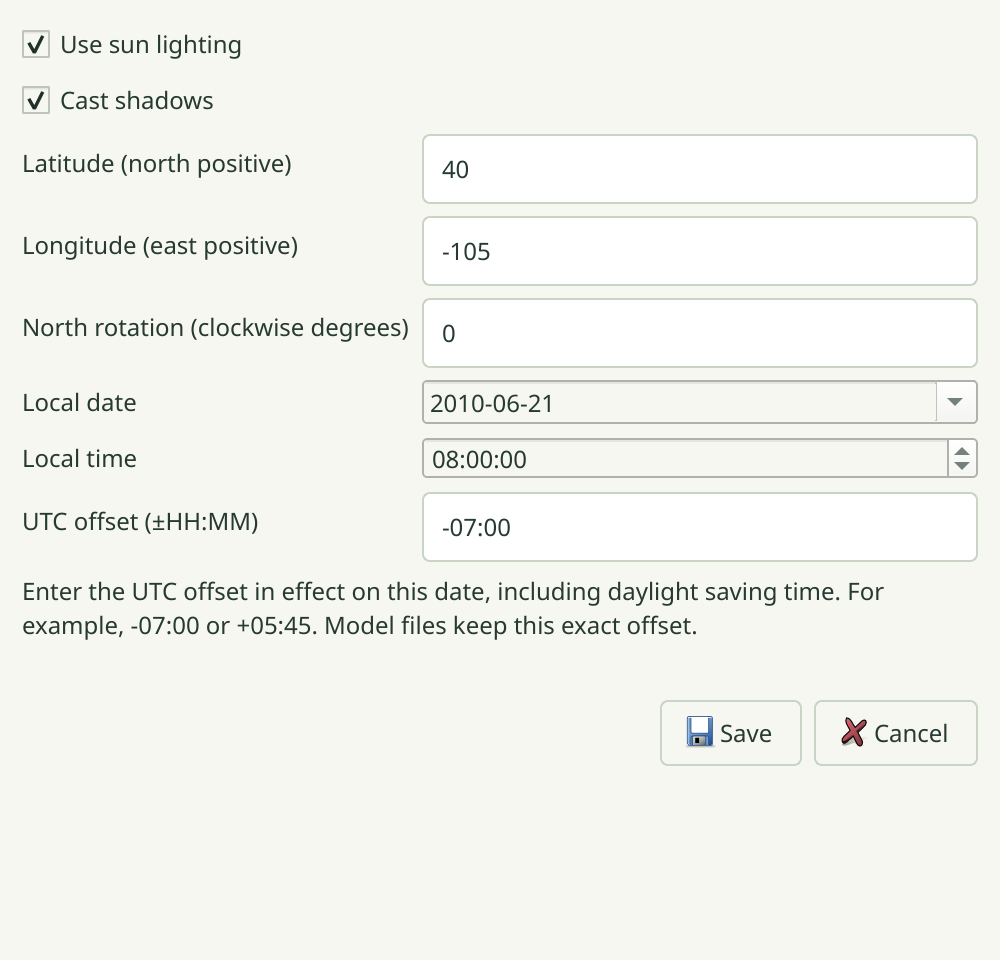
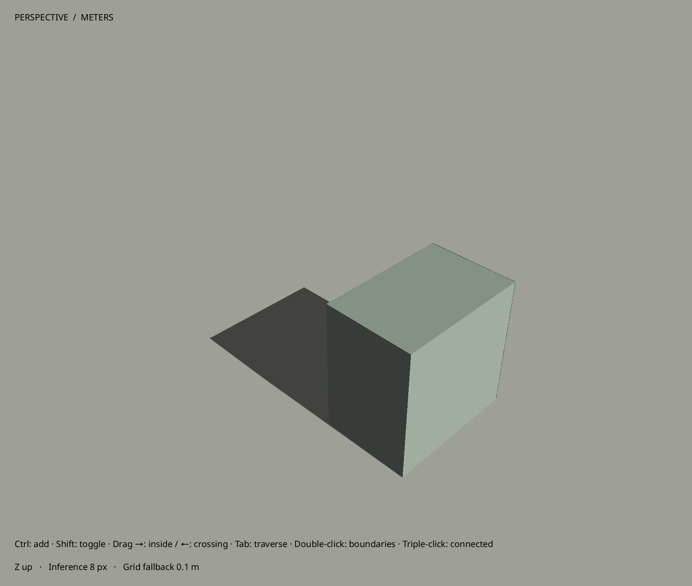

# R067.d — Native sun controls and shadow preview

2026-10-06. Implementation/native acceptance `987cc93`; integrated head `e26bb2b`.
Parent: PR #155. Contract: [0090](../decisions/0090-native-sun-and-shadows.md).

The complete Debug build and **128/128 CTest suites pass** in **119.32 s**,
including actual Blender. The [24 native cases](R067d-native-matrix.json) cover sun
controls, display-style regressions and saved scenes on Wayland/X11 at 1×/2×.
All 12 normal cases pass in **46.382 s**; all 12 ASan/UBSan cases pass with leak
detection and halt-on-error in **65.159 s**. Sanitized Wayland uses the independently
verified [private client fix](R062b-wayland-proxy.md), with no suppressions.

The native editor verifies latitude/offset validation, exact stored coordinate
precision, quarter-hour UTC offsets, a single history entry, unchanged-input no-op,
Undo/Redo, stale-editor rejection, scene capture and exact save/reopen. Existing
scene tests now explicitly opt into solar when comparing native full-view captures.

Framebuffer checks verify the geometrically projected ground shadow, shadow toggle,
night behavior, north rotation, opacity cutoff, actual texture alpha cutouts,
free clipping, named section caps, hidden casters and unchanged picking. Translated
geometry at 250 km retains its shadow. A new regression first reproduced loss of
nearby detail when a separate offscreen object sat 250 km away; the camera-focused
shadow fit fixes it on all tested backends/scales. GL error checks remain clear.

The preview uses bounded shadow-map memory, preserves ambient light, handles both
physical face sides, and keeps the visual ground non-pickable. Its finite resolution,
camera neighborhood and opaque alpha cutoff are explicit preview limits.

[Four additional native integration cases](R067d-integration-native-matrix.json)
pass in **14.763 s**: desktop inspection, native MCP, render jobs and history. The
standalone test closure includes its CLI and fake-worker executables; source fixtures
map to the identical integrated checkout. [Installed acceptance](R067d-installed-smoke.json)
reruns authoring, exact scene recall, invalid-input rollback, relocation and render
metadata checks against the final desktop/CLI, seven catalogs, examples and contract.
The example exposes visible ground for sun studies. Provider settings are untouched.

[Source-package verification](R067d-source-package.json): **135 installed inputs**
match byte for byte; build and Git artifacts are excluded. Archive SHA-256:
`c254c562d77404391c983d6779bb470fb71d16755c8a6f2f951f58a01ed56c3b`.

R067 implementation and local acceptance are complete. Remote CI and ordered merges
remain delivery gates. Blender lighting conversion remains the separate R069 item.
