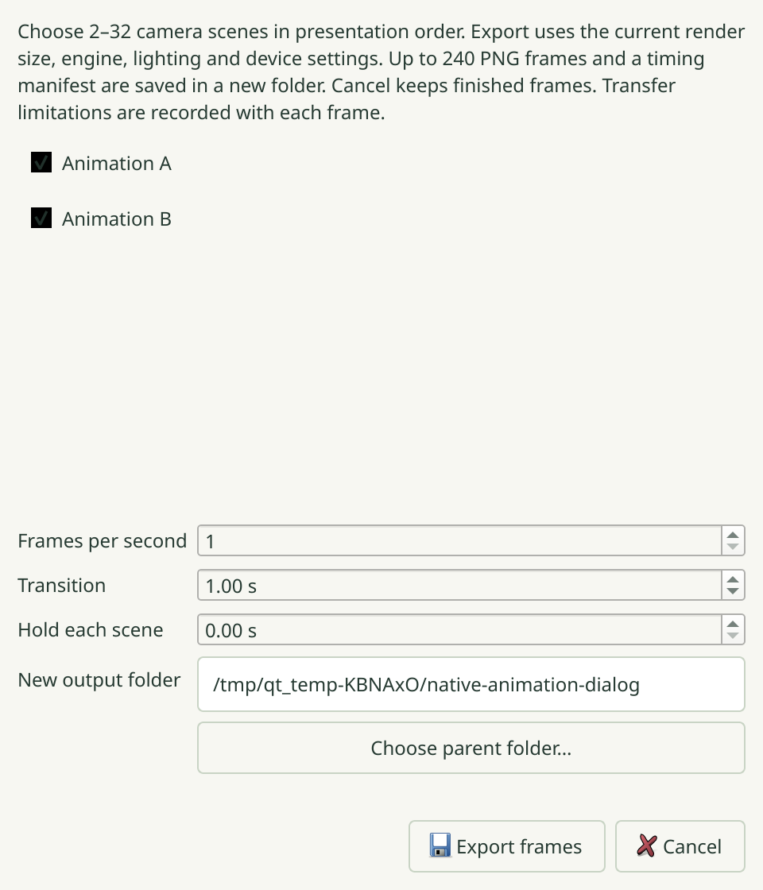
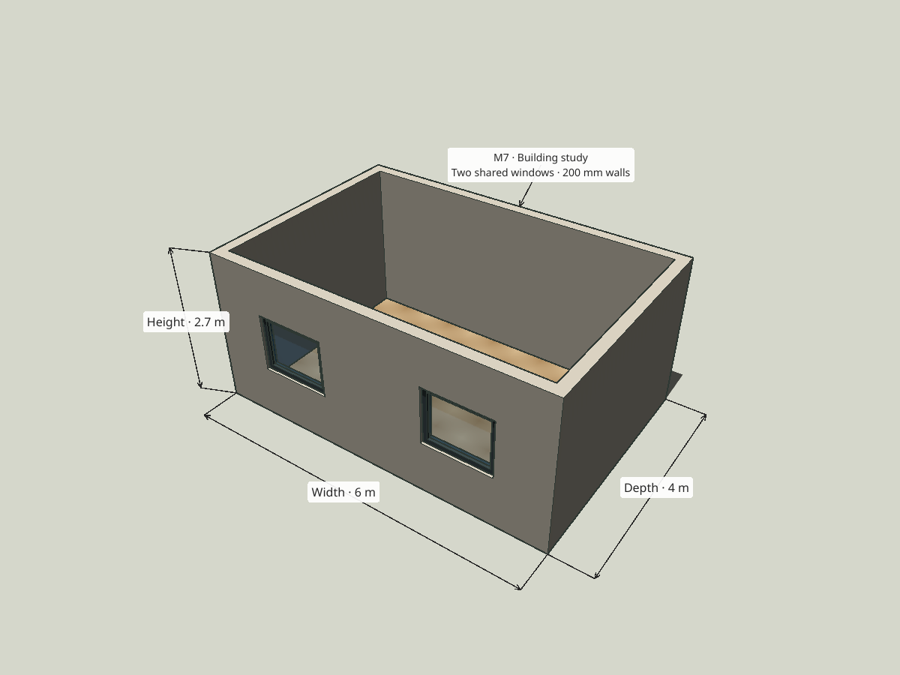
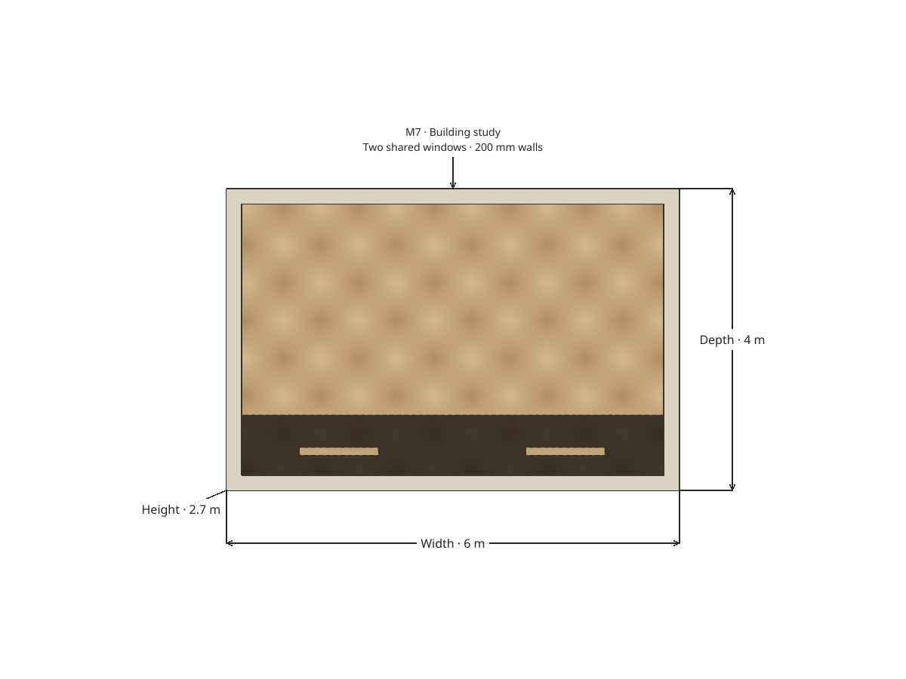
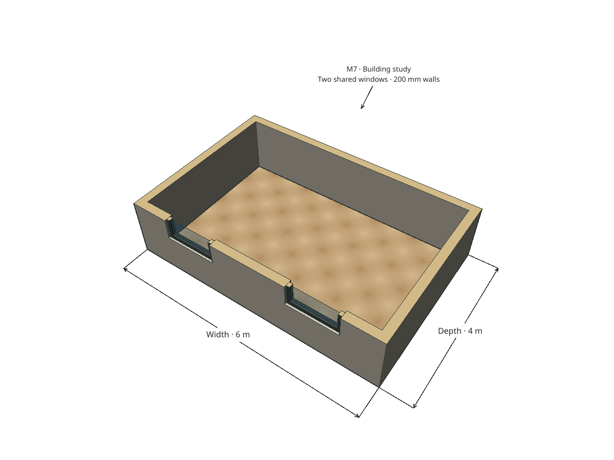
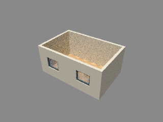
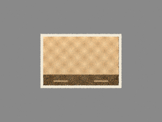
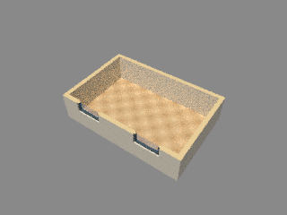

# R072.d — Native animation export and integrated presentation study

2026-10-07. Animation implementation `8071bab` through `2f5b7ce`; presentation
fixture `915435c`, correction `02c8cc8`, installed example/procedure `96307d6`
and package input `6aea57e`. Final integrated source: `9ee2a39`.
Parent: [PR #166](https://github.com/zygote55/sketchyup/pull/166).
Contract: [0107](../decisions/0107-native-animation-frame-export.md).

The complete Debug build passes **143/143 CTest suites in 160.34 s**,
including actual Blender animation and integrated presentation checks.
Five final native Wayland 2× integration suites pass in
**22.193 s** ([matrix](R072d-final-native-matrix.json)).
The [animation matrix](R072d-animation-native-matrix.json) and
[study matrix](R072d-study-native-matrix.json) each cover Wayland/X11, 1×/2×,
and normal/ASan+UBSan builds with leak detection. All sixteen focused native runs
pass. Sanitized camera/capture/export suites pass 3/3 in 2.28 s; the integrated
study passes in 5.07 s. No application leak suppression is used.

Native export captures selected ordered scenes once, then prepares and renders
bounded frames asynchronously. Each completed PNG and frame manifest is published
before the atomic sequence manifest references it. Cancellation, failed workers,
owner destruction, invalid destinations and resource limits preserve the model
and completed frames. Existing destination folders are rejected. Fake workers
exercise interrupted runs; real Blender 5.2.1 exercises all three saved cameras.
Movie encoding and resuming an interrupted export are outside this contract.

The shipped six-by-four-metre study has two shared windows, managed floor texture,
200 mm walls, explicit offline sun settings, three resolved distance annotations,
one label and a named section at 1.4 metres. The independent native workflow
recalls perspective, orthographic plan and section cameras; exports exact
1200 × 900 PNGs without changing document/history; and saves/reopens the study.
Visual review confirmed geometry, texture, labels, dimension values and section
caps. The section intentionally clips dimensions whose attached endpoints are cut.

The [retained study report](R072d-study.json) records dimensions, camera values,
completed frame hashes and explicit annotation losses. Three Cycles 320 × 240,
four-sample acceptance renders were visually checked for scene and camera
agreement; these fast, noisy images are not a quality benchmark.

A packed `.blend` independently reopened after its transfer package was deleted:
Blender 5.2.1 reported a perspective camera, one packed image and six mesh objects;
the test also checks the configured SUN light. Native annotations remain viewport
overlays and all four omissions are reported in Blender transfer data. The native
model remains unchanged. Public evidence omits worker logs and machine paths.

The [installed smoke](R072d-installed-smoke.json) checks seven catalogs, twelve
contracts, exact desktop bytes and relocatable lighting/export behavior. The
[installed study check](R072d-installed-study.json) independently resolves 6 m,
4 m and 2.7 m dimensions, three cameras and the 1.4 m section, then verifies
save/reopen equivalence and exact shipped example/procedure bytes.
[Source package](R072d-source-package.json): **156 installed inputs** match byte
for byte; SHA-256 `41580959b4297594d0811375bc7166c4922f1dfd985ce50eefb30f1d048d7caa`.

R072 and the integrated M7 workflow are locally complete. **M7 is not yet an
accepted milestone:** remote CI and the ordered R061–R072 merges remain required.
The [reproduction procedure](../M7_ACCEPTANCE.md) is installed with the example.
