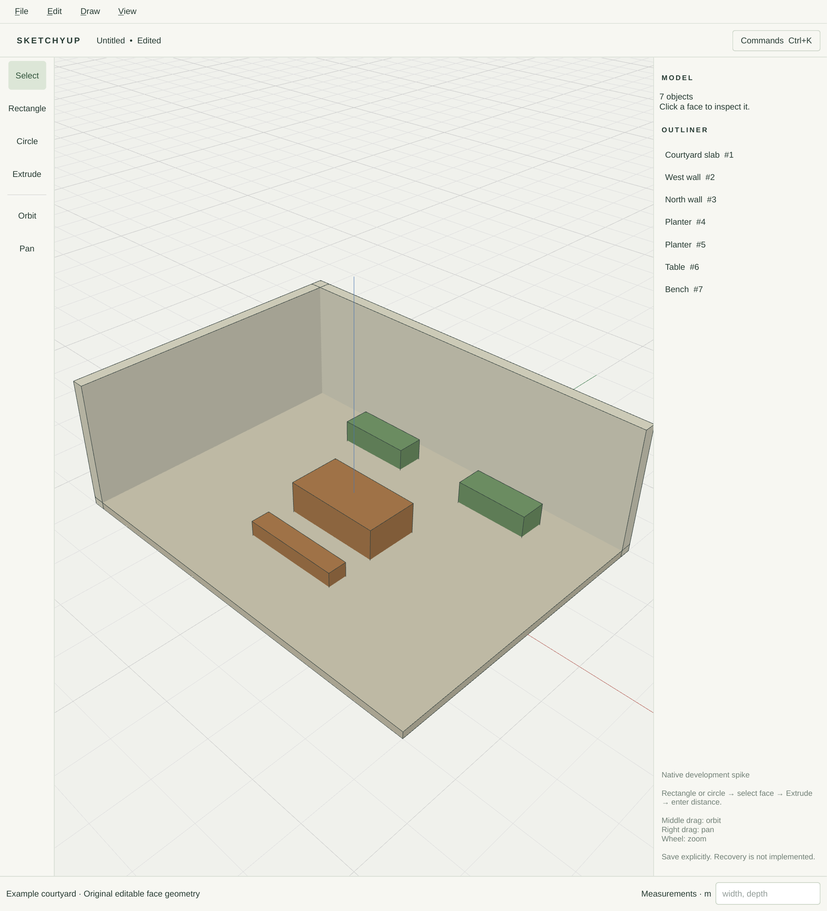

# Native spike evidence

Date: 2026-10-03. Scope: R002.a/R003.a/R004.a, with reusable build, command,
persistence and package scaffolding for later milestones. This record does not
close M0 or claim delivery of M1–M5.

## Environment and commands

Omarchy 4.0.4, Linux 7.2.5-3-omarchy, Intel Core Ultra 7 155H / Arc integrated
GPU, Mesa 26.2.2, Qt 6.11.2, GCC 16.2.1, CMake 4.4.3, Ninja 1.13.2.
CMake was installed into the user's tool environment with `uv tool install cmake`;
no compositor configuration or system package was changed.

```sh
cmake --preset dev
cmake --build --preset dev -j 4
ctest --preset dev
cmake --preset sanitize
cmake --build --preset sanitize -j 4
ctest --preset sanitize
QT_QPA_PLATFORM=wayland build/dev/interaction_tests
QT_QPA_PLATFORM=xcb build/dev/interaction_tests
QT_QPA_PLATFORM=wayland build/dev/sketchyup --smoke
build/dev/sketchyup-cli --script examples/room-shell.json --output /tmp/room.sketchyup
build/dev/sketchyup-cli --input /tmp/room.sketchyup
```

## Observed results

- Core tests pass: planar and arbitrary-plane faces, holes, signed extrusion,
  closed-prism adjacency and volume, loose edges, non-manifold adjacency,
  degeneracy rejection, atomic command failure, stale edits, immutable records,
  undo/redo, saved-state tracking, retired IDs and 200 deterministic edit/undo trials.
- Persistence/automation tests pass: identity/topology round-trip, unsupported
  versions, truncation, invalid fields/allocators, file size limit, save replacement,
  failed destination and forced short write preserving the old file; atomic batch,
  one-step undo, document identity/revision checks and retired batch IDs.
- Address/undefined-behavior sanitizer core run passes.
- Native interaction tests pass at device pixel ratios 1, 1.5, 1.6 and 2 under
  Wayland, and at 1 under X11/XWayland. Tests draw a precise rectangle and circle,
  select/extrude the face, undo/redo, type into Measurements without activating
  tool shortcuts, cancel preview, orbit without modifying content and retain
  Measurements at 640 logical pixels. X11 tiling constrained its requested resize.
- Effective Wayland scales 1/1.5/2 were exercised with `QT_SCALE_FACTOR`
  0.625/0.9375/1.25 on the native 1.6-scale display. This is an application-scale
  test, not a claim that compositor monitor scales were changed or that dragging
  between mixed-scale monitors has been tested.
- Wayland smoke selected courtyard table body 6 through projected logical-pixel
  coordinates. GL renderer: Mesa Intel Arc (MTL), OpenGL 4.6 core.
- Repeated-triangle instancing, 20 sampled frames after five warmup frames:
  100,000 triangles ~0.89 ms; 1,000,000 triangles ~2.39 ms per GPU-complete draw.
  Run `--benchmark 100000` / `--benchmark 1000000` to reproduce. These timings
  include `glFinish`, but exclude compositor presentation and full-document editing.
  They do not establish the roadmap's interactive million-triangle budget.
- Headless example creates 6×4 m outer walls, 0.2 m wall thickness and 2.7 m
  height. The wall ring has 3.84 m² area, 16 vertices and ten faces after extrusion.
  Saved output loads through both the command-line driver and native file parser.

## Package evidence

`CMAKE_BUILD_PARALLEL_LEVEL=4 makepkg --nodeps --force --noconfirm` built
`sketchyup-0.1.0-1-x86_64.pkg.tar.zst` (about 199 KiB) and a separate debug
package from a checksummed source archive. `--nodeps` was used because CMake
is installed through the user tool environment rather than the pacman database;
all actual build dependencies were present. Release-mode CTest passed inside
`makepkg`. The packaged executable, run from its staging directory, passed the
Wayland graphics/picking smoke test. The package was not installed on the host.
Clean-system dependency resolution, install/remove and upgrade tests remain open.

## Native screenshot

This is a capture of the running C++ application, not the planning HTML mockup.



## Remaining parent gates

R002.b: transparency, section clipping, graphics context recreation, mixed-monitor
transitions, more representative mesh performance and native dialog acceptance.
R003.b: persistent edge IDs and topology maps, arrangement/merge experiments,
large-coordinate and small-feature precision corpus, algorithm comparison.
R004.b: container/chunk benchmark, recovery journal, persistent transaction
outcomes and migration contract. R006: theme/focus/responsive and all C1–C6 state
contracts. No parent row is marked Verified until its full evidence is reviewed
and merged. AI, Blender, adjacent-face editing and recovery remain unavailable.
